# Data preparation

The CDT has a number of operation geared towards data preparation including organizing station data, assessing availability of observations, downloading and processing proxy data such as satellite rainfall estimates and climate model reanalysis products.  Climate data are stored in several different formats and they can have different spatial and temporal dimensions. This makes dealing with climate data somewhat challenging as a user might be required to resort to different tools for cross-platform data type matching. CDT doesn’t completely do away with this, but it allows users to convert data with different spatial and temporal dimension to the dimension preferred or needed by the user. CDT has its own data type, and a user can convert his/her data in different format to CDT data type, if required, as some functions in CDT will strictly require CDT data format. Station data can be uploaded into CDT in in text and comma-separated-values (CSV) formats. Data from the WMO-supported climate data management systems (CDMS) used by NMS in Africa is also supported in the CDT. Station data needs to be converted to CDT format and once it is done, we can manipulate station data, merge two CDT station data, filter a particular CDT station data, select CDT stations according to the percentage of non-missing data, access data availability in different stations etc. We can download and process different proxy and anciliary data including digital elevation model, shapefile, satellite rainfall estimates data and reanalysis data inside CDT. You can also download different data products by specifying your area of interest and CDT will download automatically these for you. CDT can also access data from Climsoft without needing any conversion while it can also access data from CLISYS and CLIDAT but then it needs to be converted to text or CSV format files. Sometimes you need to aggregate data to perform different tasks and thus CDT also allows you to aggregate time series, aggregate or disaggregate spatial NetCDF data etc. CDT also allows you to extract point data from gridded data (NetCDF file) where these points could be stations or any other locations according to a user’s need. CDT also has many other features for converting data from one format such as NetCDF format into other format such as CDT NetCDF format. 

## CDT station data format

Meteorological data from different met services can come at different temporal dimensions such as hourly, daily, pentad (5-days), dekadal (10-days) or monthly and CDT can handle all of these different series. Each of the input stations data should be stored in a text/ASCII or CSV (Comma-separated values) format file.

All the series from different stations for one variable are put together on a single file. It is the standard input data format used by CDT, in which the first line is the ID or name of the stations (avoid putting space in stations name), the second and third lines are longitude and latitude of the stations, and the fourth line is elevation data in meter (if it exists), and the following lines contain the observations, and the first column is the date of observations. The following tables show the format of the data.

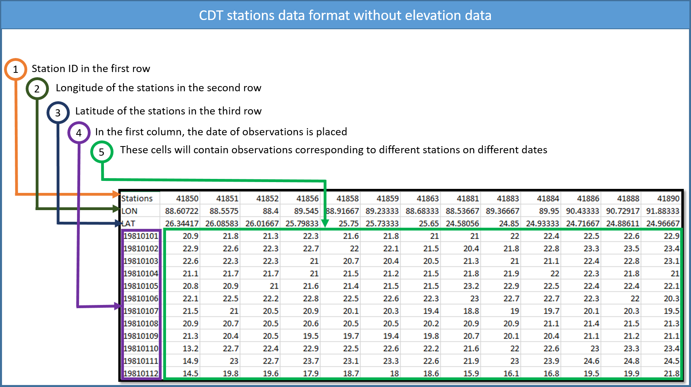

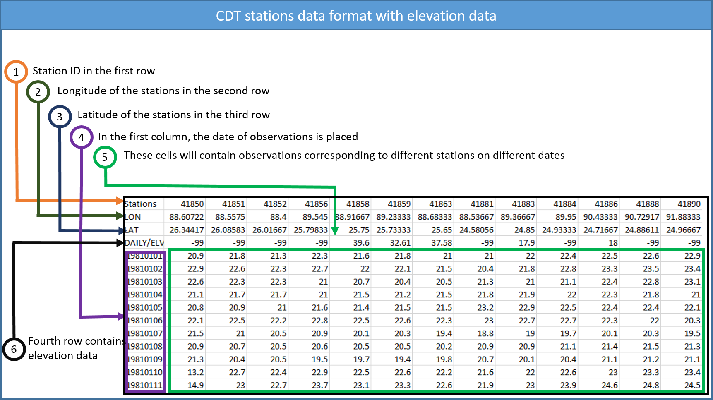

## Missing values in CDT

CDT use “-99” to flag missing values in the data series and “-9999” for anomalies data. You can use your own missing values flag (the missing values code you provided must be exactly the same as used in the data; for example, “-99.” and “-99.0” are different; you can not use “-99.” when “-99.0” is used in the input data series; it will produce some odd results).

## Date format

Date format must be grouped and there are several options available for specifying dates. For representational convenience, we represent years with 4 digit numbers denoted as YYYY, months as 2 digit numbers denoted as MM (between 01 and 12), the hour of day as also 2 digit numbers denoted as HH ranging between 00 and 23. Pentad divides every month into 6 parts where pentad 1 represents days between day 1 and 5, pentad 2 represents days between 6 and 10, pentad 3 represents days between 11 and 15, pentad 4 represents days between 16 and 20, pentad 5 represents days between 21 and 25, and pentad 5 represents days between 26 and the end of the month. Pentad is denoted as P. There are 3 dekads in a month where dekad 1 represents days between 1 and 10, dekad 2 represents days between 11 and 20, and dekad 3 represents days between 21 and the end of the month. Let dekad be denoted as D. The allowed date formats in CDT are shown in the table below.


|  | Date series |
| --- | --- | --- | --- | --- | --- |
|   | Hourly | Daily | Pentad | Dekadal | Monthly |  
| Format | YYYYMMDDHH | YYYYMMDD | YYYYMMP | YYYYMMD | YYYYMM |
| Example | 2020022823 for 23th hour of February 28th, 2020 | 20200228 for February 28th, 2020 | 1981126 for 6th pentad of December, 1981  | 2001023 for 3rd dekad of February, 2001 | 202105 for May, 2021 |

## CDT coordinates file

Sometimes CDT asks for the coordinates of the stations if it is not included in the file containing the data, i.e., the coordinates are stored in a separate file. CDT has a specific format to store the coordinates, in which the first column contains the ID or name of the stations (avoid putting space), the second column is for the long name of the stations, the third and fourth are longitude and latitude of the stations, the fifth column contains the elevation data in meter, and the following columns can contain any information about the stations.

You can edit the coordinates file on Excel spreadsheet and save it as a Comma Separated Values (CSV) file. It is useful for working on empty cells. If you edit the coordinates on Excel spreadsheet, you can leave blank the cells with missing values or fill it with missing values flag.

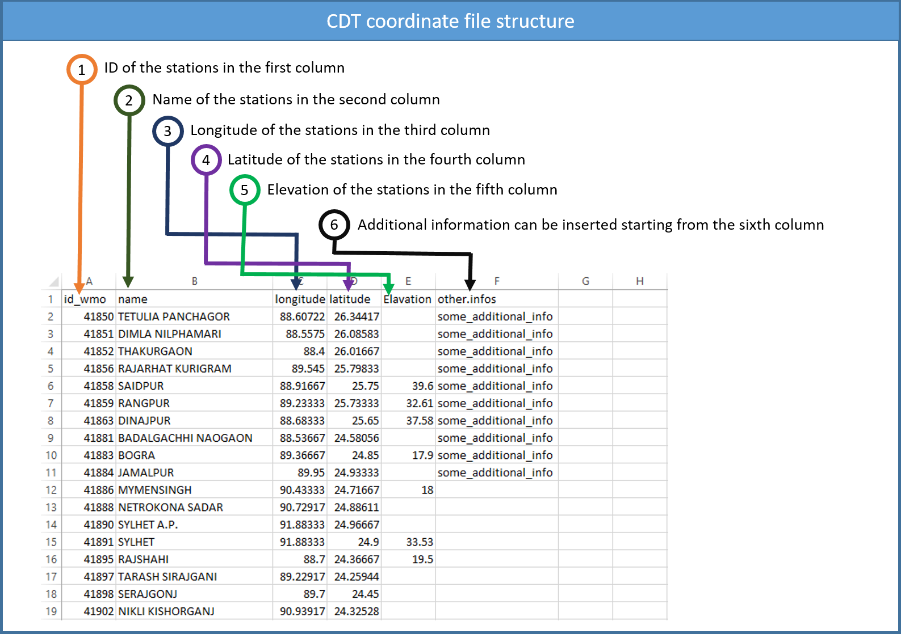

**Note:** The columns 1 to 5 must be present in the coordinates file and the order must be respected. The column containing the ID or name of the stations must be complete, this column shall not contain blank or missing values. The columns containing longitude and latitude of the stations shall not contain blank if you edit the coordinates file on Excel spreadsheet, you have to fill the blank with missing value code. You can leave blank the columns containing the long name and the elevation if they are not available.

You can add a header to this file, and specify it when you import the data to CDT.

## NetCDF data

NetCDF files contain one or more variables, which are usually structured as regular multi-dimensional arrays. CDT can handle 2D (lat/lon) NetCDF data with several variables, in other words data for each date should be stored in a separate file, and a file may contain only data for one hour, day, pentad, dekad or month. For example, if we have a dekadal rainfall series, then the data for each dekad should be stored in a separate file as shown in the table below:

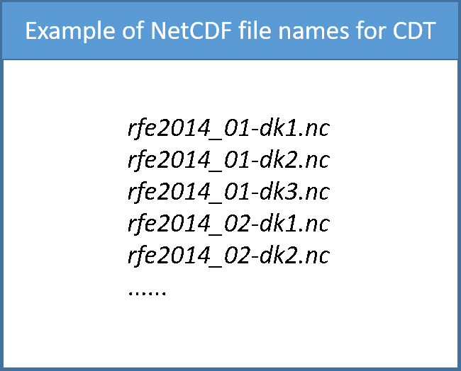  

## Format CDT input station data 

To perform different analyses and to use different functionalities available in CDT, you first need to convert row or station data to CDT station data format. To do this, in the Menu bar, click this path Data Preparation -> Format CDT Input Station Data.

Using CDT, we can format these two types of input files:

*	Data for different stations are already grouped in a single file but not in CDT station format
* Each station has its data stored in a separate file

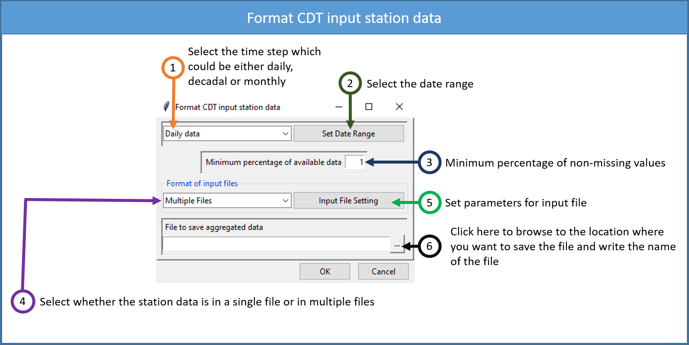

1.	Select the temporal frequency of your data. CDT gives three options: daily, dekadal and monthly data. 
2.	Select the time period for the final CDT station data output, even if different stations have different data ranges. If there are missing dates for some stations that do not match the selected period, the values for those dates will be filled with missing values.
3.	Enter the minimum percentage of non-missing values from a station to be selected for the selected period for the CDT station data output. If a station has a lower percentage of non-missing values than the specified percentage, it will be dropped in the CDT station data output.
4.	If the station data you have are in multiple files corresponding to multiple stations, select  Multiple Files. If all the station data are in a single file, select Single File.
5.	Click on Input File Setting to set the required parameters for the input file.
6.	We can either type or click on   to set the full path of the CDT station data output file. In case of the latter, a file dialog will open where we can write or select the full path of the output file. You can save it either as txt or CSV (comma separated values) file.

## Creating CDT station data from multiple input files

In this case, each station has its own separate file. Several formats are possible, the data can either have header (the column names) or not and can contain one or three variables in the following order: *precipitation - maximum temperature - minimum temperature*. Observations dates can be grouped or separated. The following examples give us an overview of possibility.

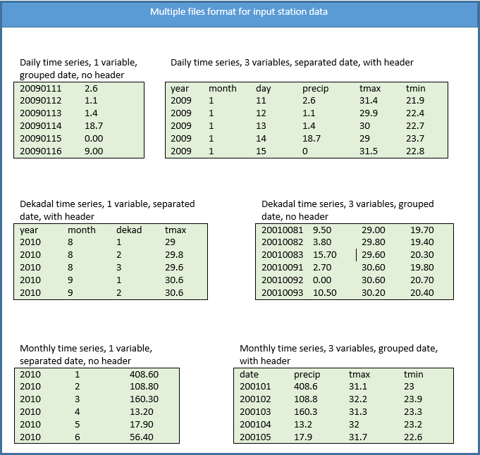

## Observation date types

Observations dates can have two types of template formats: grouped and separated. These are discussed below.

### Grouped

There is no space between the years (YYYY), months (MM), dekads (D) or the days (DD).

**Daily series:** YYYYMMDD; YYYY: year, MM: month (01-12), DD: day (01-31)

**Dekadal series:** YYYYMMD; YYYY: year, MM: month (01-12), D: dekad (1-3)

**Monthly series:** YYYYMM; YYYY: year, MM: month (01-12)

### Separated

Date separation depends on the field separator character of the file (space, tabs, comma, semicolon, …), the month and day format can be one or two digits.

**Daily series:** YYYY MM DD

**Dekadal series:** YYYY MM D

**Monthly series:** YYYY MM

**Example:**

As a simple illustration, suppose we have a daily precipitation data for 5 stations, each station has its own file and the name of each file should be the IDs of the station.

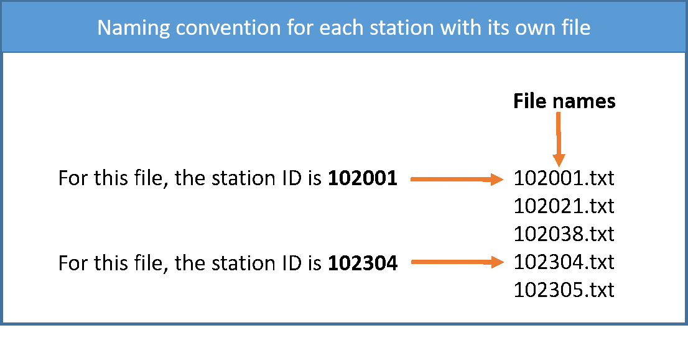

The format of data for each station must be the same. If we have a daily time series with separated date, the format of data in each file should be as follows

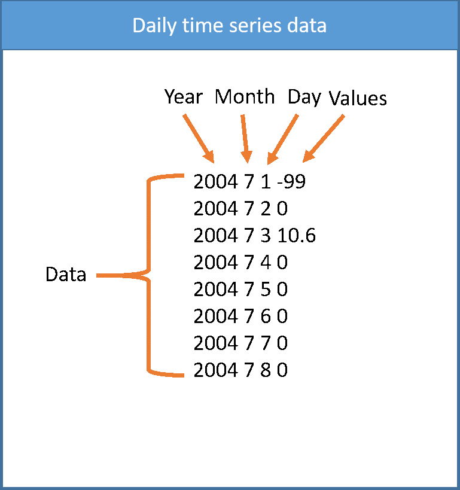{width=250px}

And the coordinates of the stations are saved in a separate file and in the format CDT coordinates file which we discussed before.

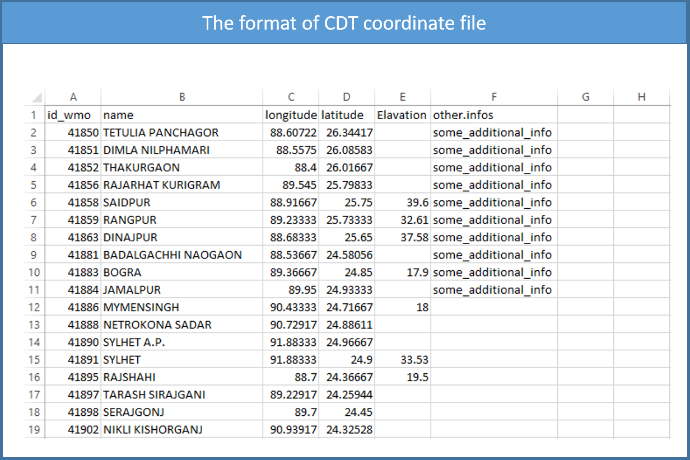

To provide all of this information to CDT, click on the button Input File Setting, it displays a dialog box

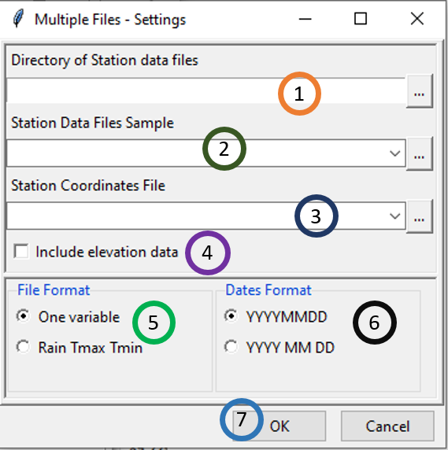

1.	Enter the full path to directory containing the station files, or browse through  
2.	Provide a sample of the data. Click on  and then click on one of the files.

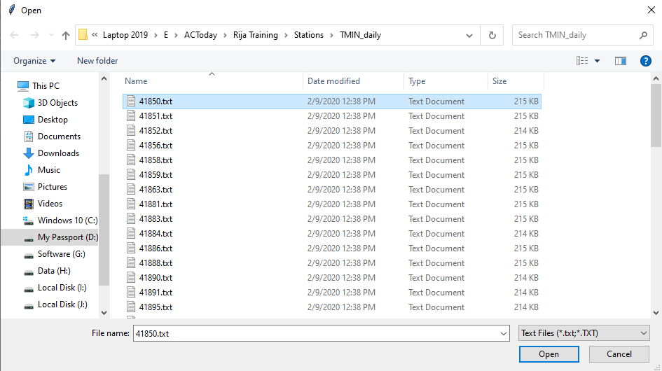

As we click on Open, we will see a dialog box similar to the following image. Note that we selected **Space** as **Delimiters** and **FALSE** for **First row as header**. Then click **OK**.

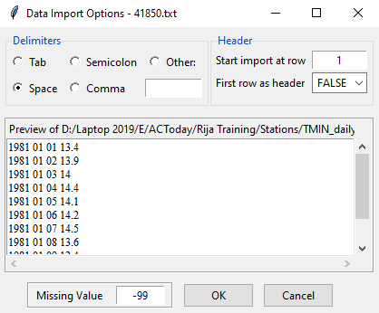

3. Select the file containing the station coordinates, if it is not opened yet, open it from   
Once we select and open this file, we will see another dialog box. Note that, as there is a header in this file, we selected **TRUE** for **First row as header** and selected **Comma** for **Delimiters**. Then click OK.

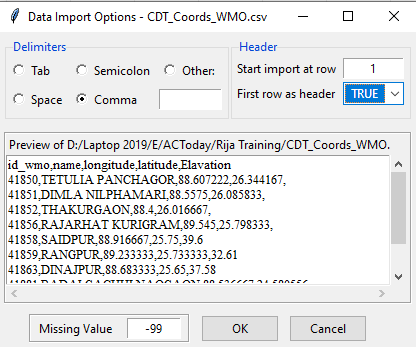

4.	Check this box, if you want to include the elevation data to the final CDT station data output, the CDT coordinates file must have a non-missing elevation data.

5.	Choose the number of climate variables in the file. In our example, we have only one variable (daily rainfall).

6.	Choose the format of date (grouped or separated). In our example, the date is separated with the format *YYYY MM DD*.

7.	Click on OK.

After that, click on  in the Tool bar to generate CDT station data from multiple station files.

## Single File

This time, all station data are already put together in a single file with a specific format which are described below. After selecting **Single File** from the drop-down list **Format of input files** and clicking the button **Input File Setting**, the following dialog box will appear.

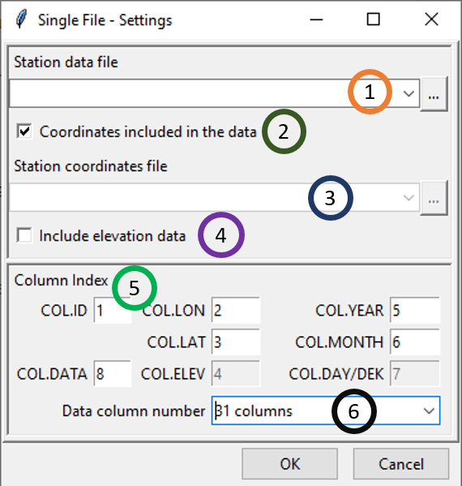

1.	Select the file containing the station data to be formatted, if the file is not loaded yet and therefore not listed, use  to open it.

2.	Check this box, if the coordinates of the station are included in the data.

3.	Select the file containing the station coordinates, if it is not included in the file containing the data. If the file is not loaded yet and therefore not listed, use  to open it.

4.	Check this box, if you want to include the elevation data to the final CDT station data output, provided that the data file contains an elevation data or the elevation data is not missing on the coordinates file.

5.	Specify the column number for:

    a. **COL.ID**: stations IDs
    b. **COL.LON**: longitude
    c. **COL.LAT**: latitude
    d. **COL.ELEV**: elevation data
    e. **COL.YEAR**: column containing the year
    f. **COL.MONTH**: month
    g. **COL.DAY/DEK**: column containing the day or dekad
    h. **COL.DATA**: column containing the climate variable or from which climate variable starts

6. Select the number of columns containing the climate variable.

    a. For daily data, there are 2 possible formats:
        * 1 column: the climate variable is placed in a single column.
        
        ```{r echo = FALSE, warning = FALSE}
        options(knitr.kable.NA = "**")
        data2 = data.frame(STATION_ID = c(102001, 102001, 102001, NA, 102001, 102001, NA, 102305, 102305, 102305, NA, 102304,   102304, NA),
             LONGITUDE = c(29.4, 29.4, 29.4, NA, 29.4, 29.4, NA, 28.75, 28.75, 29.75, NA,
                           29.91, 29.91, NA),
             LATITUDE = c(-1.9, -1.9, -1.9, NA, -1.9, -1.9, NA, -2.28, -2.28, -2.28, NA, 1.05, 1.05, NA),
             YEAR = c(2004, 2004, 2004, NA, 2005, 2005, NA, 2004, 2004, 2004, NA, 2004, 2004,NA), MONTH = c(7,7,7,NA,3,3,NA,10,10,10,NA,7,7,NA),
             DAY = c(1,2,3,NA,30,31,NA,1,2,3,NA,1,2,NA),
             PRECIP = c(-99,0,10.6, NA,2,0,NA, -99,0.5,0,NA,-99,-99,NA))
        knitr::kable(data2, digits = 3, format.args = list(scientific = FALSE), caption = "An example table caption.")
        ```

        * 31 columns: each month the climate variable is placed in 31 columns, one column is equivalent to one day.
        
        | station ID | station name | Abbreviation | longitude | latitude | elevation | district | Year | Month | 1 | 2 | 3 | 4 |         5 | ... | 26 | 27 | 28 | 29 | 30 | 31 | 
        | --- | --- | --- | --- | --- | --- | --- | --- | --- | --- | --- | --- | --- | --- | --- | --- | --- | --- | --- | --- |         --- | 
        |  |  |  |  |  |  |  |  |  |  |  |  |  |  |  |  |  |  |  |  |  |
        | 10201 | AZONTO | Prec | 29.4 | -1.9 | 1675 | ARLOT | 2004 | 7 | -99 | 0 | 10.6 | 0 | 0 | ... | 0 | 0 | 0 | 8.5 | 0 | 0         |
        | 10201 | AZONTO | Prec | 29.4 | -1.9 | 1675 | ARLOT | 2004 | 8 | 16.1 |  |  |  |  | ... | 0 | 10.1 | 0 | 0 |  |  |
        
        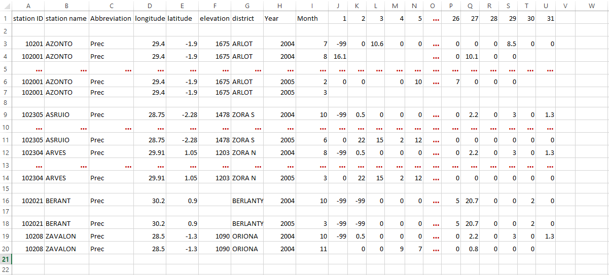

        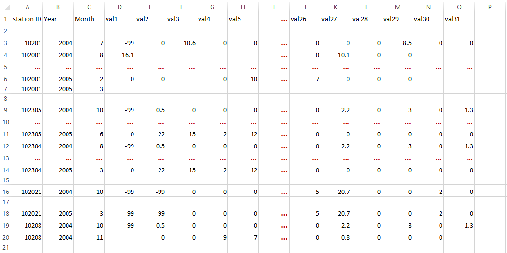
        
**Note**

If you edit the data on Excel spreadsheet, you can leave blank the cells with missing values or fill it with missing values flag, then save it as a Comma Separated Values (CSV) file.

In addition, you can leave empty a whole line.

For dekadal data, there are 3 possible formats:

*	1 column: the climate variable is placed in a single column.

    

```{r echo = FALSE, warning = FALSE}
options(knitr.kable.NA = "**")
data2 = data.frame(STATION_ID = c(102001, 102001, 102001, NA, 102305, 102305, NA, 102304, NA, 102021, 102021, NA, 102308,   102308, NA),
    LONGITUDE = c(29.4, 29.4, 29.4, NA, 28.75, 28.75, NA, 29.91, NA, 30.2, 30.2, NA, 28.5, 28.5, NA),
    LATITUDE = c(-1.9, -1.9, -1.9, NA, -2.28, -2.28, NA, 1.05, NA, 0.9, 0.9, NA, -1.3, -1.3, NA),
    YEAR = c(2004, 2004, 2004, NA, 2004, 2005, NA, 2004, NA, 2004, 2004, NA, 2005, 2005,NA), MONTH = c(7,7,7,NA,12,1,NA,7,NA,9,10,NA,6,6,NA),
      DEKAD = c(1,2,3,NA,3,1,NA,3,NA,3,1,NA,2,3,NA),
      PRECIP = c(-99,0,10.6, NA,2,0,NA, -99,NA,-99,31.3,NA,84,42.6,NA))
knitr::kable(data2, digits = 3, format.args = list(scientific = FALSE), caption = "An example table caption.")
```
    

```{r echo = FALSE, warning = FALSE}
options(knitr.kable.NA = "**")
data2 = data.frame(STATION_ID = c(102001, 102001, NA, 102305, 102305, 102305, NA, 102304, 102304, NA, 102021, 102021, NA, 102308,   102308, NA),
    LONGITUDE = c(29.4, 29.4, NA, 28.75, 28.75, 28.75, NA, 29.91, 29.91, NA, 30.2, 30.2, NA, 28.5, 28.5, NA),
    LATITUDE = c(-1.9, -1.9, NA, -2.28, -2.28, -2.28, NA, 1.05, 1.05, NA, 0.9, 0.9, NA, -1.3, -1.3, NA),
    YEAR = c(2004, 2004, NA, 2004, 2004, 2005, NA, 2004, 2004, NA, 2004, 2004, NA, 2004, 2004,NA), MONTH = c(7,8,NA,11,12,1,NA,10,11,NA,9,10,NA,9,10,NA),
      dekad1 = c(31.3, 53.2,NA,25.8,0.7,12.5,NA,1,-99,NA,-99,31.3,NA,-99,1,NA),
      dekad2 = c(14.6,10.1,NA,6.2,0,16.6,NA,2.8,-99,NA,-99,14.6,NA,-99,2.8,NA),
    dekad3 = c(19.3, 20.1, NA, 5.3,12,61,NA,7,-99,NA,-99,19.3,NA,NA,7,NA))
knitr::kable(data2, digits = 3, format.args = list(scientific = FALSE), caption = "An example table caption.")
```
    
* 36 columns: each year the climate variable is placed in 36 columns, one column is equivalent to one dekad.

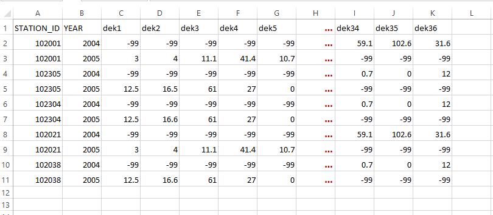

Monthly data, there are 2 possible formats:

* 1 column: the climate variable is placed in a single column

```{r echo = FALSE, warning = FALSE}
options(knitr.kable.NA = "**")
data2 = data.frame(STATION_ID = c(102001, 102001, NA, 102001, 102001, 102001, NA, 102305, 102305, NA, 102308, 102308, NA, 102304, 102304),
    LONGITUDE = c(29.4, 29.4, NA, 30.2, 30.2, 30.2, NA, 28.75, 28.75, NA, 28.5, 28.5, NA, 29.91, 29.91),
    LATITUDE = c(-1.9, -1.9, NA, 0.9, 0.9, 0.9, NA, -2.28, -2.28, NA, -1.3, -1.3, NA, 1.05, 1.05),
    YEAR = c(2004, 2004, NA, 2004, 2005, 2005, NA, 2004, 2004, NA, 2005, 2005, NA, 2005, 2005), MONTH = c(7,8,NA,12,1,2,NA,9,10,NA,5,6,NA,3,4),
      precip = c(65.2,83.4,NA,193.8,18.1,69.3,NA,-99,10.8,NA,27,183.6,NA,183.6,-99))
knitr::kable(data2, digits = 3, format.args = list(scientific = FALSE), caption = "An example table caption.")
```

* 12 columns: each year the climate variable is placed in 12 columns, one column is equivalent to one month.

    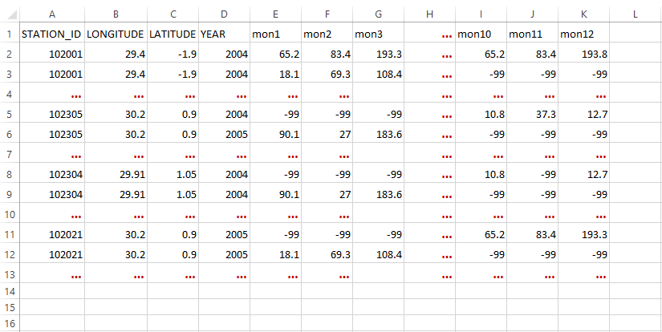
    
Click on the button  in the *Tool bar* to execute.

## Manipulating CDT station data

This section of the CDT allows you to merge two CDT stations data, filter CDT station data and select CDT station data by excluding one station data from another. These features are available under the Menu **Data Preparation -> Manipulating CDT Station Data**.

## Merge two CDT station data

To merge CDT station data from two different files into one file, use **Data Preparation -> Manipulating CDT Station Data -> Merge two CDT station data**. This will display a dialog box like the following.

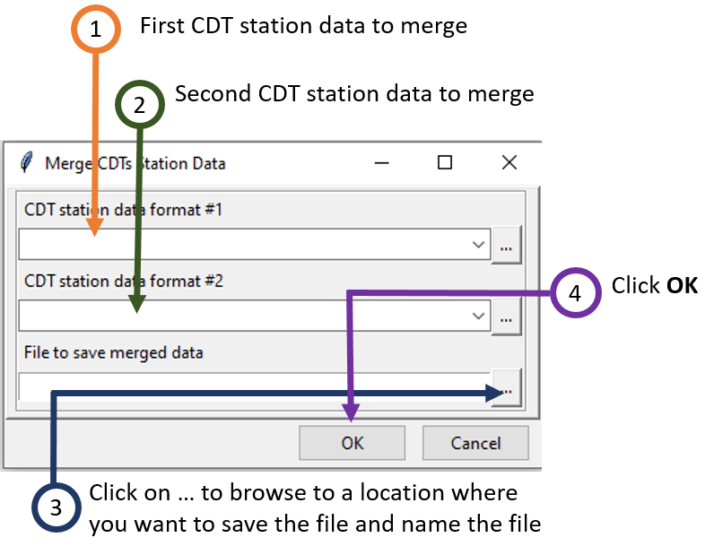

1.	Select the first CDT station data with the drop down list if it is already loaded, or open it through   
2.	Similarly, select the second CDT station data either using drop down if it was loaded before or using  
3.	Enter the name of the file to save the merged CDT station data or the full path to the file. You can also click on  , it opens a file dialog where you can select or type the name, path and type of file, either txt or csv.
4.	Now, click **OK**. This will close the dialog box.

Now, click on the button  in the Tool bar to execute the merging of these two CDT files. After it is executed, a new file will be created in the specified folder as you selected in step 3.

## Filtering CDT station data

In the CDT station data, if you want to include only the stations that have a given percentage of available data, use **Data Preparation -> Manipulating CDT Station Data -> Filtering CDT Station Data**. It will display a dialog box like below.

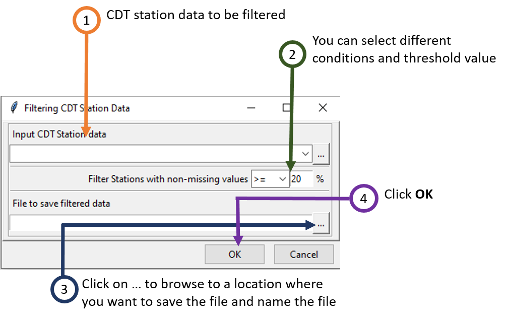

1.	Select the file containing the station data to be filtered, if the file is not loaded yet and therefore not listed, use  to open it.
2.	Select from the drop down list the operator to be used. You can use any of the following operators: **>=** (greater than or equal to), **>** (greater than), **<=** (less than or equal to), **<** (less than), and then enter the percentage of data to be filtered.
3.	Enter the name of the file to save the filtered stations data or the full path to the file. You can also click on , it opens a file dialog where you can select or type the name, path and type of the file, either txt or csv.
4.	Now, click **OK**. This will close the dialog box.

Now, click on the button  in the Tool bar to execute filtering the CDT station data. After it is executed, a new file will be created with only those stations that meet the requirement specified in step 2.

## Selecting CDT station data

Use **Data Preparation -> Manipulating CDT Station Data -> Selecting CDT station data**
to use this feature. This option allows to select some stations with a given percentage of available data from a CDT station data format and these stations are not included in other CDT station data.

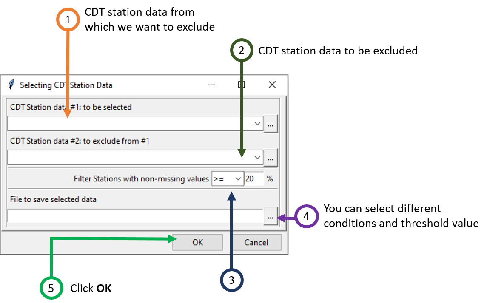
1.	Select the file containing the station data in which some stations will be selected, if the file is not loaded yet and therefore not listed, use  to open it.
2.	Select the file containing the station data that will not be included on the output. These stations are included in (**1**), but will be excluded when filtering the data from (**1**).
3.	Select from the drop down list the operator to be used. You can use any of the following operators: **>=** (greater than or equal to), **>** (greater than), **<=** (less than or equal to), **<** (less than), and then enter the percentage of data to be filtered.
4.	Enter the name of the file to save the selected stations data or the full path to the file. You can also click on  , it opens a file dialog where you can select or type the name, path and type of file (txt or csv).
5.	Now, click **OK**. This will close the dialog box.

Now, click on the button  in the Tool bar to execute selecting the CDT station data by excluding some CDT station data as specified in step 2 and also excluding the stations that did not meet the filter criteria as specified in step 3. After it is executed, a new file will be created with only those stations that meet the requirement.

## Assess data availability

Using this feature, we can check both the spatial and temporal availability of station data. We can avail this using the menu **Data Preparation -> Assess Data Availability**. This will open a widget in the Workspace in the left panel. Using this widget, you can enter or specify your input data, parameters and select different output options which will show output accordingly in the **Output area**. 

The tab **Input Data** allows to specify the input station data.

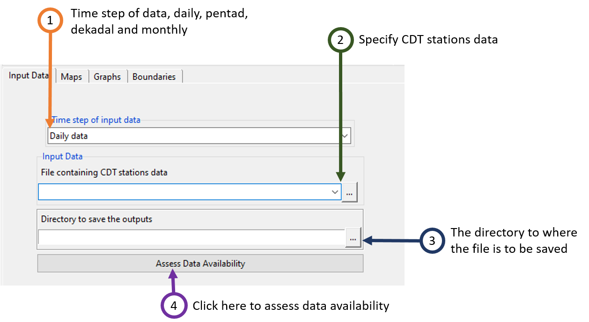

1.	Select the time step of the station data to assess. You can choose from 4 different time steps which are daily, pentad, dekadal and monthly.
2.	Select from the drop-down list the file containing the station data if it is already loaded, or open it from the browse button on the right.
3.	Type the full path to the folder to save the outputs, or use the browse button .
4.	Click the button **Assess Data Availability** to run the assessment.


This creates a folder named **ASSESS.DATA.AVAILABILITY_data** under the folder you provided (3) to save the results of the assessment. Inside this folder 2 directories and 1 file are created:

* **CDTDATASET**: directory containing all the required files used by CDT
* **CDTSTATIONS**: directory containing 4 CSV files, Annual_Average_number-stations.csv: yearly average, minimum and maximum number of stations reporting data, DataAvailability_percentage.csv: percentage of non missing values for each station in CDT station data format, Monthly_non-missing.csv: number of non missing data for each station and each month in CDT station format. Yearly_non-missing.csv: number of non missing data for each station and each year in CDT station format.
* **AssessDataAvailability.rds**: an index file, you will need to reload the outputs of the assessment if you want to visualize the results later.

**Note**: Each time you perform a station data availability assessment, rename the folder **ASSESS.DATA.AVAILABILITY_data** or change the folder to save the outputs because CDT overwrites it.

The tab **Maps** allows to display a map of the percentage of non-missing values and the number of non-missing values for each year.

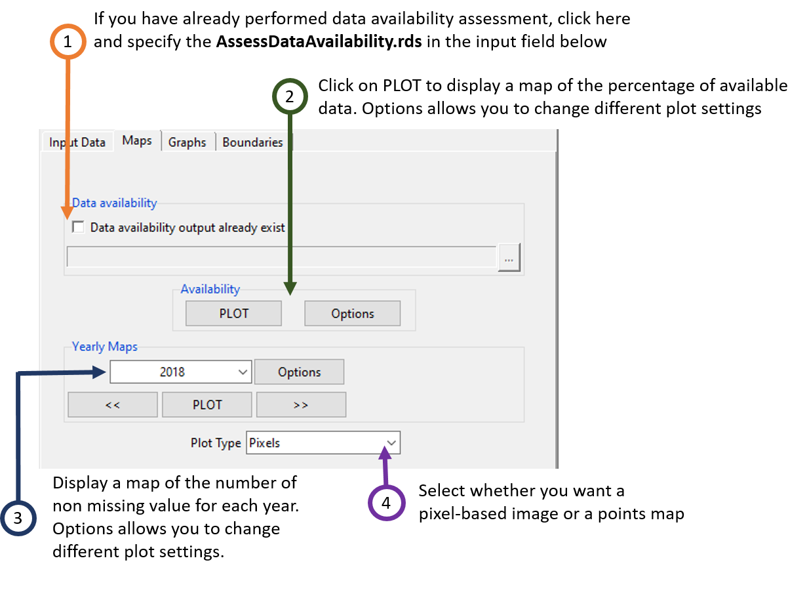

1.	If you already performed a station data availability assessment, you do not need to run it again, you can check this box, the input field below will be activated and you can provide the full path to **AssessDataAvailability.rds** under the folder **ASSESS.DATA.AVAILABILITY_data** by browsing to it through the button  on the right.
2.	Click on the button **PLOT** to display a map of the percentage of available data. The button **Options** allows you to change the colorkey settings, the label of the axis and the title of the map.

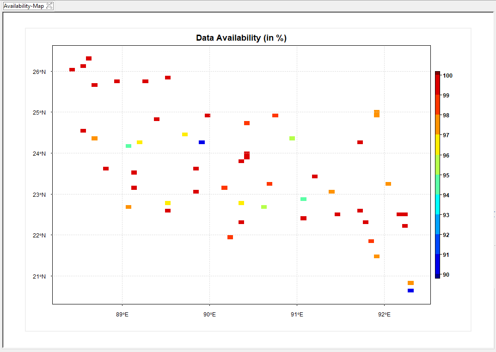

3.	To display a map of the number of non-missing values for each year, enter the year to be displayed then click on the button **PLOT**. You can use the buttons **<<**   and **>>**  to switch to the previous or next year. The button **Options** allows you to change the colorkey settings, the label of the axis and the title of the map etc.

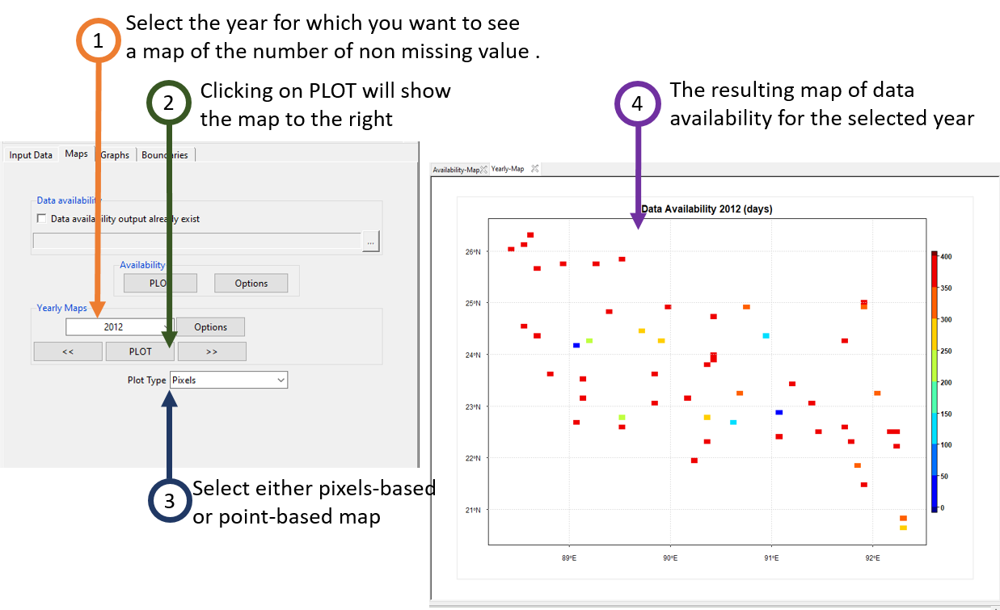

The tab **Graphs** allows to display a chart or table of available data, the annual average of station reporting data, and a distance-correlation graphic.

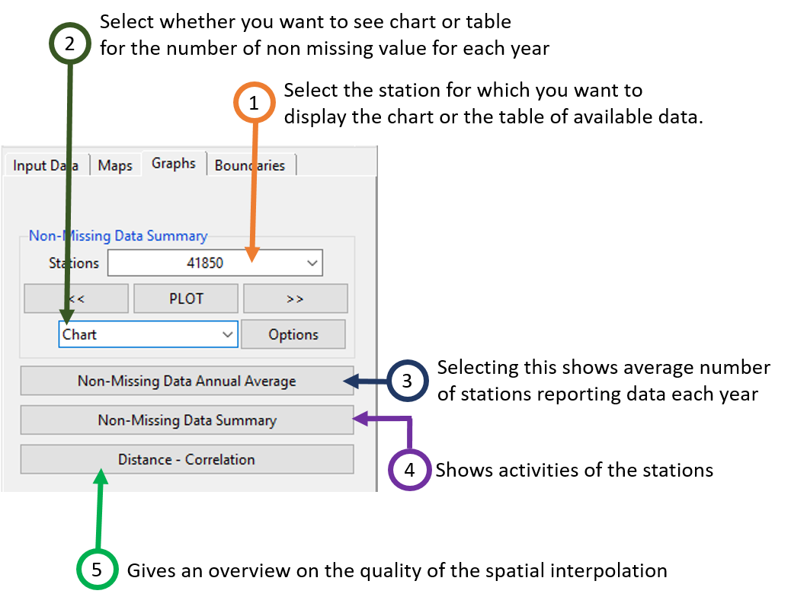

1.	Select here the station you want to display the chart or the table of available data. If you select the station from the drop-down list, click on the button **PLOT** to display the chart and **DISPLAY** for table. You can use the buttons  **<<**  and **>>**  to switch to the previous or next station.
2.	Select what you want to display, **Chart** or **Table**.
The chart displays the number of non-missing value for each year

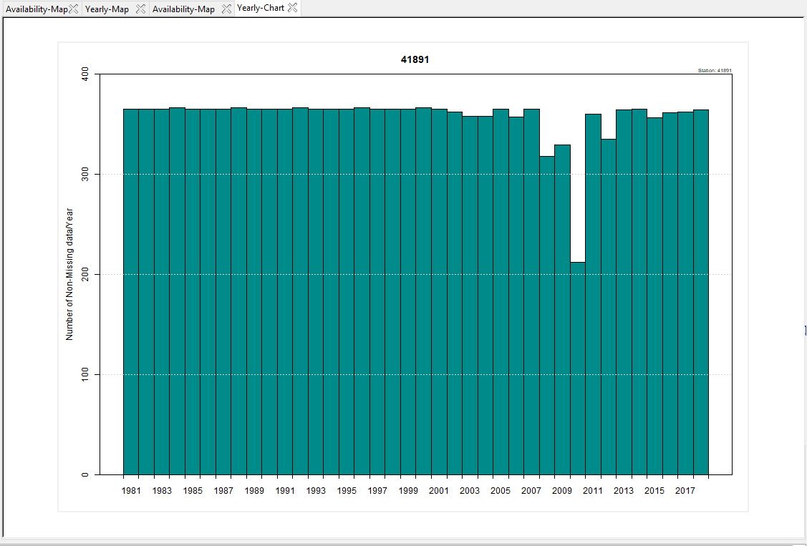

The table displays the number of non-missing value for each month.

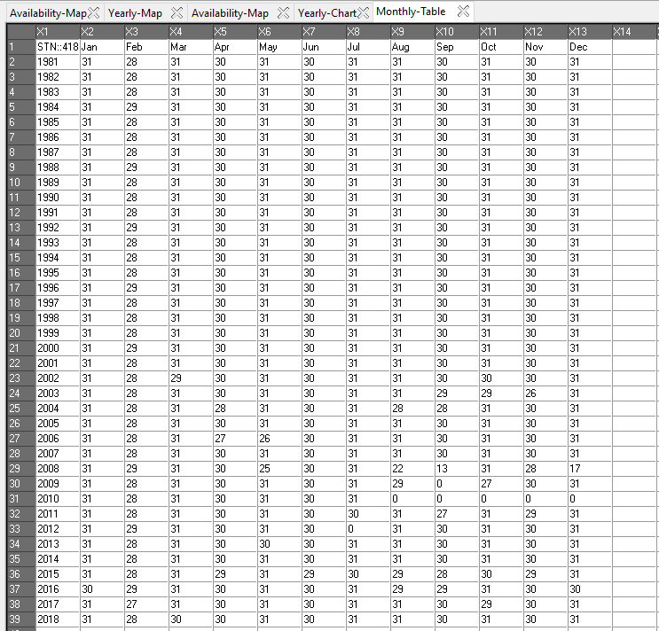

3.	Click the button Non-Missing Data Annual Average to display a graphic of the average number of stations reporting data each year.

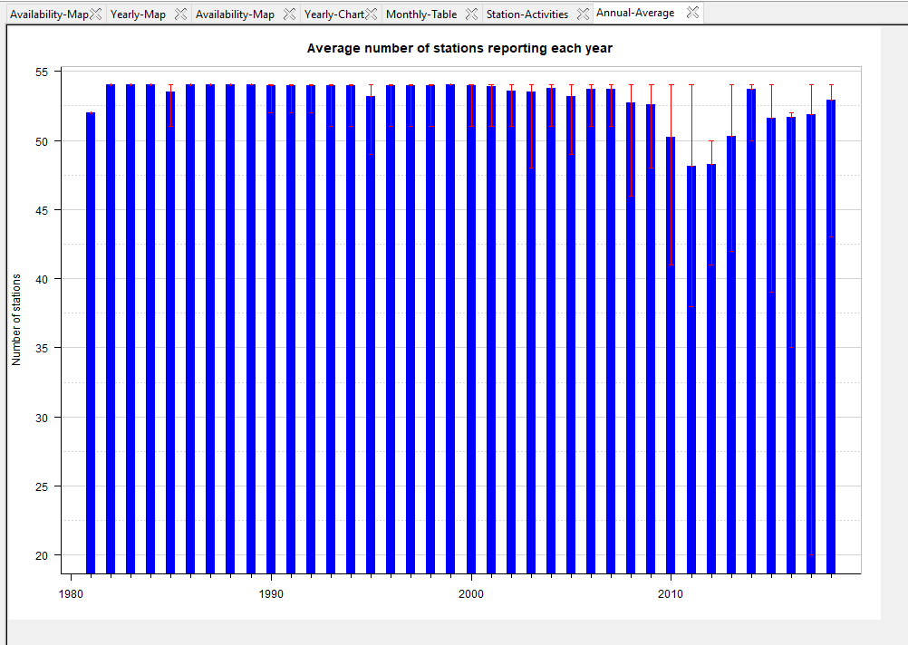

4.	Click the button **Non-Missing Data Summary** to display a graphic of the activities of the stations. The pink area represents the number of station reporting data and the cyan area represents the number of station with missing values (the stations are supposed to be in running but not report data).

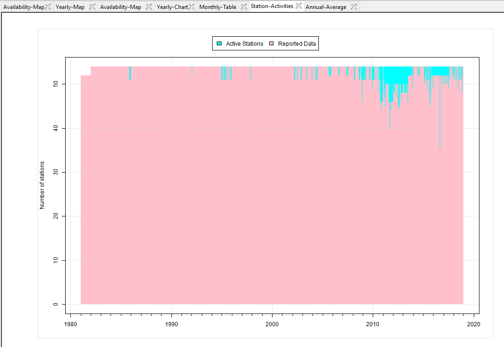

5.	The button **Distance -> Correlation** displays a graphic based on distance and correlation. It allows you to have an overview on the quality of the spatial interpolation when you want to interpolate those stations data.

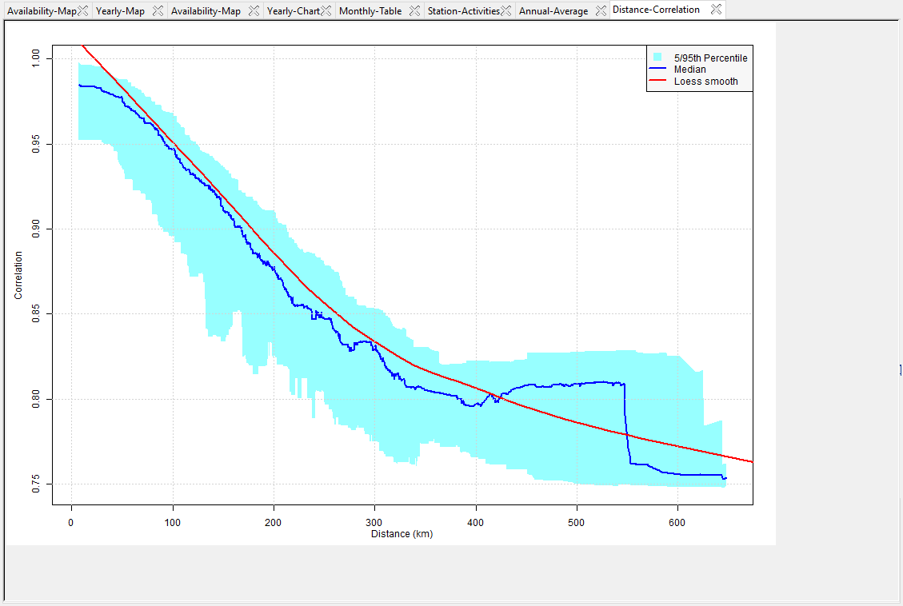

The tab **Boundaries** allows to add a shapefile on the map.

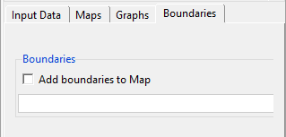

Check the box and select the shapefile from the drop-down list or open it from to add boundaries to the active map. Click on the button **Options** to change the width and of the color of the lines.

## Download data using CDT

Users can download different data including digital elevation model, shapefile, satellite rainfall estimates data and reanalysis data inside CDT for meteorological and climatological analysis. We can specify the spatial domain (area of interest), temporal domain and time domain of interest and CDT will download accordingly these for us. Using IRI data library, many of these data products can be downloaded from either the IRI Data Library (Blumenthal et al., 2014) or from the original source for the respective data product. 

The following eight rainfall estimates are available through CDT:

* ARC (Africa Rainfall Climatology; Novella and Thiaw, 2013);
* CHIRP/S (the Climate Hazards Group Infrared Precipitation and combined with station data; Funk et al., 2015).
* CMORPH [Climate Prediction Center (CPC) Morphing Techniques; Joyce et al., 2004],
* GPM (Global Precipitation Measurement Mission; Hou et al., 2014)
* PERSIANN (Precipitation Estimation from Remotely Sensed Information using Artificial Neural Networks; Nguyen et al., 2018)
* RFE [Famine Early Warning System NETwork (FEWS NET) satellite rainfall estimate; Xie et al., 2017],
* TAMSAT [Tropical Applications of Meteorology using SATellite and ground-based observations (TAMSAT); Grimes et al., 1999; Thorne et al., 2001]
* TMPA (TRMM Multi- Satellite Precipitation Analysis; Huffman et al., 2010).

For temperature data, three different climate reanalysis products are available:

* Japanese 55-year Reanalysis (JRA55);
* Modern-Era Retrospective Analysis 2 (MERRA2); and
* European Center for Medium-Range Weather Forecasts (ECMWF-ERA5).

CDT also allows users to download ancillary data such as digital elevation models and country administrative boundaries as shapefiles. Once data is downloaded, it can be further processed using different aggregation functions such as sum, average, minimum, maximum, count, etc. NetCDF format is the native gridded data format used by CDT and it can export data to different formats such as Climate Predictability Tool (CPT), GeoTiff, and GrADS.

### Download Digital Elevation Model

Using the menu **Data Preparation -> Download Digital Elevation Model** will open a dialog box using which we can download digital elevation model with a spatial resolution of 1 and 2 arc-minute for different areas as specified by you.

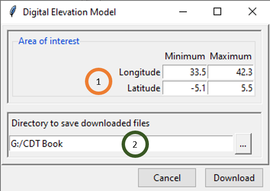

1. Set the bounding box of the area to be downloaded. Type in the fields the minimum and maximum of the longitude and latitude in degree decimal.
2. Specify the folder to save the downloaded DEM by browsing it from the button  or typing the full path to the folder.

Two files in NetCDF format will be downloaded into the folder you specified in (2):

1. DEM_1_Arc-Minute.nc: ETOPO1 Grid Registered 1 Arc-Minute Global Relief Model.
2. DEM_2_Arc-Minute.nc: ETOPO2v2c Global Gridded 2-minute elevation and bathymetric data.

### Download different country administrative boundaries or shapefile

The menu **Data Preparation -> Download Country boundary** allows to download the country outlines and administrative subdivisions for countries from one of the three continents, namely, Africa, South East Asia and South-Central America and Caribbean from [GADM](https://gadm.org/index.html) data.

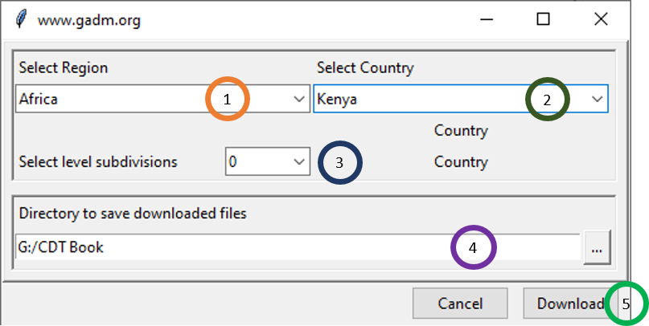

1. Select the region where the country is located
2. Select the country from the drop-down list.
3. Select the administrative subdivisions to download. 0 is the country boundaries, 1 is the first subdivision (example: Region), 2 is the second subdivision (example: District), 3 is the third subdivision (example: Sub-district), and so on.
4. Specify the folder to save the downloaded ESRI shapefile by browsing it from the button or typing the full path to the folder.
5. Click on Download to download the shapefile according to the specifications.

### Download proxy and ancilliary data

Using CDT, users can download and process different proxy and ancilliary data for meteorological and climatological analysis. For rainfall, satellite rainfall estimates are available whereas for temperature, renaalysis products are available through CDT. The following eight rainfall estimates are available through CDT:

* ARC (Africa Rainfall Climatology; Novella and Thiaw, 2013);
* CHIRP/S (the Climate Hazards Group Infrared Precipitation and combined with station data; Funk et al., 2015).
* CMORPH [Climate Prediction Center (CPC) Morphing Techniques; Joyce et al., 2004],
* GPM (Global Precipitation Measurement Mission; Hou et al., 2014)
* PERSIANN (Precipitation Estimation from Remotely Sensed Information using Artificial Neural Networks; Nguyen et al., 2018)
* RFE [Famine Early Warning System NETwork (FEWS NET) satellite rainfall estimate; Xie et al., 2017],
* TAMSAT [Tropical Applications of Meteorology using SATellite and ground-based observations (TAMSAT); Grimes et al., 1999; Thorne et al., 2001]
* TMPA (TRMM Multi- Satellite Precipitation Analysis; Huffman et al., 2010).

For temperature data, three different climate reanalysis products are available:

* Japanese 55-year Reanalysis (JRA55);
* Modern-Era Retrospective Analysis 2 (MERRA2); and
* European Center for Medium-Range Weather Forecasts (ECMWF-ERA5).

The CDT allows users to download data according to the spatial and temporal dimension of their interest, thus allowing the users to subset according to their needs. These datasets can also be downloaded using IRI Data Library (Blumenthal et al., 2014)

### Download satellite rainfall estimates data

The menu **Data Preparation -> Download Data -> Download Satellite Rainfall Estimates** data allows to download satellite rainfall products from 30 minutes to monthly temporal resolution.

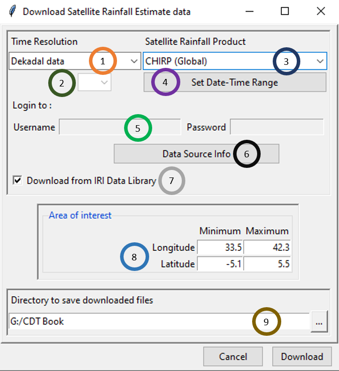

1. Select the temporal resolution of the satellite rainfall estimate product to download. Different options available for time resolution are: minutes data, hourly data, daily data, pentad data, dekadal data and monthly data.

2. In case of minutes or hourly data, select here the time step.

3. Select the satellite rainfall estimate product to download. There are different options available according to different time resolutions.

4. Set the date and time range of the data to download. See Setting date range for more details.

5. If the satellite rainfall estimate product requires a login to download the data, enter here the user name and the password you use to log in to your account. The URL of the website for login is displayed next to the label Login to. If you do not have an account yet, you can sign up to this URL.

6. Click this button to display the information about the data. It will open your default web browser and display the link to the data or relevant information about the data.

7. In case of this checkbox is activated, check it if you want to download the data from the Data Library of IRI. The IRI Data Library allows you to subset the data before downloading it into your computer, and it makes the download faster.

8. Set the bounding box of the area to be downloaded. Type in the fields the minimum and maximum of the longitude and latitude in degree decimal.

9. Specify the folder to save the downloaded rainfall data by browsing it from the button or typing the full path to the folder. Click Download to start downloading data according to the specifications you provided.

A folder containing the downloaded data will be created under the directory you provided in (9). This folder is created from the name of the satellite rainfall estimate product and the time step of the data. For the example shown in the figure, a new folder named **CHIRP_dekadal** will be created as CHIRP (Global) with dekadal time step was selected.

### Download reanalysis data

The menu **Data Preparation -> Download Data -> Download Reanalysis data** allows to download the minimum and maximum temperature data from different reanalysis products.

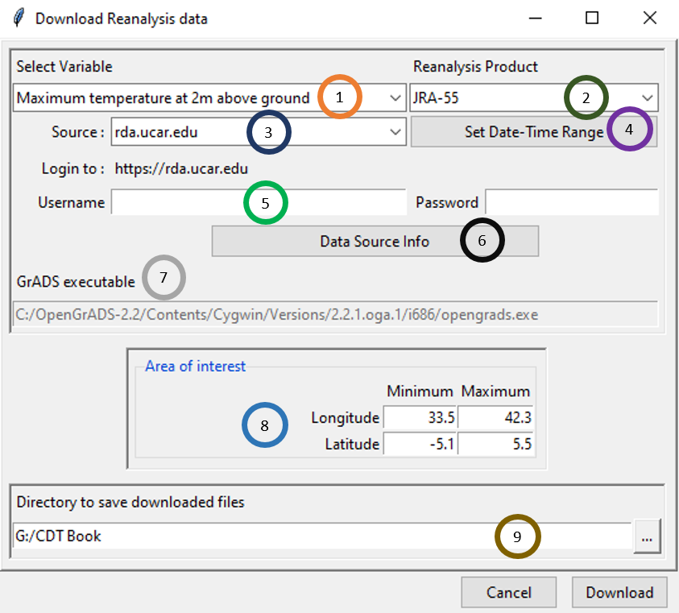

1.	Select the variable you want to download. For the moment CDT allows you to download 2 variables minimum and maximum temperature.

2.	Select the reanalysis product. CDT allows you to get the data from 3 reanalysis products: JRA-55 (3 hourly temporal resolution), MERRA-2 (daily temporal resolution) and ERA5 (still under construction).

3.	Select the data portal you want to use to download the data.

    **Note for JRA-55**

    The portal rda.ucar.edu is updated every 6 month, use this portal if you want to download a long series of data.

    The portal jra.kishou.go.jp is updated every 3 hour with approximately 2 days latency, use this portal if you want to download the latest available data.

4.	Set the date and time range of the data to download. See Setting date range for more details.

5.	If the data portal requires a login to download the data, enter here the user name and the password you use to log in to your account. The URL of the data portal is displayed next to the label Login to. If you do not have an account yet, you can sign up to this URL.

6.	Click this button to display the information about the data. It will open your default web browser and display the link to the data portal.

7.	In case this field is activated, enter here the full path to the executable of the software (GrADS or python) displayed on the label above to be used to format and extract the data. Check it if you want to download the data from the Data Library of IRI. The IRI Data Library allows you to subset the data before downloading it into your computer, and it makes the download faster.

8.	Set the bounding box of the area to be downloaded. Type in the fields the minimum and maximum of the longitude and latitude in degree decimal.

9.	Specify the folder to save the downloaded data by browsing it from the button   or typing the full path to the folder.

A folder containing the downloaded data will be created under the directory you provided in (9). This folder is created from the name of the reanalysis product and the time step of the data.

## Aggregate data

### Aggregating time series

The menu **Data Preparation -> Aggregate Data -> Aggregating Time Series** allows to perform a temporal aggregation. For example, if you have daily data, you can aggregate into pentad, dekadal, monthly or seasonal data.

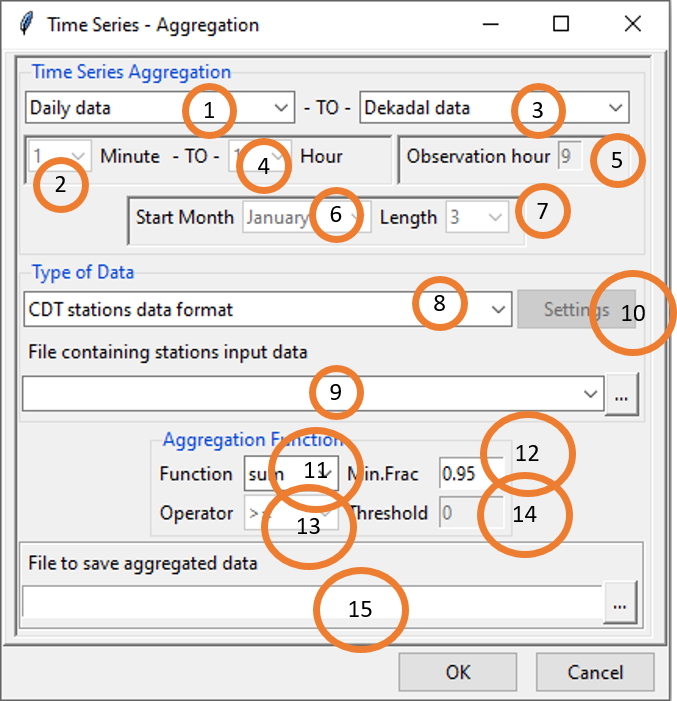

1.	Select the temporal resolution of the input data to aggregate. Valid options: minutes, hourly, daily, pentad, dekadal or monthly data.
2.	In case of minutes and hourly, select here the time step of the input data.
3.	Select the time step in which the data will be aggregated.

    Minutes: If the time step of input is minutes (5, 10, 15 and 30), you can aggregate it to a minutes data with a time step greater than the input.

    Hourly: If the time step of input is minutes (5, 10, 15 and 30) or hourly (1, 3, 6 and 12), you can aggregate it to a hourly data with a time step greater than the input for hourly input data.
    Daily: If the time step of input is minutes (5, 10, 15 and 30) or hourly (1, 3, 6 and 12), you can aggregate it to a daily data.
    Pentad: There are 6 pentads in a calendar month. The pentad must be 1, 2, 3, 4, 5 or 6; pentad 1 (contains the days from the 1st to 5th), pentad 2 (6th to 10th), pentad 3 (11th to 15th), pentad 4 (16th to 20th), pentad 5 (21st to 25th) and pentad 6 (26th to the end of the month).
    Dekadal: There are 3 dekads in a calendar month. The dekad must be 1, 2 or 3; dekad 1 (contains the days from the 1st to 10th), dekad 2 (11th to 20th) and dekad 3 (21st to the end of the month).
    Monthly: The data will be aggregated monthly.
    Annual: The data will be aggregated from January to December for each year.
    Seasonal: The data will be aggregated for each season of the year. The length of the season varies from 2 to 12 months.
    Rolling Seasonal: The data will be aggregated over a rolling season. For example, for a seasonal data with 3 months length, the following seasons will be calculated for each year: JFM, FMA, MAM, AMJ, MJJ, JJA, JAS, ASO, SON, OND, NDJ, DJF.

4.	If the outputs are minutes or hourly, select the time step of the aggregated data.

5.	If the inputs are minutes (5, 10, 15 and 30) or hourly (1 and 3) and the output time step is daily, specify here the observation hour to compute the daily data. For example: the cumulative rainfall recorded on 2018-07-30 at 9:00 is the rainfall for the day 2018-07-29.

6.	If the outputs are seasonal, select the start month of the season.

7.	If the outputs are seasonal or rolling seasonal, select the length of the season.

8.	Select the input data format to convert. Available data formats are: CDT stations data format, CDT dataset format (gridded) and NetCDF gridded data.

9.	If the input data is a CDT station data format, select from the drop-down list the file containing the station data to be converted if it is already loaded, or open it from the browse button   on the right. If the input data is a CDT dataset format (gridded), type the full path to the index file of the CDT dataset or browse it. In case of NetCDF gridded data, type the full path to the folder containing the NetCDF files or browse it.

10.	In case of NetCDF gridded data, click on the button Settings. A dialog box will be displayed in which you can set the date range, provide a sample file and change the filename format of the NetCDF file.

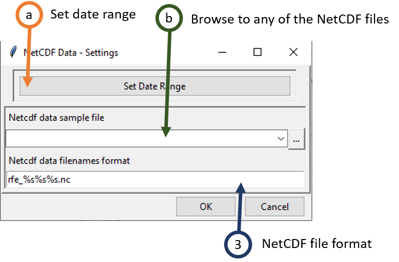
a.	Set the date range of the data to be aggregated. See Setting date range for more details.
b.	Provide a NetCDF sample file.
c.	Change the filename format to conform with the NetCDF files name. See NetCDF filename format for more details.

11. Select the function to use to aggregate the data. Valid options: mean (average), sum (total), max (maximum) or min (minimum). If the time step of the input data is daily, a function count is available which allows to compute the number of days when a variable is less or greater than a given threshold.

12. Minimum fraction of available data that must be present within each output time step (otherwise result is missing).

13. In case of the function count, select the operator to be applied.

14. In case of the function count, specify the threshold to be used.

15. If the input data is a CDT station data format, type the name of the file to save the aggregated data or the full path to the file or browse it from the button  on the right. For CDT dataset format (gridded) and NetCDF gridded data, type the full path to the folder to save the aggregated data or browse it.

Click on the button  to aggregate the data.

For CDT dataset format (gridded) and NetCDF gridded data, the aggregated data are saved in a new folder named Aggregated_Data under the folder you provided to save the output in (15).

### Aggregate/disaggregate spatial NetCDF data

The menu **Data Preparation -> Aggregate Data -> Aggregate/Disaggregate Spatial NetCDF data** allows to perform spatial aggregation and disaggregation, or, regridding. Regridding is the process of interpolating from one grid resolution to a different grid resolution. For example, if you have a file with 5 km by 5km resolution and you want to covert this to 10 km by 10km resolution, then the process of converting from 5km resolution to 10km resolution is called regridding. Similarly, if you have a file with 5 km resolution and you want to get it in a finer, say, 2km resolution, then this is also called regridding.

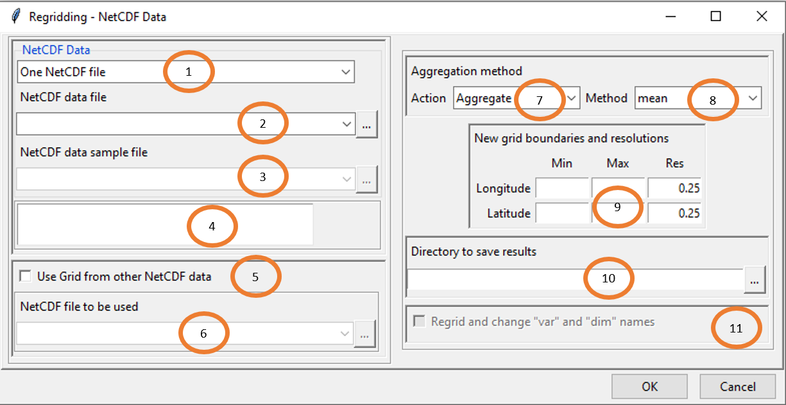

1.	Select the number of files to regrid. Valid options: One NetCDF file or Multiple NetCDF files.

2.	If you want to regrid one NetCDF file, select the file from the drop-down list if it is already loaded or open it from the button   on the right. In case of multiple NetCDF files, type the full path to the folder containing the NetCDF files or browse it.

3.	In case of multiple NetCDF files, provide a NetCDF sample file.

4.	The bounding box and the resolution of the data will be displayed in this area.

5.	Check this box if the grid points to be used for the regridding are from other NetCDF file.

6.	Provide the NetCDF file whose grid will be used to regrid the data.

7.	Select the regridding to use. Valid options:

* Aggregate: Regrid data from high resolution into coarse resolution.
* Disaggregate: Regrid data from coarse resolution into high resolution. Spatial disaggregation should be used and interpreted with the utmost caution. No additional information other than what is already contained in the original data is obtained.

8.	In case of aggregation, if you set yourself the new grid, two interpolation methods are available: mean and bilinear interpolation. The mean method consist in averaging the values from the old grid points which are included in the new grid point. This method is usually used to aggregate elevation data from a high resolution Digital Elevation Model. If you use a grid points from other NetCDF file, the bilinear method only is available. For disaggregation, only the bilinear method is available.

9.	If a grid from other NetCDF data is not used to regrid, (5 is not checked), specify here the bounding box and the resolution of the new grid.

10.	Type the full path to the folder to save the regridded data or browse it.

11.	If (5) is checked, check this box if you want to change the names of the variable and dimensions of the regridded NetCDF files to be the same as the NetCDF file used for regridding.

Click on the button  to regrid the data.

The regridded data are saved in a new folder named **Regrided_NetCDF** under the folder you provided to save the output in (10).

## Transform NetCDF files into CDT dataset

The menu **Data Preparation -> Transform NetCDF files into CDT Dataset** allows to transform a NetCDF dataset into CDT gridded dataset format. See CDT dataset format for more details.

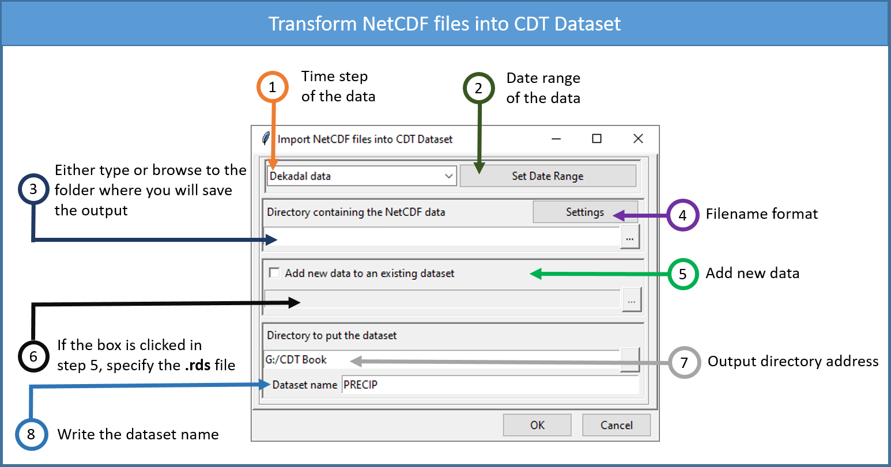

1.	Select the time step of the NetCDF data.

2.	Set the date range of the data to be converted. See Setting date range for more details.

3.	Type the full path to the folder containing the NetCDF files or browse it from the button  on the right.

4.	Provide a sample and change the filename format of the NetCDF file by clicking on the button   Settings (see Setting NetCDF data for more details).

5.	If you already have a CDT dataset format and you want to add a new data, check this box.

6.	If the box in (5) is cheked, type here the full path to the index file of the CDT dataset or browse it from the button on the right. The index file is in the form <Dataset name.rds>, see below for an example.

7.	Type the full path to the folder to save the CDT dataset, or use the browse button .

8.	Specify the name of the dataset.

Click on the button  to execute.

A folder with the name of the CDT dataset (8) is created under the folder you provided (7). If the name of the CDT dataset is **PRECIP**, the directory tree structure of this CDT dataset would be as follows

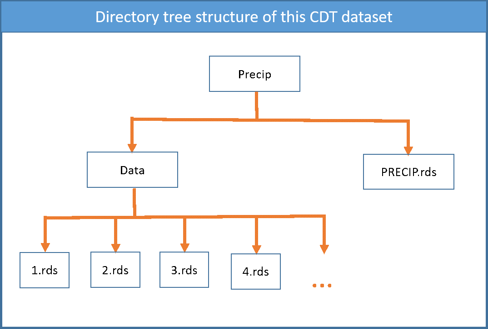

**PRECIP.rds** is the index file.

## Data extraction

CDT allows users to extract data from NetCDF gridded data. We can extract data by coordinates of a single point, by coordinates of multiple points, by rectangle, by one polygon or even by multiple polygons. We show here how to extract data using all these options. 

To extract data from a NetCDF dataset readable by CDT to a given spatial support such as a points, polygons or rectangle, use the menu **Data Preparation -> Data Extraction**. It will display a tabbed widget on the left panel, allows to enter the inputs data and parameters.

The tab **Input** allows to enter the inputs NetCDF data and the shapefile.

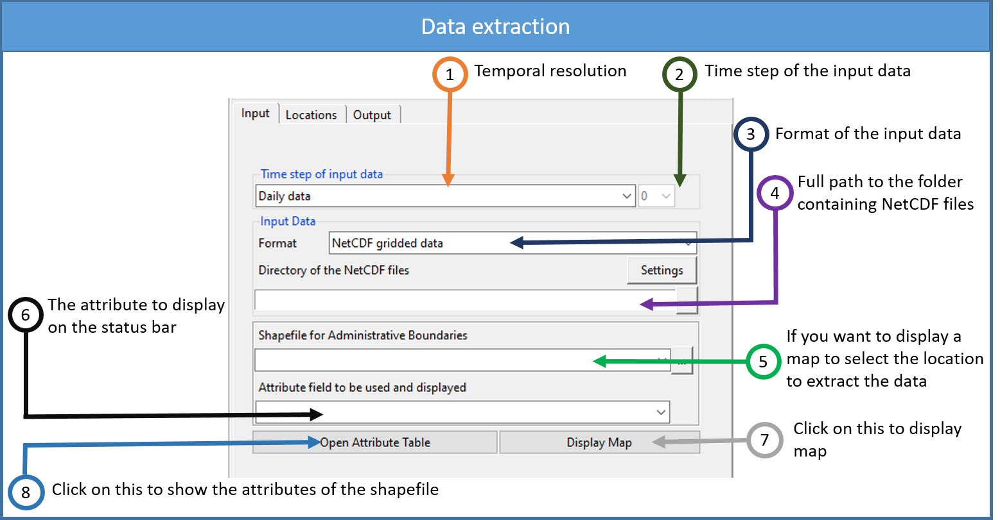

1.	Select the temporal resolution of the input NetCDF dataset to extarct. Valid options: minutes, hourly, daily, pentad, dekadal or monthly data.

2.	In case of minutes and hourly, select here the time step of the input data.

3.	Select the format of the input data. Available data formats are: **NetCDF gridded data** and **CDT dataset format (gridded)**

4.	In case of NetCDF gridded data, type the full path to the folder containing the NetCDF files or browse it, and click on the button Settings. A dialog box will be displayed in which you can provide a sample file and change the filename format of the NetCDF file. If the input data is a *CDT dataset format (gridded)*, type the full path to the index file of the CDT dataset or browse it.

5.	If you want to display a map to select the location to extract the data, provide here the shapefile to be displayed on the map. Select it from the drop-down list if it is already loaded, or open it from the browse button  on the right.

6.	Select the attribute to display on the status bar or to use when the extraction support is polygons.

7.	Click Display Map to display the map on the right panel. When you move the cursor over the map, the longitude, latitude and the name of the polygon (depending on the attribute field selected in 6) at the cursor position will be displayed on the status bar.

8.	Click Open Attribute Table to display a table of the attributes containing inside the shapefile on the right panel.

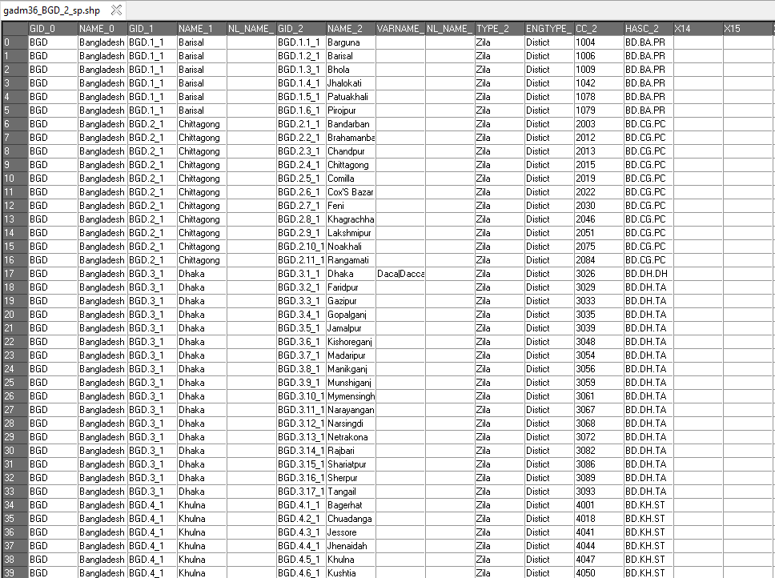

The tab Locations allows to specify the support on which the data will be extracted.

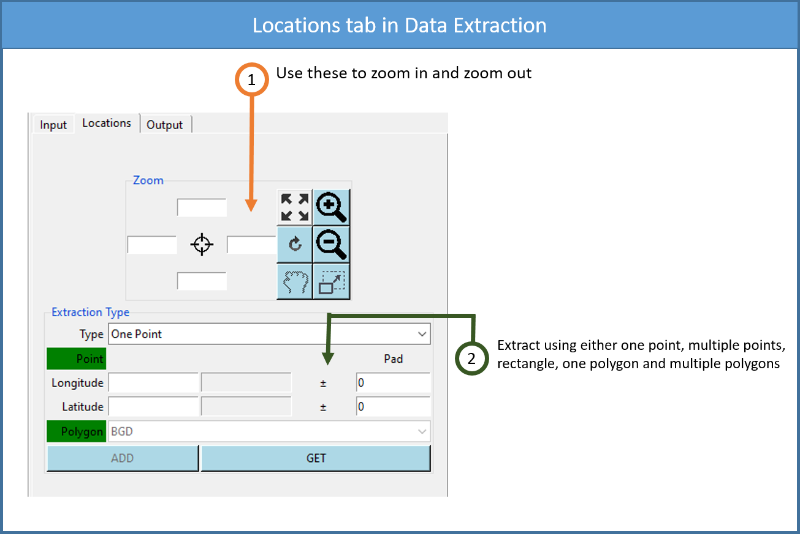

1. If a map is displayed, you can use these buttons to zoom in and out, or to specify the region to be displayed by entering its bounding box in the entry fields. Right click on the map to deactivate the zoom’s button.

2. Select the support on which you want to extract the data. Valid options are: *One Point*, *Multiple Points*, *Rectangle*, *One Polygon* and *Multiple Polygons*.

* One Point: allows to extract data on a single point.
    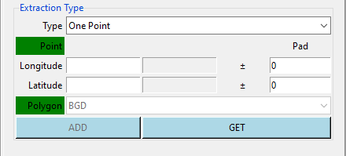

    To get the location you want to extract the data, you can enter the longitude and latitude of this location (when using this     method, you do not need to provide a shapefile and display the map), or you can click on the button GET  when it turns red       click on the map to get the point.

    Instead of extracting the data on the exact grid, you can perform a spatial average over the grid surrounding the target grid     by setting the **Pad** entries. For example, if you want to extract a spatial average of the data over all grids located     within a distance 0.1 degree on the longitude and 0.2 degree on the latitude from the coordinates you provided, enter 0.1 on the column **Pad** corresponding to the longitude and 0.2 for latitude.

* Multiple Points: allows to extract data over multiple locations.

    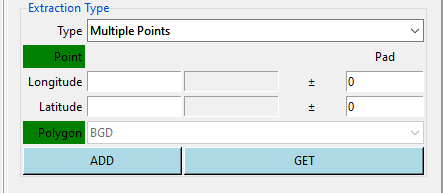

    It will display the dialog box below.

    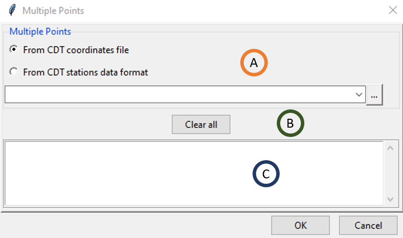

    (A) Input file to use to get the coordinates of the locations to be extracted, see below for more details. If you use this option, you do not need to provide a shapefile and display the map.
        
    (B) Click this button to reset all selected locations.

    (C) All selected locations will be displayed here.

There are several ways to extract the data over a multiple points.

*	You can enter the longitude and latitude of one location then click on   ADD   to add the point on the list in (C).

*	You can click on the button   GET   and when it turns red click on the map to get the point, when   ADD   turns red click on it to add the selected point on the list in (C).

*	You can get the coordinates of the locations from a CDT coordinates file. Select    CDT coordinates file     on (A) then select the file from the drop-down list if it is already loaded, or open it from the browse button  on the right. All the locations will be displayed in (C).

*	You can get the coordinates of the locations from a CDT stations data format file. Select    CDT stations data format     on (A) then select the file from the drop-down list if it is already loaded, or open it from the browse button  on the right. All the locations will be displayed in (C).

The same as a single point, you can spatially average the data over the grid surrounding each location by providing the **Pad**.
If you got all the locations you want click **OK**.

* Rectangle: allows to extract data over a selected rectangular area.

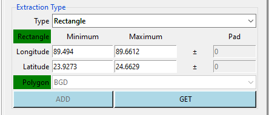

To select the area you want to extract the data, you can do as follow

* specify the bounding box of the rectangle by entering the minimum and maximum longitude and latitude (when using this method, you do not need to provide a shapefile and display the map),
* click on the button **GET** when it turns red drag the cursor on the map to get the desired rectangle.

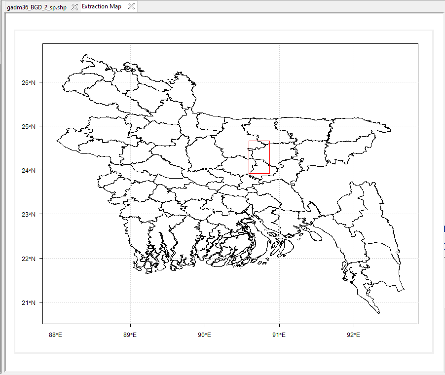

* One Polygon: allows to extract data over a selected polygon.

    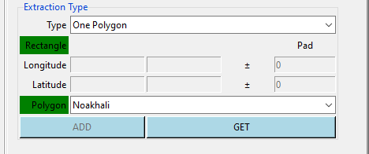

To select the polygon you want to extract the data, you can do as follow

* select the name of the polygon from the drop-down list, the name listed here is corresponding to the attribute field you have selected from the tab **Input** number (6),
* click on the button **GET** when it turns click on the map to select the desired polygon.

    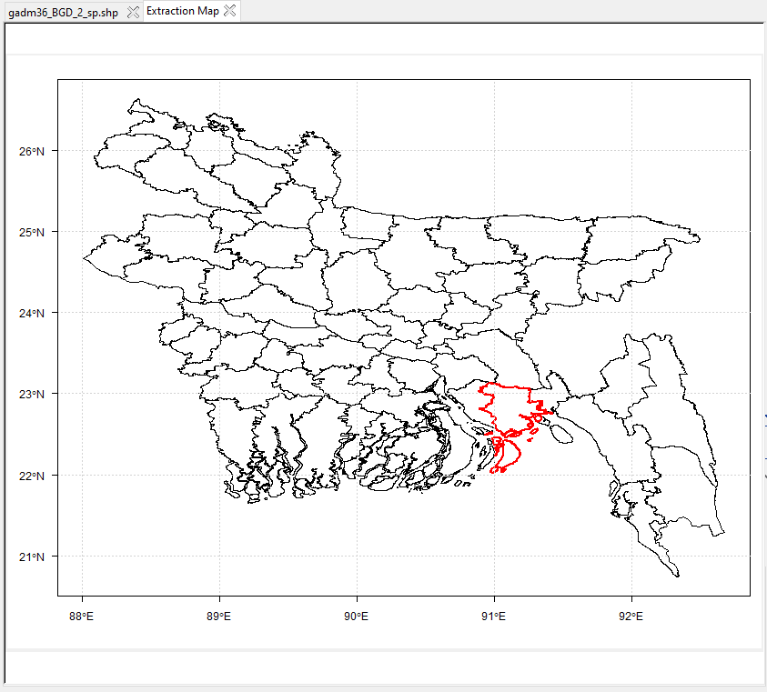

*	Multiple Polygons: allows to extract data over multiple polygons.

    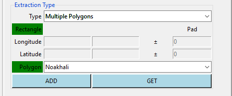
    
The name of the polygons listed in the drop-down list are from the attribute field you have selected from the tab **Input**     number (6).

It will display the dialog box below.
    
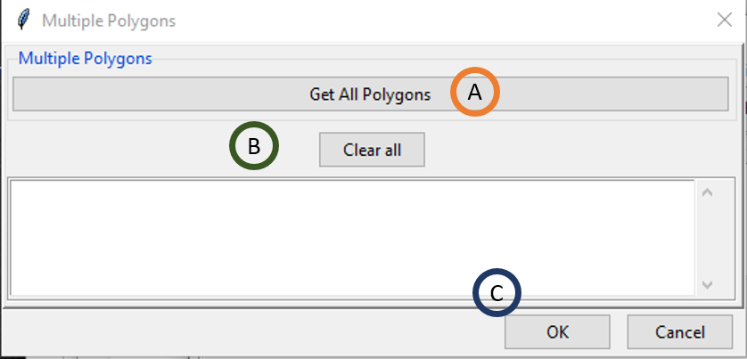

*	(A) Button to get all the polygons from the shapefile, see below for more details.
*	(B) Click this button to reset all selected polygons.
*	(C) All selected polygons will be displayed here.

There are three ways to extract the data over a multiple polygons.

*	You can select the name of the polygon from the drop-down list then click on   ADD   to add it on the list in (C).

*	You can click on the button   GET   and when it turns red click on the map to select the desired polygon, when   ADD   turns red click on it to add the selected polygon on the list in (C).

*	You can get the all the polygons from the shapefile by clicking the button   Get All Polygons   on (A). The name of the polygons will be displayed in (C).

If you got all the polygons you want click **OK**.
The tab  **Output** allows to specify the date range, the format of the extracted data.

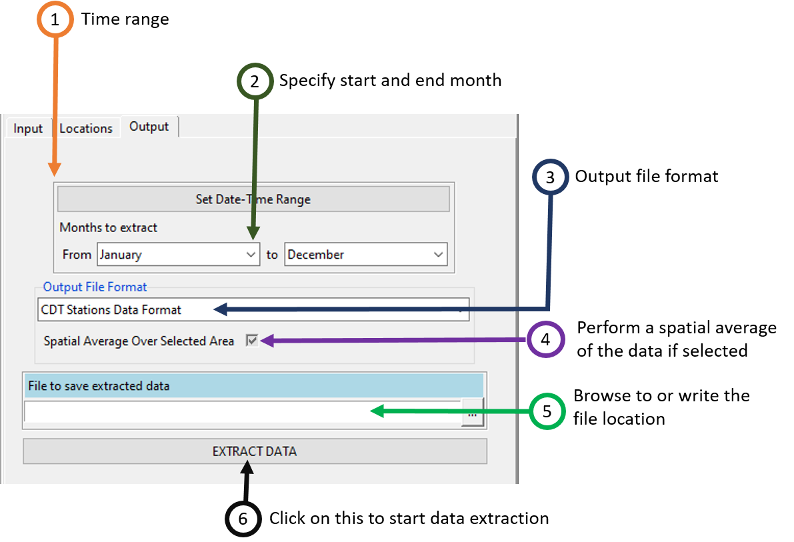

1.	Set the date and time range of the data to extract. See **Setting date range** for more details.

2.	Select the start and end month you want to extract.

3.	Select the format of the extracted data. Available data formats are: *CDT Stations Data Format*, *CPT File Format*, *NetCDF Files* and *Time|Lat|Lon|Value* Format. The formats listed here depend on the extraction support you have selected from the tab   **Locations**. The Time|Lat|Lon|Value Format format is a format of data with 4 columns, the 1st column is for the date or time, the 2nd column the latitude, the 3rd column the longitude, and the 4th column contains the value of the extracted data.

4.	When activated, check the box if you want to perform a spatial average of the data over the selected area or polygon. If this option is deactivated and the box is checked, this means that the data is spatially averaged over the selected area or polygon. If the box is unchecked, you get a gridded data.

5.	Specify the folder or the name of the file (depend on the data output format) to save the extracted data by browsing it from the button or typing the full path to the folder or the file.

6.	Click on **EXTRACT DATA** to start the extraction.

## Split NetCDF files into CDT NetCDF format

Sometimes NetCDF files have many more dimensions, for example, one NetCDF file might contain values for multiple years in a single file.

The menu **Data Preparation -> Split NetCDF files into CDT NetCDF format** allows splitting a multidimensional NetCDF data into a NetCDF data readable by CDT.

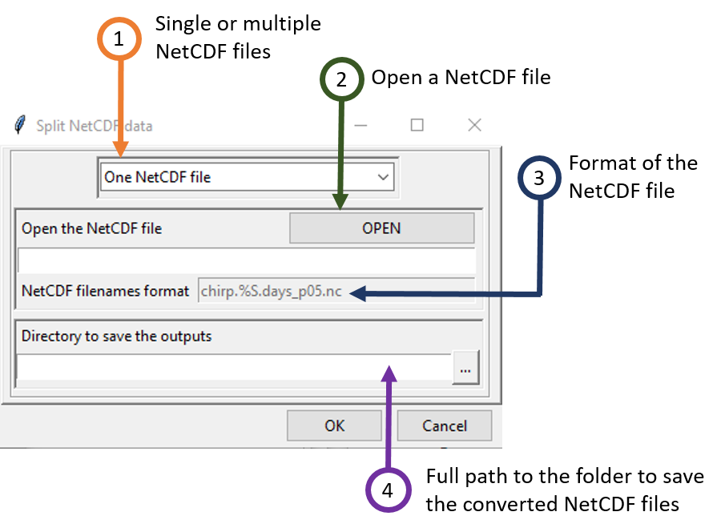

1.	Select the number of files to split. Valid options: *One NetCDF file* or *Several NetCDF files*.

2.	Click the button **OPEN** to open the NetCDF file (for One NetCDF file) or a sample from the NetCDF files (for Several NetCDF files). It will open a dialog box allowing you to select the variable to be extracted and specify the dimensions.

    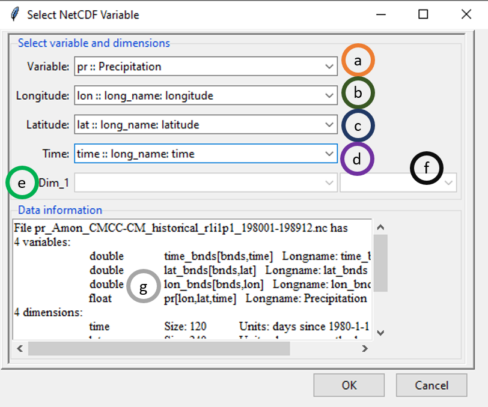

    * (a) Select the variable to extract.

    *	(b) select the dimension for longitude.

    *	(c) select the dimension for latitude.

    *	(d) select the dimension for time.

    *	(e) If the variable has more than 3 dimensions, the additional dimensions will be displayed here.

    *	(f) Select at which value or level of the additional dimension the selected variable in (1) should be extracted.

    *	(g) all information concerning the variables and dimensions inside the NetCDF file are displayed here.

3. In the case of Several NetCDF files, change the filename format to conform with the NetCDF files name. Replace the string linking all NetCDF files by %S. For example, if you have a NetCDF files as follows

    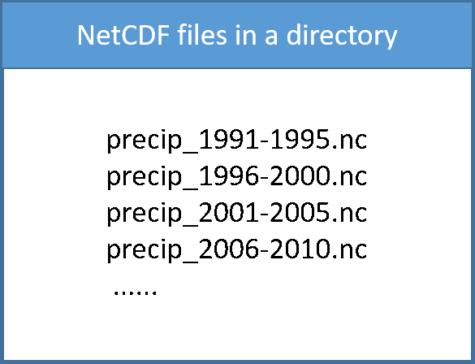

    The format of the filename must be precip_%S.nc.

4.	Type the full path to the folder to save the converted NetCDF files or browse it.

Click on the button   to split the data.

The converted NetCDF data are saved in a new folder named **CDT_NetCDF_Format** under the folder you provided to save the output in (**4**).

## Blank grid outside polygons

Suppose you have a single or multiple netCDF file/files where you want to make all the values outside an area of your interest to be blank. CDT allows users to do this by using **Data Preparation -> Blank Grid Outside Polygons**. 

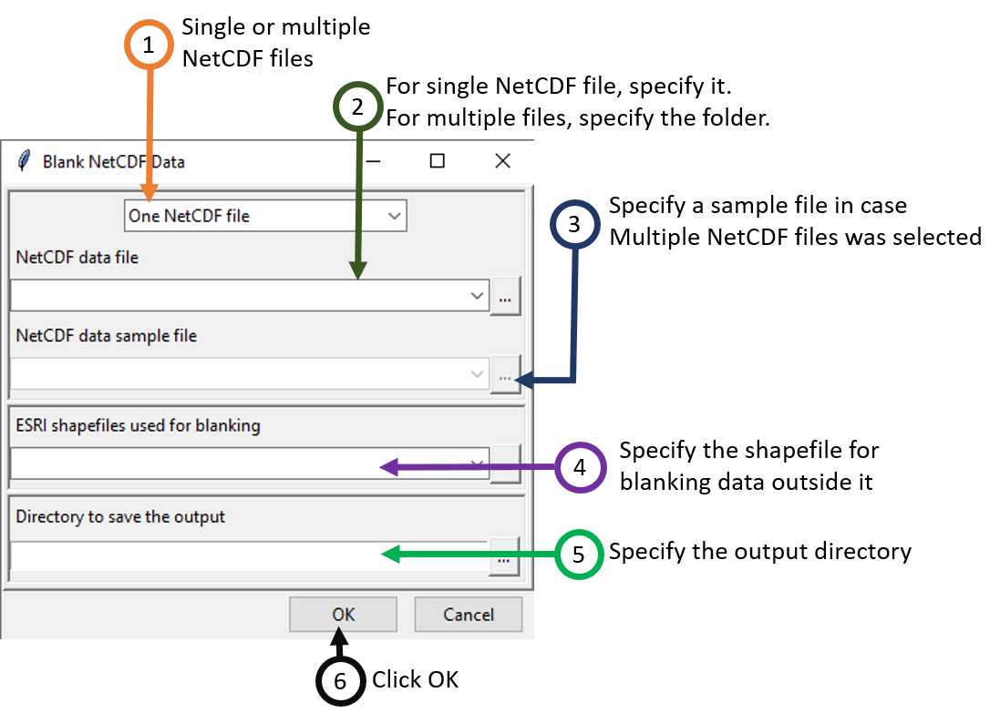

1.	You can select either a single file or multiple NetCDF files.

2.	If you selected **One NetCDF file** in step 1, browse to or specify the full path of the file. If **Multiple NetCDF files** was selected, specify the folder containing the NetCDF files.

3.	If **Multiple NetCDF files** was selected in step 1, this field will be activated, otherwise it will be deactivated. Specify a sample file by browsing to one of the NetCDF files in case of the selection of **Multiple NetCDF files** in step 1.

4.	Browse to or specify the full path of the shapefile to be used for blanking. In this case, for the NetCDF file/files, the areas that are outside your specified shapefile, will have blank values.

5.	Click OK.

Now, click on  to blank NetCDF file/files outside the shapefile.

## Data format conversion

### Conversion to CPT format

We can convert both CDT stations data and NetCDF gridded data to CPT format. 

### Converting NetCDF/GeoTIFF/ESRI .hdr Labelled

Here, we will see how CDT allows a user to convert raster data from one format to another. If you want to convert CDT station data format or a NetCDF dataset into CPT station or gridded data format, use **Data Preparation -> Data Format Conversion -> Conversion to CPT data format**, it will display a dialog box.

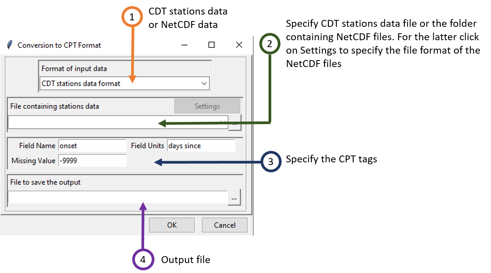

1.	Select the input data format to convert. Available data formats are: CDT stations data format, NetCDF gridded data.

2.	If the input data is a CDT station data format, select from the drop-down list the file containing the station data to be converted if it is already loaded, or open it from the browse button  on the right. In case of NetCDF gridded data, type the full path to the folder containing the NetCDF files or browse it from the button  on the right. Then click on the button **Settings**. A dialog box will be displayed in which you can provide a sample file and change the filename format of the NetCDF file.

    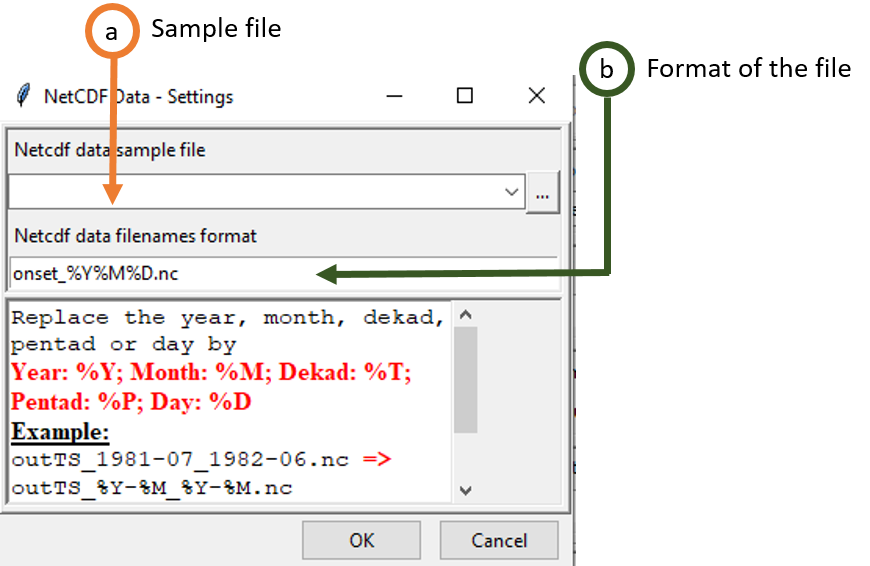

    *	(a) Provide a NetCDF sample file.
    *	(b) Change the filename format to conform with the NetCDF files name. You have to replace the year, month, dekad, pentad or day in the NetCDF file name as follow
        + Year: %Y
        + Month: %M
        +	Dekad: %T
        +	Pentad: %P
        +	Day: %D
    **Example**: If you have a NetCDF dataset with the file name outTS_2017-12_2018-02.nc, the format should be like this outTS_%Y-%M_%Y-%M.nc.
    If the file name is onset_20181201.nc, the format should be like this onset_%Y%M%D.nc.

3.	Specify the CPT tags.
    *	Field Name: the CPT tag cpt:field representing the abbreviated name of the field variable.
    *	Field Units: the CPT tag cpt:units for the units in which the data are stored.
    *	Missing Value: the CPT tag cpt:missing for the missing value code.
4.	Type the name of the file to save the converted data or the full path to the file. You can also click on  on the right, it opens a file dialog where you can select and/or type the name, the path and the file extension.

Click on the button  to start the conversion

### Converting NetCDF/GeoTIFF/ESRI .hdr Labelled 

The menu **Data Preparation -> Data Format Conversion -> Converting NetCDF/GeoTIFF/ESRI .hdr Labelled** allows to convert NetCDF, GeoTIFF, ESRI .hdr Labelled (.bil and .hdr) files to other format. 

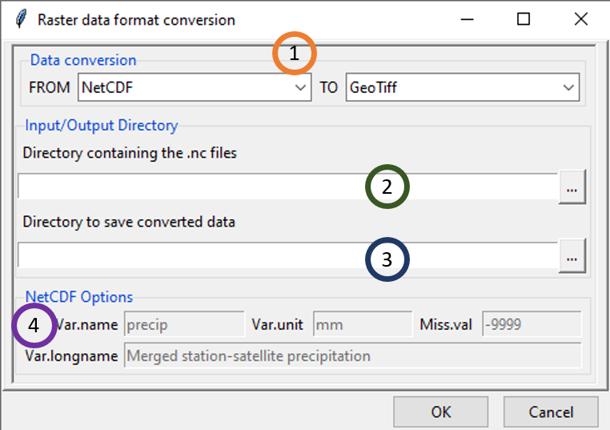

1.	Select the format of the data to convert and the format in which the data will be converted.

2.	Type the full path to the folder containing the files to convert or browse it from the button  on the right.

3.	Type the full path to the folder to save the converted files or browse it using the button .

4.	If the output files are in NetCDF format, all these fields will be activated allow you to define the NetCDF variable. Take a look at the function ncvar_def of the R package ncdf4 for more details.

Click on the button  to start the conversion

### Create GrADS Descriptor File from CDT NetCDF files

As CDT can only handle a NetCDF data with a separate file for each time step, you need to create a Data Descriptor File to be able to display CDT output NetCDF in GrADS. You can use the menu **Data Preparation -> Data Format Conversion -> Create GrADS Descriptor File from CDT NetCDF files** to create the data descriptor file.

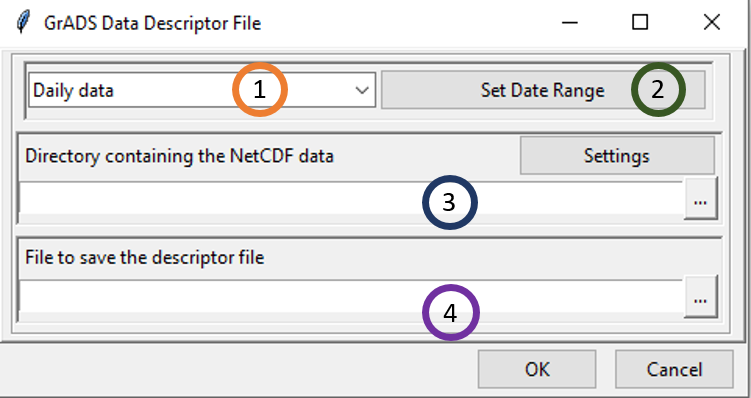

1.	Select the time step of the NetCDF data.

2.	Set the date range you want to include to the data descriptor file. See Setting date range for more details.

3.	Type the full path to the folder containing the NetCDF files or browse it from the button  on the right. Then click on the button **Settings**. A dialog box will be displayed in which you can provide a sample file and change the filename format of the NetCDF file.

    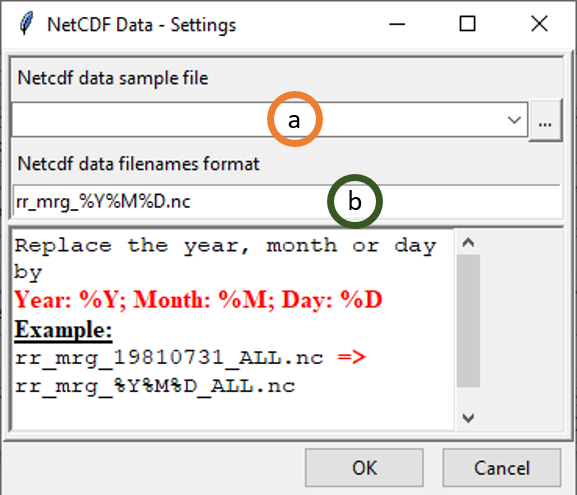

    *	(a) Provide a NetCDF sample file.
    *	(b) Change the filename format to conform with the NetCDF files name. You have to replace the year, month or day in the NetCDF file name as follow
        +	Year: %Y
        +	Month: %M
        +	Day: %D
    Example: If you have a NetCDF dataset with the file name **rr_mrg_20180121_ALL.nc**, the format should be like this **rr_mrg_%Y%M%D_ALL.nc**.
    If the file name is **rfe_201801.nc**, the format should be like this **rfe_%Y%M.nc**.

4.	Type the name of the file to save the data descriptor file or the full path to the file. You can also click on  on the right, it opens a file dialog where you can select and/or type the name, the path and the file extension.

Click on the button  to create the data descriptor file.

## Filing missing dekadal temperature values

The menu **Data Preparation -> Filing missing dekadal temperature values** allows to fill out the missing values of dekadal temperature data in CDT station data format with an adjusted reanalysis dekadal temperature data by a regression.

The reanalysis data are extracted at the station locations, then a regression between the station and the extracted adjusted reanalysis is performed by using the series of dekad corresponding to the missing dekad to be filled out. The length of the series is limited to 21 dekads centered at the missing dekad.

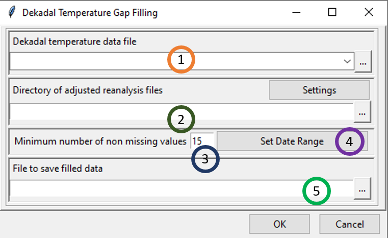

1.	Select from the drop-down list the file (in CDT station data format) containing the dekadal temperature data to be filled if it is already loaded, or open it from the browse button  on the right.

2.	Type the full path to the folder containing the adjusted reanalysis files (in NetCDF format) or browse it from the button  on the right. Do not forget to provide a sample file and change the filename format of the NetCDF file by clicking on the button   Settings   (see Setting NetCDF data for more details).

3.	Minimum length (between 10 and 20) of non missing data to be used to perform the regression.

4.	Set the date range of the data to be filled. See Setting date range for more details.

5.	Type the name of the file to save the filled data or the full path to the file. You can also click on  on the right, it opens a file dialog where you can select and/or type the name, the path and the file format (txt or csv).

Click on the button  to execute.

## References

Blumenthal, M.B., Bell, M., Del Corral, J., Cousin, R., Khomyakov, I. (2014). IRI Data Library: Enhancing Accessibility of Climate Knowledge: The International Research Institute for Climate & Society: Shaping the Landscape of Climate Services. Earth Perspectives: Transdisciplinarity Enabled, 1: 19. 

Funk, C., Peterson, P., Landsfeld, M., Pedreros, D., Verdin, J., Shukla, S., … Michaelsen, J. (2015). The climate hazards infrared precipitation with stations—a new environmental record for monitoring extremes. Scientific Data, 2, 150066. https://doi.org/10.1038/sdata.2015.6

Grimes, D. I. F., Pardo-Igúzquiza, E., & Bonifacio, R. (1999). Optimal areal rainfall estimation using raingauges and satellite data. Journal of Hydrology, 222(1), 93–108. https://doi.org/10.1016/S0022-1694(99)00092-X.

Hou, A. Y., Kakar, R. K., Neeck, S., Azarbarzin, A. A., Kummerow, C. D., Kojima, M., … Iguchi, T. (2014). The Global Precipitation Measurement Mission. Bulletin of the American Meteorological Society, 95(5), 701–722. https://doi.org/10.1175/BAMS-D-13-00164.1

Huffman, G. J., Adler, R. F., Bolvin, D. T., & Nelkin, E. J. (2010). The TRMM Multi-Satellite Precipitation Analysis (TMPA). In M. Gebremichael & F. Hossain (Eds.), Satellite Rainfall Applications for Surface Hydrology (pp. 3–22). https://doi.org/10.1007/978-90-481-2915-7_1

Joyce, R. J., Janowiak, J. E., Arkin, P. A., & Xie, P. (2004). CMORPH: A Method that Produces Global Precipitation Estimates from Passive Microwave and Infrared Data at High Spatial and Temporal Resolution. Journal of Hydrometeorology, 5(3), 487–503. https://doi.org/10.1175/1525-7541(2004)005<0487:CAMTPG>2.0.CO;2

Nguyen, P., Ombadi, M., Sorooshian, S., Hsu, K., AghaKouchak, A., Braithwaite, D., … Thorstensen, A. R. (2018). The PERSIANN family of global satellite precipitation data: a review and evaluation of products. Hydrology and Earth System Sciences, 22(11), 5801–5816. https://doi.org/10.5194/hess-22-5801-2018

Novella, N. S., & Thiaw, W. M. (2013). African Rainfall Climatology Version 2 for Famine Early Warning Systems. Journal of Applied Meteorology and Climatology, 52(3), 588–606. https://doi.org/10.1175/JAMC-D-11-0238.1

Thorne, V., Coakeley, P., Grimes, D., & Dugdale, G. (2001). Comparison of TAMSAT and CPC rainfall estimates with raingauges, for southern Africa. International Journal of Remote Sensing, 22(10), 1951–1974. https://doi.org/10.1080/01431160118816

Xie, P., Joyce, R., Wu, S., Yoo, S.-H., Yarosh, Y., Sun, F., et al. (2017). Reprocessed, bias-corrected CMORPH global high-resolution precipitation estimates from 1998. J. Hydrometeorol. 18, 1617–1641. doi: 10.1175/JHM-D-16-0168.1

