# Quality Control

Due to error in data recording or systematic errors, station data could suffer from quality issues. These errors could dilute the climate signal that we are trying to detect and in some cases, errors could be larger than the signal leading to an erroneous conclusion. In many countries of Africa, climate data quality is a serious challenge (Dinku. 2019). Thus, it is extremely important to conduct the quality control of station data before starting climate analysis. Quality control is an attempt to identify isolated errors in the station data (Abbott 1986). These errors can stem from different sources such as observation error or defective instruments, transcription or transmission. If the rain gauge gives incorrect measurement, we get observation error while we get transcription and transmission error when the wrong key is typed, or any digit is missed, a column is misplaced in a spreadsheet etc. There can also be systematic errors stemming from the use of wrong units for data, misplacing climate variable(s), using wrong code for missing values etc. There can also be bias or drift in data over a long period of time. To detect these different types of errors, different quality control techniques are employed. 

CDT comes with a suite of quality control options for identifying, and if needed, also fixing errors.It allows the users to inspect different possible errors by showing them in different formats. NMS staffs can easily use it to identify and fix or remove errors from the data. This tool allows to do all of these at different temporal scales of  daily, dekadal, and monthly. Once a suspected value is detected, NMS staffs or user can either replace the missing data with a missing value code, replace with correct data, or can just leave the data unchanged.

The overall process for quality check implemented in CDT include the following steps:

1. checking for station coordinates; 
2. checking for false zero values (for rainfall); 
3. checking for suspicious observations (outliers); and 
4. checking for homogeneity of climate time series.


## Checking station coordinates

This facility allows to check whether the station coordinates are correct. This is done by checking whether the station coordinate is within the country boundary or not. The locations of the stations are displayed on a Google Map. These allow to check whether the stations are correctly located on the map. Further, CDT also allows to check for duplicate and missing coordinates. 

The menu **Quality Control -> Check Station Coordinates** allows to check if there are duplicated and implausible coordinates, or stations outsides a provided shapefile. It will display a tabbed widget on the left panel that allows users to enter the input data and display the results of the checking. 

The tab **Input** allows to enter the inputs data, run the command to check and correct the stations coordinates.

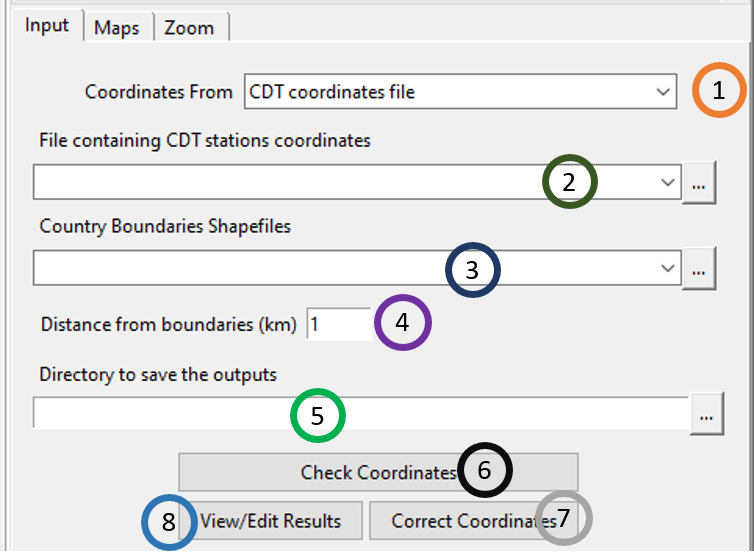

1.	Select the input data format containing the coordinates of the stations to be checked. Available data formats are: **CDT coordinates file**, **CDT stations data format**.

2.	Select from the drop-down list the file containing the coordinates of the stations to be checked if it is already loaded, or open it from the browse button 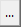 on the right.

3.	Select the shapefile containing the country boundaries if it is already loaded, or open it from the browse button  on the right.

4.	Specify a distance (in km) from the country boundaries. This distance will be used to create a buffer around the country outlines. All stations located outside the boundaries, but still located inside the buffer, will be supposed to be part of the network.

5.	Type the full path to the folder to save the outputs or browse it.

6.	Click the button **Check Coordinates** to check the stations coordinates.

7.	Click on the button **View/Edit Results** to view and edit the results of the verification. It will open a table on the right panel displaying the stations with missing, duplicated or invalid coordinates, or stations with coordinates outsides of the boundaries.


```{r echo = FALSE, warning = FALSE}
options(knitr.kable.NA = "")
data2 = data.frame(State = c("Duplicate Coordinates", "Duplicate Coordinates", "Duplicate Coordinates", "Duplicate Coordinates", "Coordinates Outside", "Coordinates Outside", "Coordinates Outside", "Coordinates Outside", "Coordinates Outside", "Coordinates Outside", "Coordinates Outside"),
             id_wmo = c(41850, 41220, 41883, 41121, 40001, 40002, 41955, 41963,41964,41992,41998),
             name = c("Tetulia", "Place1","Bogura", "Place2", "Another", "Another", "Saint", "Hatia", "Sandwip", "Cox's Bazar", "Teknaf"),
             longitude = c(88.607222,88.607222,89.366667,89.366667,96.342546,95.1233,92.328333,91.1,91.433333,91.433333, 92.3), latitude = c(26.344167,26.344167,24.85,24.85,16.336578,17.092562,20.602778,22.433333,22.433333,21.433333,20.866667),
             Elevation = c(NA, NA, 17.9,17.9,NA,NA,NA,2.44,2.1,2.1,5),
             X7 = c(NA,NA,NA,NA,NA,NA,NA,NA,NA,NA,NA))
knitr::kable(data2, digits = 3, format.args = list(scientific = FALSE), caption = "Example table of checking station coordinates in CDT")
```

8.	Click the button Correct Coordinates to correct the wrong coordinates if there are any. To correct the stations coordinates, change the values in the table. To remove a station from the input data, right-click on the column of row number corresponding to this station then from the pop menu click on **Delete Selected Row** as shown in the figure below.

    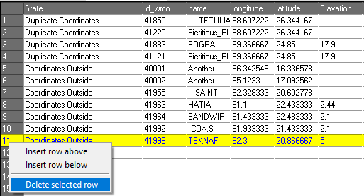

    After editing this table, you have to save the changes you made. You can go to the menu **File -> Save table** or click on the button  in the toolbar to save the table. If the table is saved correctly, you should see an output message “*Table saved successfully*”.
    
This creates a folder named **CHECK.COORDS_data** under the folder you provided in (5) to save the  results of the verification. Inside this folder 1 directory and 3 files are created:

* **CDTDATASET**: directory containing all the required files used by CDT.

*	**CoordinatesCheck.rds**: an index file, you will need to reload the outputs of the verification if you want to view the results or to continue the correction of the coordinates of stations later.

*	**Stations_to_Check.csv**: a table containing the information on the stations that need verification.

*	**Checked_Coords_<Filename>.csv**: file containing the corrected coordinates, where <Filename> is the input file name you provided in (2)

**Note**: Each time you check the coordinates of the stations, rename the folder **CHECK.COORDS_data** or change the folder to save the outputs because CDT overwrites it.

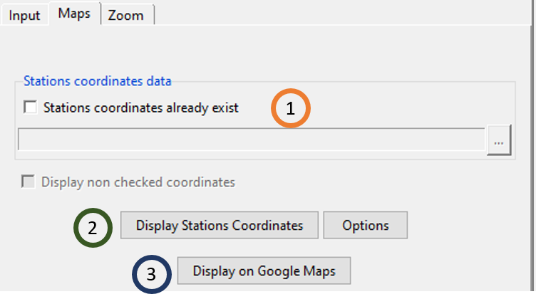

1.	If you want to view or edit the output from a previous stations coordinates checking, you can check this box, the input field below will be activated and you can provide the full path to **CoordinatesCheck.rds** under the folder **CHECK.COORDS_data** by browsing it through the button  on the right. 

2.	Click on **Display Station Coordinates** to  display the map of the stations location on the right panel.

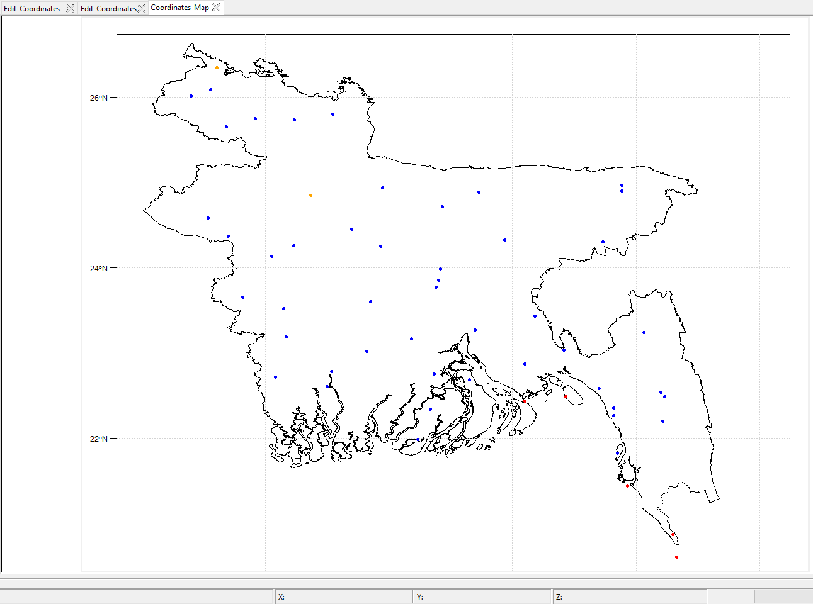

Click on the button **Options** on the right to change the color, the symbol and the size of the symbol to be used to display the stations locations; or to change color and the width of the boundaries lines.

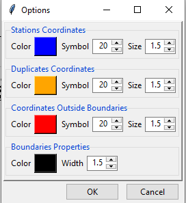

3.	Click on **Display on Google Maps** to display the map of the stations on Google Maps. This will open your default web browser and display the location of the stations on Google. You need an Internet connection to be able to use this function.

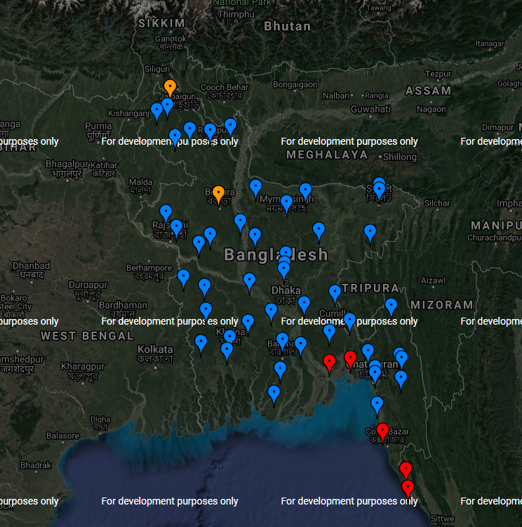

Click on the pin to get the information about the station. If you want to get a specific location from the map, zoom in to the location and right click on it to get the coordinates.

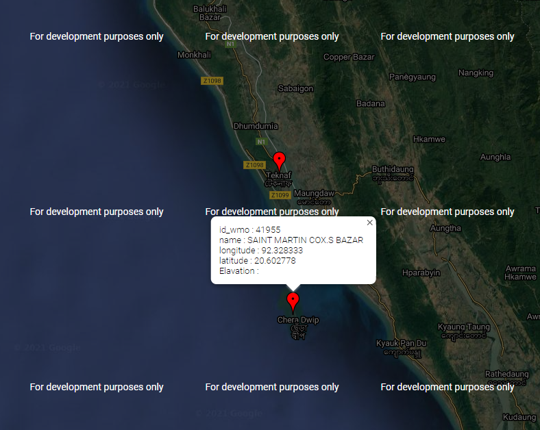

You can select and copy the displayed coordinates and use it to correct the coordinates of the station.

The tab **Zoom** allows to zoom the displayed map.

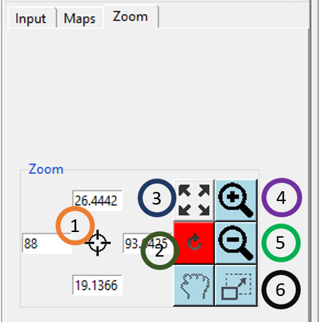

1.	Enter here the bounding box of the area to be displayed on the map.

2.	After setting the bounding box (1), click this button for the change to take effect.

3.	Reset the zoom.

4.	Click this + sign to zoom in the map.

5.	Click the - sign to Zoom out the map.

6.	Click here to draw a rectangle on the map which will zoom in to this rectangle area.

7.	After clicking the hand symbol, we can move the displayed map.

Right click on the map to deactivate the active zoom.

## False-zero check for daily rainfall

A false zero is an incorrect report of zero precipitation during the rainy season. The false zeros mainly come from the conversion of file with a given format to another file format, in most cases, the missing values from the original file format are not flagged and left blank, when converting the file to the other format the missing values are replaced by zeros. To check the false zeros, the percentage of zero values for each month at the target station is computed and compared to the average of the percentage of zero values for the corresponding month of the neighbor stations. If this percentage is greater than a given threshold, this month is flagged as a month containing false zeros.

To perform false-zeros check for daily rainfall data, use the menu **Quality Control -> False-Zeros Check for daily rainfall**. It will display a tabbed widget on the left panel, allows to enter the inputs data and parameters.

The tab **Data and Parameters** allows to enter the inputs data and set the parameters for the QC.

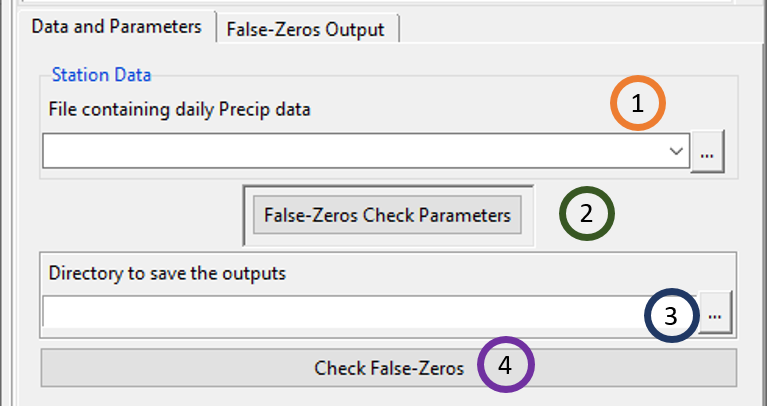

1.	Select from the drop-down list the file containing the daily rainfall station data to be checked if it is already loaded, or open it from the browse button   on the right.

2.	Click on this button to set the parameters to be used for the false-zeros check. It displays a dialog box

    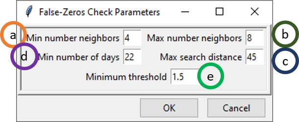
    
    (a) Specify the minimum number of neighbor stations to be used.
    (b) Specify the maximum number of neighbor stations to be used.
    (c) Specify the radius of search (in kilometers) to select the neighbor stations.
    (d) Specify the minimum number of days without missing values for each month.
    (e) Specify the minimum threshold to be used to flag that a month contains a false zero. If the ratio of the percentage of zero at the target station and the average of the percentage of zero of the neighbor stations is greater than this threshold the corresponding month is flagged as suspicious.

3. Specify the folder to save the results by browsing it from the button  or typing the full path to the folder.

4.	Click the button **Check False-Zeros** to execute.

The tab **False-Zeros Output** allows to view the results of the false zeros check.

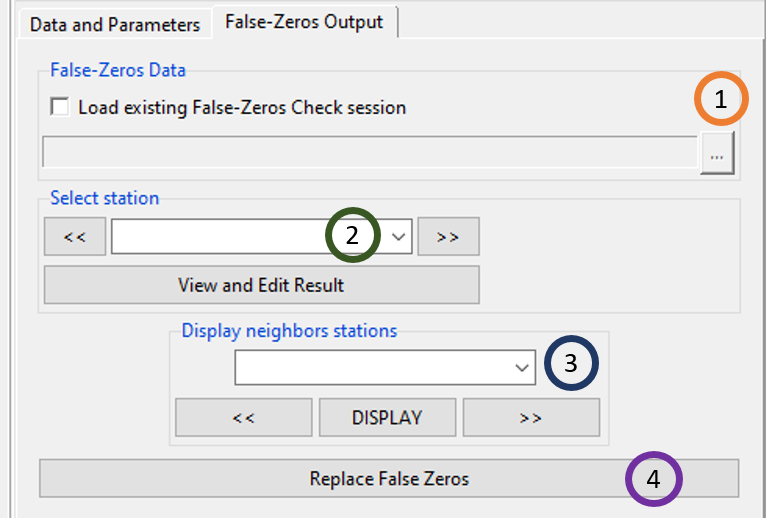

1.	If you already performed a false zeros check, you do not need to run it again, you can check this box, the input field below will be activated and you can provide the full path to **FalseZeros.rds** under the folder **FALSE.ZEROS.CHECK_data** by browsing it through the button  on the right.

2.	 The stations with a month containing false zeros are listed here. You can select a station and click on the button **View and Edit Result** to view the results. You can use the buttons 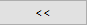  or 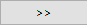  to switch to the previous or next station. It will open a table on the right panel showing the output of the false zeros for the selected station.

```{r echo = FALSE, warning = FALSE}
options(knitr.kable.NA = "**")
data33 = data.frame(STN.ID = c(11805), YYYYMM=c(198306), NEAR.STN.=c(3), STN.V=c(75),NEAR.STN.D=c(37),NGBHR.AV=c(46),
                    NGBHR.MAX=70,RATIO.NG=1.6,RATIO.NGH=1.5)
knitr::kable(data33, digits = 3, format.args = list(scientific = FALSE), caption = "Table for false-zero check")
```

  (a) **STN.ID** is the ID of the station.
  (b) **YYYYMM** shows the year and month on which false zeros have been suspected.
  (c) **STN.VAL** is the percentage of zero at the target station.
  (d) **NEAR.STN.VAL** is the percentage of zero for the closest neighbor station.
  (e) **NEAR.STN.DIST** is the distance in kilometers of the closest neighbor station.
  (f) **NGHBR.AVRG** is the average of the percentage of zero for the neighbor stations.
  (g) **NGHBR.MAX** is the maximum value of the percentage of zero for the neighbor stations.
  (h) **RATIO.NGHBR.AVRG** is the ratio of (c) and (f).
  (i) **RATIO.NGHBR.IDW** is the ratio of (c) and the interpolated percentage of zero of the neighbor stations using the method of weighted inverse distance.

After editing this table, you have to save the changes you made. You can go to the menu **File -> Save table** or click on the button 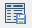 in the toolbar to save the table. If the table is saved correctly, you should see an output message **“Table saved successfully”**.

3.	Select here the date corresponding to a month with false zeros to display the values of the rainfall data at the target station and the neighbor stations for this month. If you select the date from the drop-down list, click on the button Display to display the table. You can use the buttons  or  to switch to the previous or next date.

4.	After saving the changes you made on the table (2), click on the button Replace False Zeros to replace all the false zeros by missing values.

To replace all the values flagged as suspicious for all stations by missing values, use the following command to the R console:

    indexFZ <- "/<path_to>/FALSE.ZEROS.CHECK_data/FalseZeros.rds"
    CDT:::FalseZerosCheck_replaceAll(indexFZ, action = "all")

Change < **path_to**> with the exact path. The corrected data are located under the folder **FALSE.ZEROS.CHECK_data/CDTSTATIONS**. 

## Outliers check

Users can also check for outliers in CDT using methods such as limit check, internal consistency check, temporal check, and spatial check. In limit check, an observation is checked to see whether it is inside upper and lower limit for the variable of interest in a specific climate. For example, usually, both minimum and maximum temperature can't go below 0 over any area in Bangladesh. Similarly, for daily rainfall amounts there could be an upper limit above which rainfall is not expected.

Internal consistency involves comparing an observation with other meteorological parameters to check whether there are physical and climatological consistency between them. It is done either for the time the observation denotes or for the time series. As some of the meteorological parameters are physically related, checking the consistency between these variables informs us about whether the observation is outlier or not. Right now,  CDT allows only one method for internal consistency which is checking to see that minimum temperature is less than maximum temperature.

Temporal consistency checks an observation of a station for a given month against the long time series for that month. This is done for each of the 12 months separately in CDT to ensure that climatological periods are not compared. The results of these analyses are shown in both tabular and graphical formats, and a user can either keep or change these suspected values by making edit in the table.

Spatial check compares the observation with data from nearby stations or the expected value at the station under question using data from neighboring stations. It can be done using interpolation by either by checking against numeric values calculated based on the values from surrounding stations, or by comparing statistics. The observations that are significantly different from the expected values are flagged for suspected outliers. The following conditions are checked for rainfall: isolated rainfall (rainfall observed at the given station but surrounding stations reported no rainfall), isolated zero (opposite to isolated rainfall), and outlier (observation deviates too much from surrounding observations). CDT shows the values in both graphical and tabular formats. These values can be vieewed on map along with the options of adding administrative  boundaries, digital elevation model, and gridded data. Here, one can add digital elevation model (DEM) for temperature and satellite estimates for rainfall to provide additional insight into data. For example, due to elevation differnece between two neighboring stations, the temperature could be significantly different and adding DEM to the map allows the visual inspection of this.

The flagged suspected values  can be either replaced with missing code, or replace the value with the correct one, if that is the case, or just leave the value as it is. For replacing the value, the user can directly enter the value which will then replace the value in the original database. 

### Outliers check for rainfall data

CDT allows to check outliers in rainfall data for different time frequency (daily, pentad, dekadal, and monthly) both in temporal and spatial dimension.  

To check the outliers for rainfall data, use the menu **Quality Control -> Outliers Check for rainfall data**. It will display a tabbed widget on the left panel which allows to enter the input data and parameters.

The tab **Data** allows you to enter the input data and set the parameters for the QC.

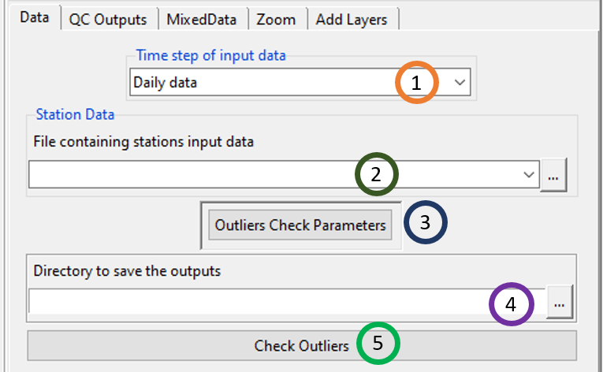

a.	Select the time step of the station data to be checked.

b.	Select from the drop-down list the file containing the station data to be checked if it is already loaded, or open it from the browse button  on the right.

c.	Click on this button to set the parameters to perform the outliers check.

  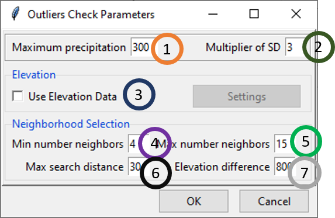

  (1) Specify the maximum possible value of rainfall. It depends on the time step of the input data and the region or country.

  (2) Enter the multiplier of the standard deviation to perform the temporal check. You can use a real number like 3.5. In a normal distribution 99.73% of the data should be within +/- 3 times of the standard deviation around the mean. It will be converted to a confidence level to conduct the test.

 (3) If you want to use elevation data to select the neighbor stations, check this box and click on the button Settings, it will display a dialog box which allows to specify the elevation data to be used. If the elevation data come from DEM (Digital Elevation Model), **Select Elevation from DEM**, you have to provide the DEM file in NetCDF format, select it from the drop-down list if it is already loaded or open it from the browse button . If the elevation data come from the station data select  **Elevation from station data**.
 
 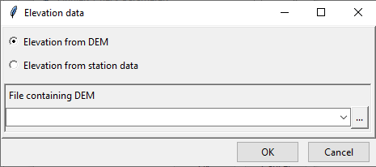
 
 (4) Specify the minimum number of neighbor stations to be used to perform the spatial check.
    
 (5) Specify the maximum number of neighbor stations to be used to perform the spatial check.
 
 (6) Specify the radius of search (in kilometers) to select the neighbor stations.

 (7) If using elevation data to select the neighbor stations, specify the maximum altitude difference (in meter) to be used to select the neighbor stations. For example, 800 m means the stations located 400 m above and below the target station will be selected.

d.	Type the full path to the folder to save the results of the outliers check, or use the browse button  .

e.	Click the button **Check Outliers** to run the quality control.

This creates a folder named **RR.OUTLIERS.CHECK_data** under the folder you provided (4) to save the results of the outliers check. Inside this folder 2 directories and 1 file are created:

- **CDTDATASET**: directory containing all the required files used by CDT

- **CDTSTATIONS**: directory containing the checked data, when you did a correction on the suspicious values. The name of the file containing the corrected data is the same as the name of the file from the input (**2**).

- **OutliersCheck.rds**: an index file, you will need to reload the outputs of QC if you want to view the results or to continue the correction of suspicious values later.

The tab QC Outputs allows to view the results of the QC.

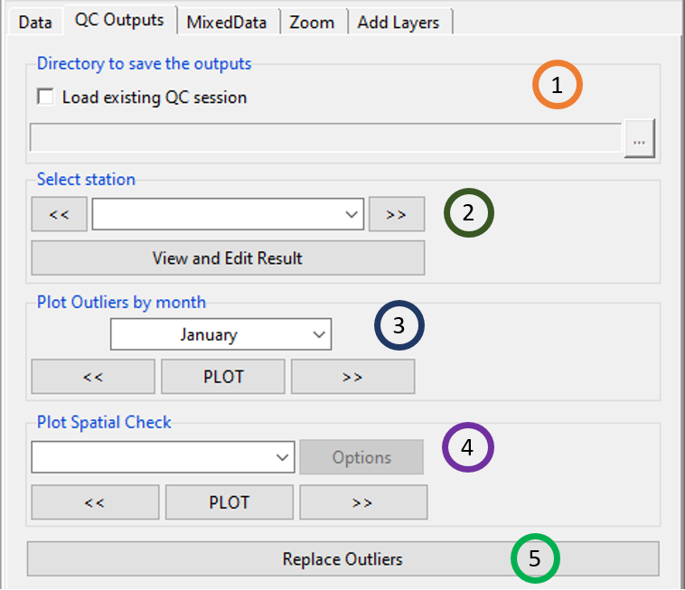

1.	If you already performed an outliers check, you do not need to run it again, you can check this box, the input field below will be activated and you can provide the full path to **OutliersCheck.rds** under the folder **RR.OUTLIERS.CHECK_data** by browsing it through the button  on the right.

2.	The stations with suspicious values are listed here. You can select a station and click on the button **View and Edit Result** to view and edit the result of the QC for this station. You can use the buttons   or  to switch to the previous or next station. It will open a table on the right panel showing the output of the QC for the selected station.


```{r echo = FALSE, warning = FALSE}
options(knitr.kable.NA = "**")
data332 = data.frame(STN.ID = c(10120,10120), DATE=c(19830724,19950927), STN.V=c(200,366), STN.TE=c(1.09,1.72),STAT.SPA=c(37, NA),OUT.TEMP=c("upper.outliers","greater.than.maximum.values"),
                    OUT.S=(c(NA,NA)),NOT.REP=c(1, NA),REPLACE.V=c(NA,NA))
knitr::kable(data332, digits = 3, format.args = list(scientific = FALSE), caption = "Table for rainfall outlier")
```

 (a) **STN.ID** shows the ID of the station.
    
 (b) **DATE** is the dates on which suspicious values are found.
    
 (c) **STN.VAL** is the observed suspicious values.
    
 (d) **STAT.TEMPORAL** gives statistics from the temporal check if available.

 (e) **STAT.SPATIAL** is the statistics from the spatial check if available.

 (f) **OUT.TEMPORAL** gives us the description of the suspicious value from temporal check.
  
  + **negative.values**: the value is negative;
  
  +	**greater.than.maximum.values**: the value is greater than the maximum possible value you provided when you set the parameters of the QC;
  
  +	**upper.outliers**: the value is flagged as too large compared to the time series from this month.
        
 (g) **OUT.SPATIAL** provides the description of the suspicious value from spatial check.
    
  +	**spatial.not.outliers**: the value is flagged as upper.outliers from the temporal check but not an outlier when a spatial check is performed;
  
  + **isolated.precipitation**: the value is flagged as isolated precipitation, an observation is implausible and called isolated precipitation if this value is extremely suspicious and very large compared to those of neighboring stations and verifies the following conditions
        
$$
Pmax < ISPMAX and Pobs > ISPOBS
$$	
			   
where 
 **Pmax**: maximum value of neighboring stations
 **Pobs**: value of target station
 **ISPMAX** and **ISPOBS**: values depend on the climatology of the region and computed by CDT from the station data;

 + **isolated.dryness**: the value is flagged as **isolated dryness**, an observation is implausible and called **isolated dryness** if this value is extremely suspicious and very small compared to those of neighboring stations and verifies the following conditions

$$
Pmin ⩾ ISDMIN; Pobs < ISDOBS and P25 ⩾ ISDQ1
$$

 Where

 **Pmin** : minimum value of neighboring stations
 **Pobs** : value of target station
 **P25** : the first quartile of neighboring stations
 **ISDMIN**, **ISDOBS** and **ISDQ1**: values depend on the climatology of the region and computed by CDT from the station data;

 +	**too.large.deviation.above**: the value is flagged very high compared to the values of the neighbor stations, an observation is strongly deviate to the right-tail (too large deviation above) and stated as implausible if

$$
            (Pobs - Q50) / IQR > 2 . IQRF and Pobs > ISPBOS
$$
  Where
 **Pobs**: value of target station
 **Q50**: the median of neighboring stations
 **IQR** : the interquartile range of neighboring stations
 **IQRF**: a multiplier factor of the interquartile range set to 2.8 by default;

 +	**too.large.deviation.below**: the value is flagged very small compared to the values of the neighbor stations, an observation is strongly deviate to the left-tail (too large deviation below) and stated as implausible if

$$
(Pobs - Q50) / IQR < -IQRF and Pobs ≤ ISDOBS
$$
            
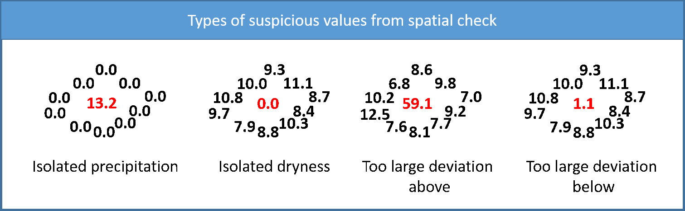

 (h) You can specify here an action to take when you want to correct the suspicious value. By default, the value in this column is **1**, this means no correction will be done. If you put a flag **1** in this column, the corresponding value in column (**c**) will be kept. If you leave this column blank, the corresponding value in (c) will be replaced by missing value.
 (i) If you put a value in this column, this value will be taken to replace the value in (**c**). This column takes the priority, whenever you put a flag **1** or leave blank the column (**h**).

  After editing this table, you have to save the changes you made. You can go to the menu **File -> Save table** or click on the button  in the toolbar to save the table. If the table is saved correctly, you should see an output message “*Table saved successfully*”.

3. Select here the month to display a chart of the time series for this month and the suspicious values detected from the temporal check. If you select the month from the drop-down list, click on the button **PLOT** to display the chart. You can use the buttons  and  to switch to the previous or next month.

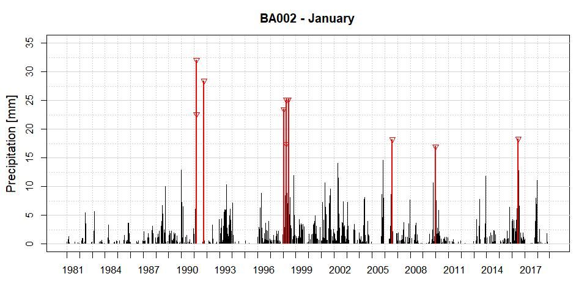

4.	Select here the date corresponding to a suspicious value to plot it on a map for this date. If you select the date from the drop-down list, click on the button PLOT to display the map. You can use the buttons  and  to switch to the previous or next date.

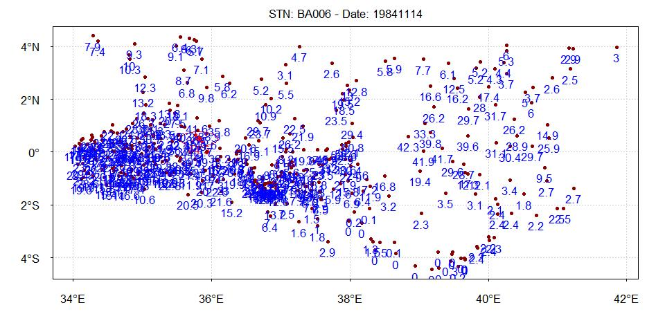

5.	After saving the changes you made on the table, click on the button Replace Outliers for the changes to take effect.

To replace all the values flagged as suspicious for all stations by missing values, use the following command to the R console:

    indexQC <- "/<path_to>/RR.OUTLIERS.CHECK_data/OutliersCheck.rds"
    CDT:::QC.RR_replaceAll(indexQC, action = "all")

Change <**path_to**> with exact path. The corrected data are located under the folder **RR.OUTLIERS.CHECK_data/CDTSTATIONS**.

The tab **MixedTemp** allows to verify if a temperature values are found inside the rainfall data for some stations.

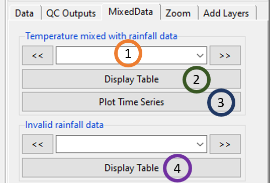

1.	The stations with suspected temperature values inside the rainfall data are listed here. You can select a station from the drop-down list, or use the buttons  and  to switch to the previous or next station.
2.	Click this button to display a table showing the period when the temperature data are found inside the rainfall.
3.	Click this button to display the time series of the selected station from (**1**).

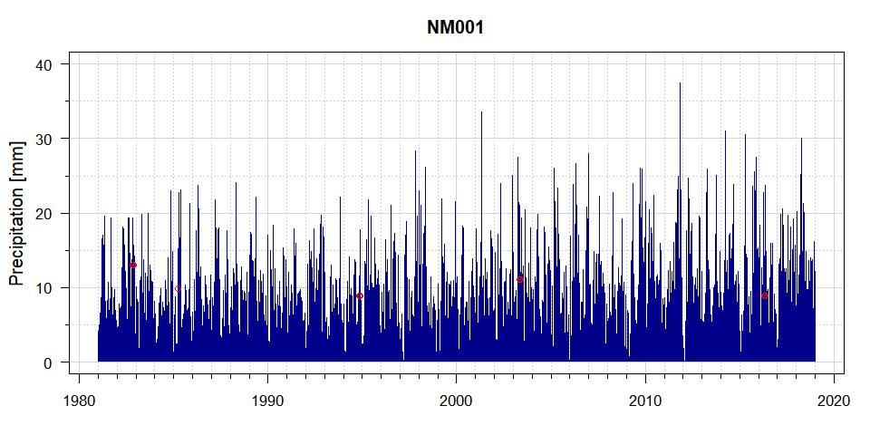

The tab **Zoom** allows you to zoom the displayed map.

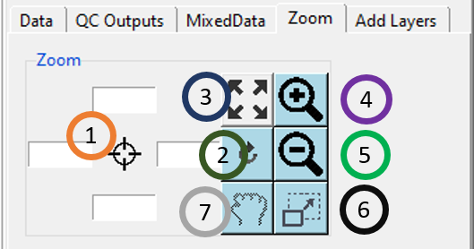

1.	Enter here the bounding box of the area to be displayed on the map.
2.	After setting the bounding box (1), click this button for the change to take effect.
3.	Reset the zoom.
4.	Zoom in to the map area
5.	Zoom out
6.	Draw a rectangle on the map to zoom in an area.
7.	Move the displayed map.

Right click on the map to deactivate the active zoom.

The tab **Add Layers** allows you to superpose other layers.

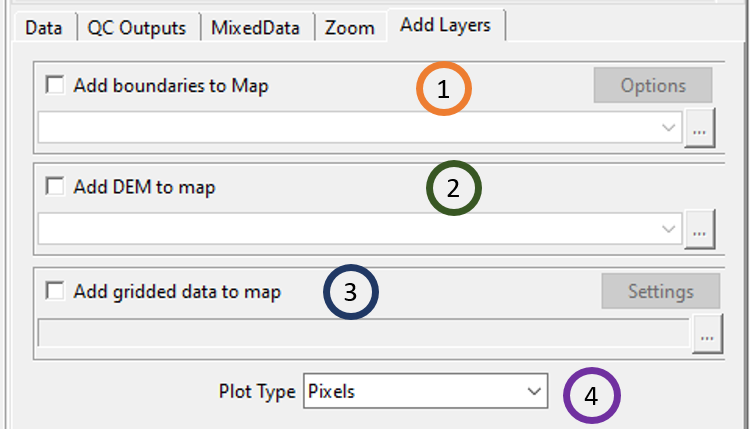

1.	Check the box and select the shapefile from the drop-down list or open it from  to add boundaries to the active map.
2.	Check the box and select the NetCDF file containing the DEM (Digital Elevation Model) from the drop-down list or open it from  to add elevation data as background to the active map.
3.	Check the box and enter or browse the full path to the NetCDF data (from satellite or radar) to display. Do not forget to provide a sample file and change the filename format by clicking on the button **Settings**.
4.	Select the type of the map. You can choose between a pixel-based image or a contour map.

### Outliers check for temperatures data

Similar to precipitation, temperature records can also contain outliers stemming from different sources. CDT also has in-built features for detecting and updating temperature outliers through spatial and temporal checking. Suspicious values can also be plotted in a map as provided by the user.

To check the outliers for temperatures data, use the menu **Quality Control -> Outliers Check for temperatures data**. This will display a tabbed widget on the left panel, allowing you to enter the inputs data and parameters.

The tab **Data** allows you to enter the inputs data and set the parameters for the QC.

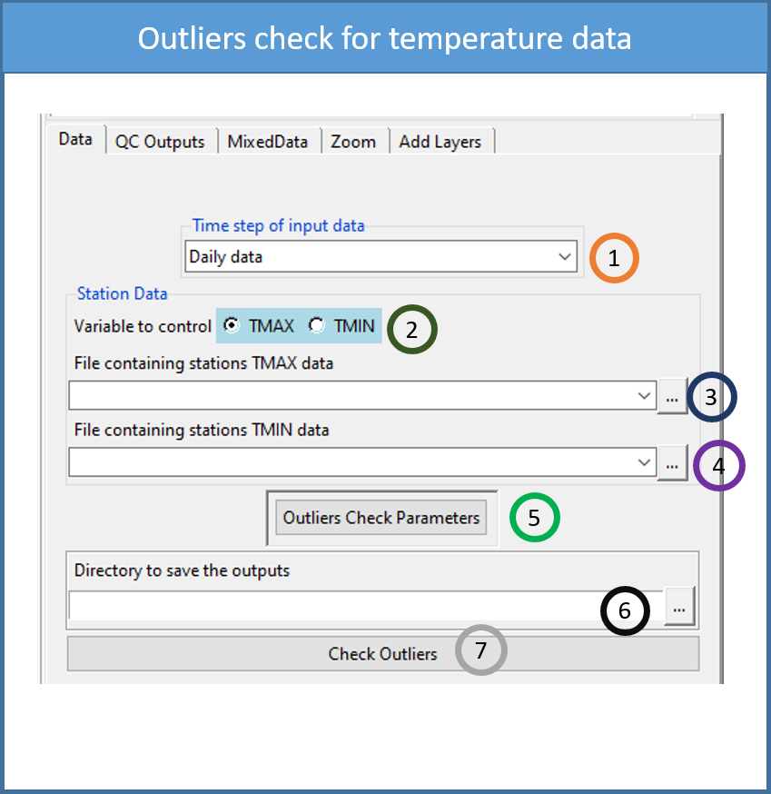

1.	Select the time step of the station data to be checked. We can use any of these different time periods: daily, pentad, dekadal and monthly.
2.	Choose the variable to be checked between the maximum and minimum temperature.
3.	Select from the drop-down list the file containing the station data to be checked if it is already loaded, or open it from the browse button  on the right.
    *	If TMAX is selected in (**2**), this should be the file containing the maximum temperature.
    *	If TMIN is selected in (**2**), this should be the file containing the minimum temperature. 
4.	Select from the drop-down list the file containing the station data to be used to check if the minimum temperature is greater than the maximum.
    *	If TMAX is selected in (**2**), this should be the file containing the minimum temperature.
    *	If TMIN is selected in (**2**), this should be the file containing the maximum temperature.

5.	Click on this button to set the parameters to perform the outliers check

    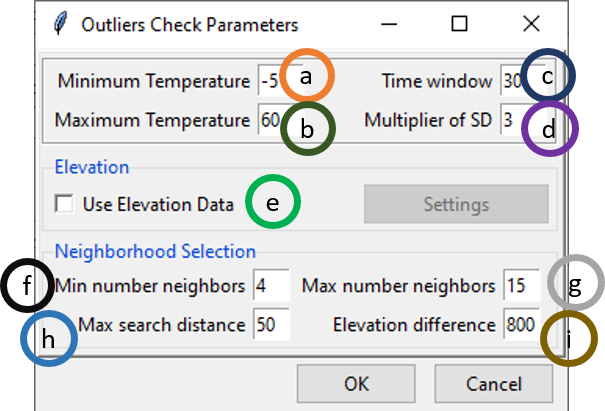

    (a) Specify the minimum possible value of the temperature. It depends on the time step of the input data and the region or country.
    (b) Specify the maximum possible value of the temperature.
    (c) Length of the time window to be used to perform a sliding regression. The unit is days if the input is a daily data.
    (d) Enter the multiplier of the standard deviation to perform the temporal check. You can use a real number like 3.5. In a normal distribution 99.73% of the data should be within +/- 3 times of the standard deviation around the mean. It will be converted to a confidence level to conduct the test.
    (e) If you want to use elevation data to select the neighbor stations, check this box and click on the button Settings, it will display a dialog box which allows to specify the elevation data to be used.

    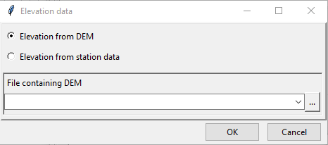

    If the elevation data come from DEM (Digital Elevation Model), Select **Elevation from DEM**, you have to provide the DEM file in NetCDF format, select it from the drop-down list if it is already loaded or open it from the browse button .  If the elevation data come from the station data select Elevation from station data. 

    (f) Specify the minimum number of neighbor stations to be used to form the predictors for the regression.
    (g) Specify the maximum number of neighbor stations to be used to form the predictors for the regression.
    (h) Specify the radius of search (in kilometers) to select the neighbor stations.
    (i) If using elevation data to select the neighbor stations, specify the maximum altitude difference (in meter) to be used to select the neighbor stations. For example, 800 m means the stations located 400 m above and below the target station will be selected

6.	Type the full path to the folder to save the results of the outliers check, or use the browse button .

7.	Click the button Check Outliers to run the quality control.

This creates a folder named **TMAX.OUTLIERS.CHECK_data** or **TMIN.OUTLIERS.CHECK_data** under the folder you provided (6) to save the results of the outliers check. Inside this folder 2 directories and 1 file are created:

- **CDTDATASET**: directory containing all the required files used by CDT

- **CDTSTATIONS**: directory containing the checked data, when you did a correction on the suspicious values. The name of the file containing the corrected data is the same as the name of the file from the input (3).

- **OutliersCheck.rds**: an index file, you will need to reload the outputs of QC if you want to view the results or to continue the correction of suspicious values later.

The tab **QC Outputs** allows to view the results of the QC.

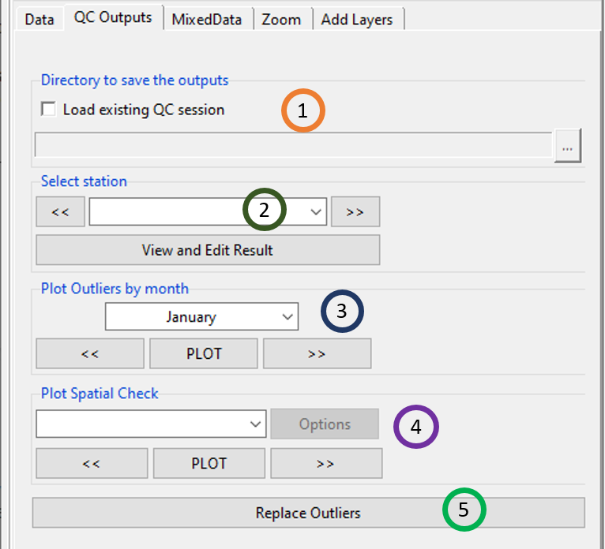

1.	If you already performed an outliers check, you do not need to run it again, you can check this box, the input field below will be activated and you can provide the full path to **OutliersCheck.rds** under the folder **TMAX.OUTLIERS.CHECK_data** or **TMIN.OUTLIERS.CHECK_data** by browsing it through the button  on the right.

2.	 The stations with suspicious values are listed here. You can select a station and click on the button View and Edit Result to view and edit the result of the QC for this station. You can use the buttons  or  to switch to the previous or next station. It will open a table on the right panel showing the output of the QC for the selected station.

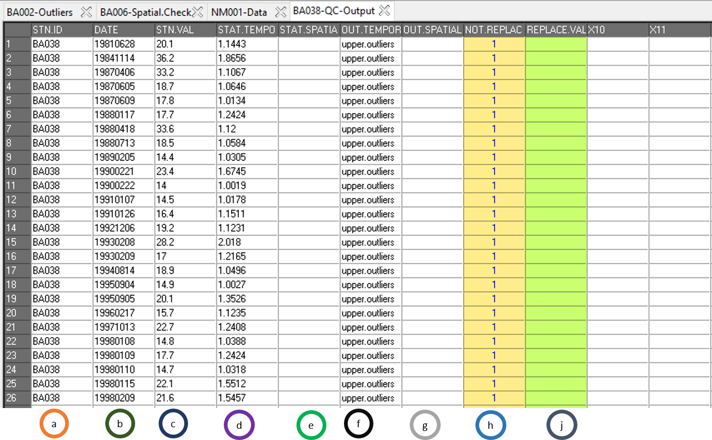

 (a) The ID of the station.
 (b) The dates on which suspicious values are found.
 (c) The observed suspicious values.
 (d) Statistics from the temporal check if available.
 (e) Statistics from the spatial check if available.
 (f) Description of the suspicious value from temporal check.

  * **lower.values**: the value is flagged as too small compared to the time series from this month;
  *	**upper.outliers**: the value is flagged as too large compared to the time series from this month;
  *	**TMIN >= TMAX**: the minimum temperature is greater than the maximum temperature;
  *	**greater.than.maximum.values**: the value is greater than the maximum possible value you provided when you set the parameters of the QC;
  *	**less.than.minimum.values**: the value is less than the minimum possible value specified.
 
 (g) Description of the suspicious value from spatial check.
  *	**spatial.not.outliers**: the value is flagged as outlier from the temporal check but not an outlier when a spatial check is performed;
  *	**upper.outliers**: the value is flagged very high compared to the values of the neighbor stations;
  *	**lower.outliers**: the value is flagged very small compared to the values of the neighbor stations.
  (h) The estimated value from the regression.
  (i) You can specify here an action to take when you want to correct the suspicious value. By default, the value in this column is 1, this means no correction will be done. If you put a flag 1 in this column, the corresponding value in column (c) will be kept. If you put a flag 2, the corresponding value in column (c) will be replaced by the estimated value in column (h). If you leave this column blank, the corresponding value in (c) will be replaced by missing value.
  (j) If you put a value in this column, this value will be taken to replace the value in (c). This column takes the priority, whenever you put a flag 1, 2 or leave blank the column (i).

 After editing this table, you have to save the changes you made. You can go to the menu **File -> Save table** or click the button  in the  toolbar to save the table. If the table is saved correctly, you should see an output message “Table saved successfully”.

3.	Select here the month to display a chart of the time series for this month and the suspicious values detected from the temporal check. If you select the month from the drop-down list, click on the button PLOT to display the chart. You can use the buttons  and  to switch to the previous or next month.

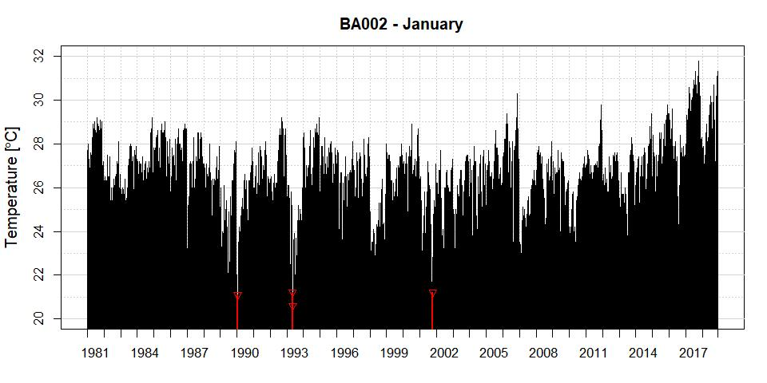

4.	Select here the date corresponding to a suspicious value to plot it on a map for this date. If you select the date from the drop-down list, click on the button **PLOT**  to display the map. You can use the buttons  and  to switch to the previous or next date.

    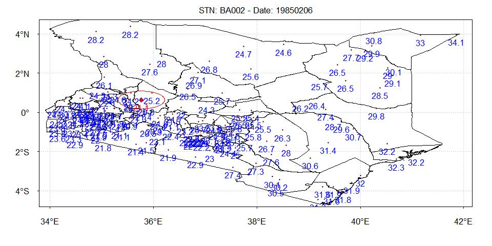

5.	After saving the changes you made on the table, click on the button **Replace Outliers** for the changes to take effect.

To replace all the values flagged as suspicious for all stations by missing values, use the following command to the R console:

    indexQC <- "/<path_to>/TMAX.OUTLIERS.CHECK_data/OutliersCheck.rds"
    CDT:::QC.TT_replaceAll(indexQC, action = "all")

Change **<path_to>** with exact path. The corrected data are located under the folder **TMAX.OUTLIERS.CHECK_data/CDTSTATIONS**.
You can do the same for the minimum temperature by replacing **TMAX** by **TMIN**.
The tab **MixedData** allows the user to see the suspicious equal observations or invalid temperature data in tabular form.

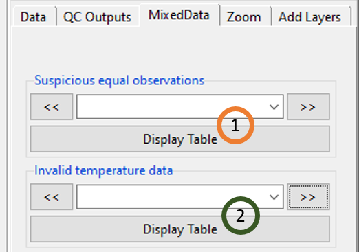

1.	It shows the suspicious equal observations for temperature data. We can use the  and  buttons to move to the previous or next value. By clicking on Display Table, we can see all the suspicious equal observations in tabular format.
2.	This shows invalid temperature data and similar to the suspicious equal observations, we can move to previous or next values and can see them in tabular format.

The tab **Zoom** allows you to zoom the displayed map.

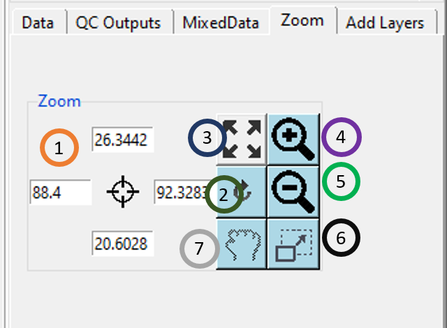

1.	Enter here the bounding box of the area to be displayed on the map.
2.	After setting the bounding box (1), click this button for the change to take effect.
3.	Reset the zoom.
4.	Zoom in
5.	Zoom out
6.	Draw a rectangle on the map to zoom in an area.
7.	Move the displayed map.

Right click on the map to deactivate the active zoom.

The tab **Add Layers** allows you to superpose other layers.


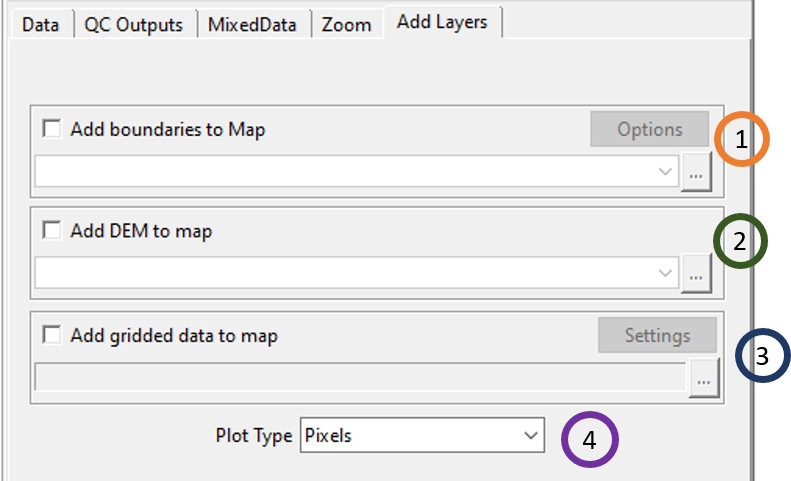

1.	Check the box and select the shapefile from the drop-down list or open it from  to add boundaries to the active map.

2.	Check the box and select the NetCDF file containing the DEM (Digital Elevation Model) from the drop-down list or open it from  to add elevation data as background to the active map.

3.	Check the box and enter or browse the full path to the NetCDF data (from satellite or radar) to display. Do not forget to provide a sample file and change the filename format by clicking on the button **Settings**.  

4.	Select the type of the map. You can choose between a pixel-based image or a contour map.

## Homogeneity test

In homogenous climate data, variations in climate data stem from variations in climate only (Mahmood and Jia, 2016). Inhomogeneity in climate data could occur due to changes in instruments, changes in observational routine, relocation of stations etc (Li-Juan and Zhong-Wei, 2012). In the presence of inhomogeneity, calculation of climate trends, variability and climate extreme analysis can be affected leading to erroneous conclusions in meteorological and hydrological studies (Hansel et. al., 2016; Mahmood and Jia, 2016). Thus it is very important to homogenize climate data by removing theinhomogeneity. We do so by detecting breakpoints and removing the inhomogeneity from the data. There are many different techniques for detecting irregularity of a station. 

CDT offers 4 different statistical techniques for detecting irregularity which are Pettitt test, SNHT test (standard normal homogeneity test), CUSUM type test and CUSUM type with trend test (Gallagher, Lund and Robbins, 2013). Pettitt test (Pettitt, 1979) is a non-parametric approach to change point detection which can detect abrupt change in the mean value of the distribution of climate variables such as rainfall or precipitation (Tarhule and Woo, 1998). It is a rank-based non-parametric method to detect change point and test its statistical significance. This test has the null hypothesis that if we randomly split the sample in two segments, the mean value of these two segments is the same. SNHT test is used for detecting linear trends of arbitrary length in the time series of climate data (Alexandersson and Moberg, 1997). This test allows you to detect abrupt jumps and thus to homogenize data. CUMSUM test is a method to detect a change in the mean of the series. This statistic is calculated using cumulative values up to the changepoint time. Changepoint statistics in data can be used both for data without trends and with trends. CDT allows you to use the CUMSUM test for both of these two cases.

CDT allows users to use two methods for adjusting homogeneities: mean and quantile matching. The first method works by comparing the mean of the variable under consideration before and after the break, while the second method compares quantile before and after the break (Squintu et al., 2020). 

## References

Alexandersson H, Moberg A. 1997. Homogenization of Swedish temperature data. Part 1: homogeneity test for linear trends.
International Journal of Climatology. 17: 25–34. 

Dinku, T. (2019). Challenges with Availability and Quality of Climate Data in Africa. In A. M. Mellese, W. Abtew and G. Senay(ed.) Extreme Hydrology and Climate Variability, Springer book

Gallagher, C., Lund, R., and Robbins, M. (2013). Changepoint detection in climate time series with long-term trends. J. Clim. 26, 4994–5006. doi: 10.1175/JCLI-D-12-00704.1

Hansen, J. W., Zebiak, S., and Coffey, K. (2014). Shaping global agendas on climate risk management and climate services: an IRI perspective. Earth Perspect. 1, 13. doi: 10.1186/2194-6434-1-13

Li-Juan, C., and Zhong-Wei, Y. (2012). Progress in research on homogenization of climate data. Adv. Climate Change Res. 3, 59–67. doi: 10.3724/SP.J.1248.2012.00059

Mahmood, R. and Jia S. (2016) Quality control and homogenization of daily meteorological data in the trans-boundary region of the Jhelum River basin. Journal of Geographical Sciences 26, 1661-1674 

Pettitt, AN. (1979). A non-parametric approach to the change-point problem. Appl. Stat., 28(2):126–135

Squintu, A. A., van der Schrier, G., Štěpánek, P., Zahradníček, P., and Tank, A. K. (2020). Comparison of homogenization methods for daily temperature series against an observation-based benchmark dataset. Theor. Appl. Climatol. 140, 285–301. doi: 10.1007/s00704-019-03018-0

Tarhule, A. and Woo, M. (1998) Changes in Rainfall Characteristics in Northern Nigeria. International Journal of Climatology, 18, 1261-1271