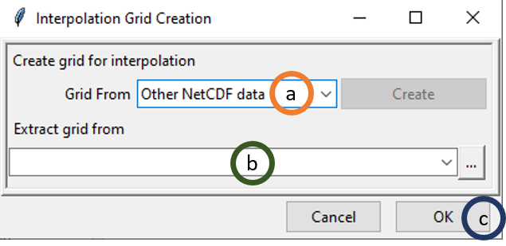

# Gridding:

Spatial data are mainly of two types: vector data and raster data. Vector data are used for representing features such as points, lines and polygons. Whereas continuous features such as elevation, vegetation etc. are represented by raster data through the arrangement of data in grids. We use either vector data or raster data according to what spatial object we want to measure. Sometimes we might need data for contiguous locations in an area but we have data only for some specific locations within that area. In that case, we can convert vector data to raster data and this process is called gridding. We can directly convert vector data or station observation data to raster data using spatial interpolation techniques. Additionally, we can also merge vector or station data with reanalysis or satellite data for generating merged gridded data.

## Spatial Interpolation:

CDT has various spatial interpolation techniques including **inverse distance weighting**, **modified Shephard** (Renka, 1988), *ordinary kriging*, *universal kriging* (Bargaoui and Chebbi, 2009),, **spheremap interpolation** (Kluver et al., 2016), **nearest neighbor** (Shope and Maharjan, 2015), **nearest neighbor with elevation**. User can specify different parameters such as grid size or spatial resolution, radius for interpolation, number of neighbors to consider (both minimum and maximum), variogram type etc. Description of these methods and hos to use these in CDT are described below.

### Inverse Distance Weighting:

For a climate variable z, the interpolated value at the location s0 using the inverse distance weighting is defined as
$$
\hat{z}(s_0) = \frac{\sum_{i = 1}^{n}\frac{z(s_i)}{d_i^p}}{\sum_{i = 1}^{n}{\frac{1}{d_i^p}}}
$$
where s~i~ (i = 1, 2, …) stands for the n locations for which there are recorded observations for each of these locations z(s~i~). 

### Modified Shephard’s Method:

Modified Shephard’s Method (MSM), developed by Franke and Nielson (1980), uses inverse distance weighted least squares to compute the interpolated values. The equation is:

$$
F(x, y) = \frac{\sum_{i = 1}^{n}W_k(x, y).Q_k(x, y)}{\sum_{i = 1}^{n}W_i(x, y)}
$$
where:

* F(x, y) is the Shephard function for the coordinate x and y,
* W is the relative weights, and 
* Q~k~ is the bivariate quadratic function
* The relative weight is determined by

$$
W_k(x, y) = [\frac{(R_\omega-d_k)_+}{R_\omega.d_\omega}]^2
$$


Where:
* W is relative weights
* d~k~ is the Euclidean distance between points located in (x, y) and (x~k~,y~k~)
* R~ω~ is the radius of influence around the point x~k~.

### Kriging

Kriging is another set of interpolation methods where the interpolated value at a location is calculated using linear combination of the surrounding values. In calculating linear combination, the weights of the surrounding values are calculated using a model of spatial autocorrelation. Kriging uses variogram (2γ) which is the expected squared difference of all pairs of points for a specified distance. A variogram is defined as

$$
2\gamma(h) = \frac{1}{N(h)}\times\sum_{i = 1}^{N_h}[z_n-z_{n+h}]
$$
Where:

* N(h) is the total number of data pairs at distance h
* z~n~ is the observed value at location n,
* z~n+h~ is the observed value at location n + h

We can use the following theoretical models for approximating the behavior of a model (Isaaks i Srivastava, 1989):

$$
\gamma(h) = C[(\frac{3h}{2a}) - (\frac{h^2}{2a^2}) ]  \qquad h\leq{x}\qquad\qquad\qquad\qquad spherical\qquad model\qquad\qquad\qquad\qquad (1)            
$$
$$
\gamma(h) = C \qquad\qquad h>a
$$
$$
\gamma(h) = C[1 - exp(\frac{-h}{a}) ]  \qquad h\leq{x}\qquad\qquad\qquad\qquad exponential\qquad model\qquad\qquad\qquad\qquad (2)            
$$
$$
\gamma(h) = C[1 - exp(\frac{-h^2}{a}) ]  \qquad h\leq{x}\qquad\qquad\qquad\qquad Gaussian\qquad model\qquad\qquad\qquad\qquad (3)            
$$
Where 

* γ(h) stands for the variogram value,
* C stands for constant,
* h stands for distance, and 
* a stands for range

There are different types of kriging which are discussed below:

* Ordinary kriging estimates the interpolated value by estimating linear combination of the available data while minimizing the variance of the errors. Ordinary kriging assumes stationarity or that the mean and variance remain constant spatially.
* Universal kriging relaxes this assumption of stationarity by allowing the mean to vary using a spatial trend while keeping the constant variance assumption. 

### Spheremap Interpolation

The nearest neighbor interpolation assigns value to a point according to the value of its nearest neighbor (Islam, 2018). For defining areas of influence around observed data point, this method uses Thiessen or Voronoi polygons (Integrated Environmental Health Impact Assessment System, 2021). 

### Nearest Neighbor and nearest neighbor interpolation with elevation:

Nearest neighbor method uses the surrounding neighbors or values for doing spatial interpolation.

CDT offers 7 different spatial interpolations that we have discussed here: *IDW*, *ordinary kriging*, *universal kriging*, *modified shepard interpolation*, *spheremap interpolation*, *nearest neighbor* and *nearest neighbor with elevation*.

To conduct spatial interpolation, use the menu **Gridding -> Spatial Interpolation**. This will display a tabbed widget on the left panel, allowing you to enter the inputs data and select different interpolation methods and parameters.

The first tab Input Data allows you to specify the input data of different time frequency, choose an interpolation method and specify different parameters. 


1.	Specify the time frequency of the data.
2.	Browse to the file location for which you want to spatially interpolate data.
3.	Click on Set Date Range by specifying the date range between which you want to interpolate data. This will pop up a dialog box as following.

    
    (a) Specify the start time for data filtering. If you selected Daily data in step 1, you will get filtering options up to day, if you selected Monthly data then you will get options up to month and so on.
    (b) Similarly, set the ending time for data filtering.

4. Click on Interpolation Parameters to specify the interpolation method and its associated parameters. This will open the following dialog box.

    

    (a) By default, Inverse Distance Weighted interpolation method is selected. We can select different interpolation methods here.
    (b) nmin is the minimum number of stations to be considered for interpolation. Here, 8 means that at least 8 stations’ point data will be used for interpolation.
    (c) nmax is the minimum number of stations to be considered for interpolation.
    (d) maxdist is the maximum radius in km from an unobserved point for which interpolated value is to be computed. The stations that lie within this radius or maxdist, are considered for interpolation.
    (e) If ticked, block mean values will be used instead of all the point values.
    (f) Click **OK**.

    In this example, interpolation for an unobserved value is computed using at least 8 stations and at most 16 stations that lie within 3.5 km radius around the point.

    If you want to use a different interpolation method, select it by clicking on different options given for Interpolation Method in (a). Now, select Ordinary Kriging which will also change some of the parameter options as shown below.
    
    

    (a) Select **Ordinary Kriging** option under **Interpolation method**.
    (b) Similar to Inverse Distance Weighted interpolation, nmin equals 8, nmax equals 16 and maxdist equals 3.5 mean that minimum 8 stations’ data and maximum 16 stations’ data will be used for interpolation that are inside 3.5 km range from the point of consideration. You can change these options according to your requirement by rewriting these parameter values.
    (c) If ticked, block mean values will be used instead of all the point values.
    (d) This provides all the variogram models that will be used. Sph stands for spherical model, Exp stands for exponential model, Gau stands for Gaussian model, Pen stands for …
    (e) Minimum number of points to be used …..
    (f) Click OK.

    Now, let’s have a look at different options if you selected **Universal Kriging**. 

    

    (a) Select **Universal Kriging** option under **Interpolation method**.
    (b) You can specify only **nmin** and **nmax** here. The option **maxdist** is disabled.
    (c) If ticked, block mean values will be used instead of all the point values.
    (d) This provides all the variogram models that will be used. Sph stands for spherical model, Exp stands for exponential model, Gau stands for Gaussian model, Pen stands for …
    (e) Minimum number of points to be used …..
    (f) You can use one or all of these options: **Elevation**, **Slope**, **Aspect**, **Longitude** and **Latitude**. 
    (g) In case, either **Elevation**, **Slope** or **Aspect** is ticked or two of them or all of them are ticked, **Elevation data (NetCDF)** is activated. If activated, browse to the NetCDF file of elevation data or write down the full path here.
    (h) Click **OK**.

    To use modified Shepard interpolation, select it and the options given for parameters will again change.
    
    

    (a) Select Modified Shepard interpolation option under Interpolation method.
    (b) Like Universal Kriging, you can specify only nmin and nmax here. The option maxdist is disabled here too.
    (c) Click **OK**.

    If you selected Spheremap interpolation method, the parameter options are similar to modified Shepard as shown above.

    

    If you select **Nearest Neighbor**, the widget will appear as following.

    

    (a) Select Nearest Neighbor option under Interpolation method.
    (b) Radius of Influence is the radius within which the nearest neighbor will be selected and the value will be used. I this case, if you specify 3.5 then the nearest neighbor within the 3.5 km range will be used as the value for the unobserved location for which you want to get interpolated value.

    You can also select **Nearest Neighbor with elevation – 3D**, the widget will appear as following. This will give us an additional option of using elevation data.

    

    *	(a) Select Nearest Neighbor with elevation – 3D option under Interpolation method.


## Merging:

Climate data are collected from a limited number of stations which are dispersed across a geographical area of interest. This poses a challenge for spatial representation for many areas where there are no stations. It is imperative to have spatially and temporally complete data for climate monitoring, drought monitoring (Bajarcharya et al., 2015) hydrological analysis, forecasting flood and hydrological hazards (Long et al., 2016). You have already learned that one way to address this problem is spatial interpolation. But for climate variable such as rainfall which have high spatial variability, spatial interpolation might not capture this variability (Tao et al., 2009). On the other hand, there are satellite data or climate model reanalysis products that have continuous spatial coverage but which are not as accurate as observation data.  Merging observation data with satellite or reanalysis products can utilize the better of these two types of data: accurate data from observations or stations and better spatial coverage of satellite or reanalysis data. Thus merging station data with satellite or reanalysis data addresses the problem of less spatial coverage of station data and less accuracy of satellite or reanalysis data.

Merging satellite or reanalysis data with observation data requires some pre-processing steps to align these two different datasets. First, you need to decide whether the satellite or reanalysis data is at the desired spatial resolution. If not, then downscale the satellite or reanalysis data to the required spatial resolution. Satellite or reanalysis data suffer from systematic errors, called bias. Bias represents the difference between the station and satellite/reanalysis data. This bias can be connected with a number of factors such as latitude (Haile et al., 2013), topography, local climate and season (Dinku et al., 2008). You need to remove this bias from satellite/reanalysis data using observed data from stations. There are various methods for bias correction such as multiplicative bias time step variable, multiplicative bias, multiplicative bias for each month, quantile mapping with fitted distribution, quantile mapping with empirical distribution etc. Using any of these methods, you can estimate bias coefficients and then use them to remove bias from the satellite/reanalysis data. After you get bias adjusted satellite/reanalysis data, you can then merge these with observation data using several techniques such as: Cressman scheme, Barnes scheme, simple bias adjustment and regression kriging. Different steps of merging as used in CDT are discussed below.
 
### Downscaling reanalysis

If you need reanalysis resolution at a higher resolution than the given reanalysis resolution, you will need to downscale this reanalysis data. For example, if the reanalysis has a spatial resolution of 0.6 degree and you need a spatial resolution of 0.4 degree or around 4 km resolution, you need to downscale the reanalysis products. CDT uses elevation data for downscaling as temperature varies with the altitude. In this case, we compute constant lapse rate for each month and use this to compute residuals for different time period. After that we add back the residual with the newly computed temperature at the required grid using lapse rate. 

First, we use the following linear model where temperature depends on elevation.

$$
Temp_m = a_m * Elev + b_m       \qquad\qquad\qquad\qquad\qquad\qquad\qquad\qquad\qquad\qquad(4)
$$
Temp~m~ is the temperature for month m, Elev is the elevation data, a~m~ is the coefficient for
month m or the lapse rate, and b~m~ is the intercept of the linear model

Now, we will compute the residual or the difference between the reanalysis temperature and the computed temperature. 

$$
Resid_{ymd} = Temp.reanl_{ymd} – (a_m * DEM.reanl.grid + b_m)\qquad\qquad\qquad\qquad\qquad\qquad\qquad\qquad(5)
$$


**Resid~ymd~** is the residual for the date ymd (here ymd stands for year, month and date), **emp.reanl~ymd~** is the reanalysis at the date ymd, and **DEM.reanl.grid** is the DEM data at the reanalysis grid.

Interpolate the residuals at the desired grid, using an inverse distance weighted, ordinary kriging, nearest neighbor and nearest neighbor with 3-D. Denote this as **Resid.down~ymd~** and also regrid the DEM data to the required grid and denote it as **DEM.down.grid**. Now, using equation (4), lapse rate, and using the DEM at the required grid compute the temperature at the required grid and add the residual **Resid.down~ymd~**  at the new grid.

$$
Temp.down_{ymd} = (a_m * DEM.down.grid + b_m) + Resid.down_{ymd} \qquad\qquad\qquad\qquad\qquad\qquad\qquad\qquad
$$

**Temp.down~ymd~** is the downscaled reanalysis at the date ymd, **DEM.down.grid** is the DEM data at the downscaled data grid and **Resid.down~ymd~** the interpolated residual at the date ymd.

### Bias adjustment

#### Climatological Bias Factors


There are different ways to correct specific errors and artifacts in the gridded data. Bias from the downscaled reanalysis or satellite data can be removed using station data. It can be done using station data as ground truth.

In computing the bias, gridded data is extracted at stations location and then the bias are calculated by comparing station data and extracted data for these station locations. There are mainly two types of bias: multiplicative bias and quantile mapping.

##### Multiplicative Bias

In this case, the bias is assumed to be multiplicative. Multiplicative bias can be defined as the following:

$$
BF_{tj} = \frac{\sum_{(t \; for\;  each\;  year)}STN_{tj}}{\sum_{(t \; for\;  each\;  year)}^{}GRD_{tj}}\qquad\qquad\qquad\qquad\qquad\qquad\qquad\qquad(6)
$$

where
* BF~tj~ is the bias factor for the time period under consideration which could be either pentad, dekad or month denoted as t at a station j
* T is the time period that varies from 1 to 72 for pentad data, 1 to 36 for dekadal data and 1 to 12 for monthly data
* STN~tj~ is the value at the station j for the time t
* GRD~tj~ is the value of the gridded data at the station j for the time t

For daily data, a centered time window of 5 days will be added to take account the variability.

The equation of the bias factor becomes

$$
BF_{tj} = \frac{\sum_{(t \; for\;  each\;  year\pm 5 \;days)}STN_{tj}}{\sum_{(t \; for\;  each\;  year\pm 5 \;days)}^{}GRD_{tj}}\qquad\qquad\qquad\qquad\qquad\qquad\qquad\qquad(7)
$$

where
* **BF~tj~** is the bias factor for day t at a station j
* **T** is the day from 1 to 365
* **STN~tj~** stands for the value at the station j for day t
* **GRD~tj~** stands for the value of the gridded data at the station j for day t

If the bias is assumed to be heterogeneous in space (independent and normally distributed),
the bias factor at the station locations is interpolated to the grid of the gridded data and then
used to adjust (correct) the gridded data.

The adjusted value can be obtained by multiplying the gridded data with the bias factor.

#### Quantile mapping

Quantile mapping (QM) works by matching the cumulative distribution function of the gridded data with the cumulative distribution function of the station data. QM maps quantiles from the gridded data and the observed data set and doing so it corrects bias in the gridded data.

If FSTN is the Cumulative Distribution Function (CDF) of a climate random variable xSTN at a
given station during the historical time period, and FGRD for the CDF of the same variable xGRD from the gridded data, for the same time period. The quantile mapping method aimed to match the distribution function of the gridded data with the station data.

F~STN(xSTN)~ = F~GRD(xGRD)~

The adjusted value x~bc~ can be obtained empirically from
$$
x_{bc}=F_{STN}^{-1} (F_{GRD} (x_{GRD} )) \qquad\qquad\qquad\qquad\qquad\qquad\qquad\qquad\qquad\qquad\qquad\qquad(8)
$$
Where $F_{STN}^{-1}$, defined from [0, 1], is the inverse function (quantile function) of FSTN.

##### Rainfall 

A mixture of the Bernoulli and the Gamma distribution is used to fit the distribution of the series. The Bernoulli distribution is used to model the occurrence of zero values with the
probability of **1-prob**. Non-zero values follow the Gamma distribution with **shape** and **scale**
parameters.

An Anderson-Darling test is used to test if the series come from the specified distribution. If the
series do not follow the specified distribution, no fitting will be made.

##### Temperature 

A normal distribution is used to fit the distribution of the series. A Shapiro-Wilk normality test is used to test if the series are compatible with a normal distribution. If the series do not follow the normal distribution, no fitting will be made.

Then the parameters of the distribution are interpolated to the grid of the gridded data. Assumes that the parameters are heterogeneous in space (independent and normally distributed).

## Merging in CDT

Station data can be merged with satellite or reanalysis data using different methods discussed above in CDT. Below, we will show separately how you can merge rainfall data from stations with satellite data followed by how you can merge temperature data from stations with reanalysis data.

### Merging rainfall data with satellite data

Merging rainfall data from stations with satellite data can be done in CDT using three steps:

a. Compute bias coefficient by comparing station data against satellite data;
b. Apply bias coefficients on satellite data to remove bias, and
c. Merge the bias corrected satellite data from the previous step with station rainfall data.

#### Computing bias coefficients

In CDT, there is a separate menu bar called Gridding under which you will get all the options available for gridding in CDT. To perform the first step of computing bias coefficient for rainfall data merging, you need to use the menu **Gridding -> Merging Rainfall Data -> Compute Bias Coefficients**. This will display a dialog box like the following.


1.	Select the time period of the data by clicking on the drop-down.
2.	Click on **Set Bias Base Period** to select the time period for which you want to calculate the bias and ultimately merge the dataset.
3.	Either specify the full path to the **Station data file** by writing it or by browsing to the file using .
4.	  Either specify the full path to the directory by writing it or browse to the directory using .
5.	Now, click on **Settings** and specify the settings of the files. This will bring a dialog box like the following.

    
    
    a.	Browse to the folder where the NetCDF files of the satellite product are located. Select any of the file and either double click or click Open. As soon as you do this, a new dialog box will open where you need to specify the variable name in the NetCDF file along with the **Longitude** and **Latitude** names. 

    
      1.  For Variable, click on the drop-down menu and select the variable name for precipitation. For example, for our case, the name is **precip**.
      2. Select the name for **Longitude**.
    3. Select the name for **Latitude**.
    4. Click **OK**.
<br>
    
         
    b.	Specify the filename format for the NetCDF files. For example, if one of the file name has this format precip_20160521.nc, then in the Netcdf data filenames format, rewrite **rfe_%s%s%s.nc** as **precip_%s%s%s.nc**. Here first **%s** represents year, second **%s** represents month and the third %s represents day.
    c.	Click **OK**.

6.	Specify or browse to the directory where you want to save the result.
7.	In the **Bias method** field, select the bias correction method that you want to apply. There are 4 bias correction methods available in CDT which are: **Multiplicative Bias Time Step Variable**, **Multiplicative Bias for Each Month**, **Quantile Mapping with Fitted Distribution** and **Quantile Mapping with Empirical Distribution**.


8.	Specify Minimum length of data.
9.	Click on Bias Interpolation Parameters to choose the interpolation method to be used for interpolating bias computed at station locations. As you saw for Spatial interpolation, here also CDT offers 4 interpolation methods: Inverse Distance Weighted, Ordinary Kriging, Nearest Neighbor and Nearest Neighbor with elevation - 3D. As you will select different interpolation method, the parameter options will also change.


10.	**Create Grid for Interpolation** allows you to specify the grid over which the interpolated value needs to be computed.  You can use the grid of the input NetCDF file for rainfall, use a different NetCDF file or define yourself the extent and resolution of the grid. Clicking on **Create Grid for Interpolation** brings the following dialog box. 


By default **The input NetCDF data** is selected and if you want to use this, click **OK**. 

If you want to use any other NetCDF data for defining the grid, then change the value of **Grid From** to **Other NetCDF data**.



a.	Select **Other NetCDF data**.
b.	Browse to the new file using which you want to create the grid for interpolation. In this case also, NetCDF file settings have to be specified such as the variable name, Longitude and Latitude variables names, filename settings etc.
c.	Click OK

Now, if you want to define the grid by yourself, select **User defined grid** for **Grid From**.  


a.	Select **User defined grid**.
b.	Click on **Create**. This will pop up another dialog box.

    

Now, specify the extent of the new grid in terms of longitude and latitude and specify the resolution to be used across longitude and latitude.
        
c.	Click **OK**.

11. Click **OK**.

Now, press  to compute bias coefficients. A new folder will now be created with the bias values.

#### Applying bias coefficients

To apply bias coefficients on the satellite rainfall data or to remove the bias, you need to use the menu **Gridding -> Merging Rainfall Data -> Apply Bias Correction**.


1.	Select the time period of the data by clicking on the drop-down.
2.	Click on **Set Date Range** to select the time period for which you want to calculate the bias corrected data.
3.	In **Bias method**, select the bias method that was used for **Bias computation**. If **Multiplicative Bias Time Step Variable** was used for **Bias computation**, select this method here. If any other method was used for Bias computation, select that particular method here.
4.	Browse to the directory containing bias files.
5.	Browse to the directory containing satellite rainfall data. 
6.	Now, click on **Settings** and specify the settings of the files.
7.	Specify or browse to the directory where you want to save the result.
8.	In **Adjusted data filename format**, specify the filename format for the NetCDF files. For example, for daily data, if you specify the format as bias_adjusted_%s%s%s.nc and the starting date is January 1st of 1981 then the filenames will have names like bias_adjusted_19810101.nc, bias_adjusted_19810102.nc and so on.
9.	Click **OK**.

Now, press  in the **Tool bar** to compute bias corrected rainfall data. A new folder will now be created with bias corrected NetCDF files.

#### Merging Data

After the satellite rainfall data is bias corrected in the previous step, you can now merge bias corrected data with station data. For accessing this functionality, click **Gridding -> Merging Rainfall Data -> Merging Data**. This will open the following dialog box.


There are two tabs: **Input Data** and **Merging Parameters**. In the first tab, you can specify the input data and the output data directory and format. In the second tab, you can specify different merging methods you want to use and their associated parameters. Now, let’s look at different options available under the **Input Data** tab as shown in the picture above.
1.	Select the time period of the data by clicking on the drop-down.
2.	Click on **Set Date Range** to select the time period for which you want to merge data. This time period normally is the same as the time period you used for bias computation.
3.	Specify the station data file by browsing to it through clicking .
4.	Here, specify the directory that contains the bias corrected station rainfall data you generated after completing **Applying bias coefficients**. 
5.	Specify the settings of the bias corrected files.
6.	Browse to the directory where you want to save the merged files.
7.	Specify the format of the name of the merged data files.

Now, click on the **Merging Parameters** tab. This will show different options for merging parameters.

CDT allows you to perform a multiple merging in a nested way, the outputs of the previous merging are used as input for the current merging process. Multiple passes are made through the grid at consecutively smaller radius of influence and number of neighbor stations used to increase precision. At each pass, the radius of influence, minimum and maximum number of neighboring stations used to interpolate on grid node are decreased in a given ratio. In other words, the parameters used for the local interpolation, **maxdist**, **nmin** and **nmax** will be multiplied by the factor provided by the user (**Pass ratio**). The table below shows an example summarizing the process of merging with 4 nested runs.

```{r echo = FALSE, warning = FALSE}
options(knitr.kable.NA = "")
data2 = data.frame(Run = c(1,2,3,4),
             Pass_ratio = c(1,0.75,0.5,0.25),
             maxdist = c("4", "4*0.75 = 3", "4*0.5 = 2", "4*0.25 = 1"),
             nmin = c("8", "8*0.75 = 6", "8*0.5 = 4", "8*0.25 = 2"), nmax = c("16", "16 * 0.75 = 12", "16*0.5 = 12", "16*0.25 = 4"),
             Input_data = c("Initial input (E.g.: Bias adjusted rainfall gridded data)", "Output 1", "Output 2", "Output 3"),
             Output_data = c("Output 1", "Output 2", "Output 3", "Output 4"))
knitr::kable(data2, digits = 3, format.args = list(scientific = FALSE), caption = "Merging with 4 nested runs")
```

The final merged data is **Output 4**. Note that if the difference between **nmax** and **nmin** is less than 2, then 2 more neighbor stations will be added to **nmax**.


1.	Click on **Merging Parameters** tab.
2.	Select the merging method. There are 4 merging methods available: **Cressman Scheme**, **Barnes Scheme**, **Simple Bias Adjustment** and **Regression Kriging**. 
3.	Specify the number of nested run that you want.
4.	Write the pass ratio in **Pass ratio**.
5.	Click on **Merging Interpolation Parameters**. This will pop up a new dialog box that you already saw.

    
The only additional option here is the use of **Use variable radius influence for each grid**. After selecting the interpolation method and making necessary change, click OK.
6.	You can either use the grid of the bias corrected rainfall data, grid of any other NetCDF file or the grid defined by you. You saw similar example while computing bias coefficients when we defined the grid for interpolation.

    

7.	A rain/no rain mask is applied to the merged rainfall over the region there is no observed rain from the stations. The objective is to prevent overestimation of the occurrence of rainfall in the merged data. To create the mask, the station data and the extracted merged data over the station locations are converted to a binary data using a threshold provided by the user, the rainfall below this threshold is set to zero while set to one when it is above the threshold. A generalized linear model is performed, the extracted merged data over the station locations are used as regressors to predict the binary trend on the grid of the merged data, then the residuals of the model are interpolated over the grid of the merged data and added back to the predicted trend. A threshold (boundary decision) is used to define the rainy region for the mask, the values of the grid greater than this threshold is considered as rainy region. Finally, the unmasked merged data is multiplied by the created mask to obtain the final masked merged data.

If you tick **Apply Rain-no-Rain Mask**, then rain/no rain mask is applied.  In this case, when you ticked, the other two options for ticking will also be activated. You can specify threshold for rain by ticking **Rainy day threshold**. For example, if **Rainy day threshold** is specified as 1 then rainfall less than 1 mm will be considered as no rainfall. To prevent a steep gradient in the interpolated mask, tick **Smooth Rain-no-Rain Mask** box to apply a spatial smoothing in the interpolated mask.
 
8.	If **Blank merged data using ESRI shapefiles** is checked, then all the data that lie beyond the boundary of the shapefile are blanked. If this is clicked, the shapefile could be loaded using .
9.	Click **OK**.

Now, press  in the **Tool bar** to compute merged rainfall data. A new folder will now be created with merged data which are created merging the observation or station data and satellite rainfall data.

#### Merging temperature data with reanalysis data

Merging temperature data from stations with reanalysis data can be done in CDT using five steps:
a.	Compute downscaling coefficients,
b.	Downscale reanalysis data using downscaling coefficients,
c.	Compute bias coefficient by comparing station temperature data against downscaled reanalysis data;
d.	Apply bias coefficients on downscaled reanalysis data to remove bias, and
e.	Merge the bias corrected downscaled reanalysis data from the previous step with station temperature data.

##### Compute downscaling coefficients

To perform the first step of computing downscaling coefficients, click **Gridding -> Merging Temperature Data -> Compute Downscaling Coefficients**. The downscaling coefficient is computed using lapse rate as we discussed before.


1.	Select the time period of the data by clicking on the drop-down.
2.	Click on **Set Base Period** to select the time period for which you want to compute downscaling coefficients. 
3.	Specify the station data file by browsing to it through clicking .
4.	Specify elevation data by browsing to the elevation data by clicking .
5.	Specify the directory where to save the result.
6.	Click **OK**.

Now, press  in the Tool bar to compute downscaling coefficients. A new folder will now be created with downscaling coefficients which will be used in the next step to downscale temperature data (reanalysis). You will see two files: **STN_DEM_GLM_COEF.rds** and **STN_DEM_GLM_COEF.txt**. **STN_DEM_GLM_COEF.txt** contains coefficients or lapse rates for 12 months. In the linear model, this was denoted as **a~m~**. It also contains 12 intercepts for 12 months which we denoted before as **b~m~**. **STN_DEM_GLM_COEF.rds** contains these coefficients and intercepts which will be used for reanalysis downscaling.

##### Reanalysis Downscaling

In this step, you need to downscale the temperature reanalysis data using the intercepts and coefficients (lapse rates) for 12 months that are saved in **STN_DEM_GLM_COEF.rds**. For reanalysis downscaling, we use the following equation:
$$
Temp.down_{ymd} = (a_m * DEM.down.grid + b_m) + Resid.down_{ymd}
$$
Here, **a~m~** is the lapse rate and **b~m~** is the intercept for month m saved in **STN_DEM_GLM_COEF.rds** where m goes from 1 to 12. **DEM.down.grid** is the DEM file at the new finer scale (for example, 0.04 degree) at which we want to downscale. **Resid.down~ymd~** is the residual of the linear model interpolated at the downscaled grid or at the finer scale. You can access this feature using **Gridding -> Merging Temperature Data -> Reanalysis Downscaling**. 


1.	Select the time period of the data by clicking on the drop-down.
2.	Click on **Set Date Range** to select the time period for which you want to apply downscaling coefficients. 
3.	Browse to the file **STN_DEM_GLM_COEF.rds** you computed while computing downscaling coefficients. Click on   to browse to this file.
4.	Click on  to browse to the directory containing the reanalysis files (temperature data).
5.	Click on **Settings** to specify the reanalysis file setting.
6.	Specify the elevation data by clicking on .
7.	Click on **Downscaling Interpolation Parameters** to specify the interpolation technique for downscaling and the parameters associated with it.

    

    There are 3 interpolation methods available for downscaling interpolation: **Inverse Distance Weighted**, **Ordinary Kriging** and **Bilinear interpolation**. Here, bilinear interpolation is a new method which we have not mentioned before. Bilinear interpolation computes the interpolation by taking weighted average of the nearest pixels. 

    

8.	Now, you can specify the grid to be used for interpolation by clicking on **Create Grid for Interpolation**. You can use the reanalysis grid, grid of any other NetCDF file or a grid defined by you. You have already come across this option before.
9.	Browse to the directory where you want to save the output.
10.	Specify the file name format for the output file or downscaled reanalysis data in **Downscaled data filename format**.
11.	Click **OK**.

Now, press  in the **Tool bar** to compute downscaled reanalysis data. A new folder will now be created with the downscaled reanalysis data of the NetCDF format.

##### Computing bias coefficients

The steps in computing bias coefficients for temperature are similar to the steps that you followed for computing bias coefficients for rainfall – you will get the same options for different bias methods and their associated parameters, creating grid etc. To compute bias coefficient for temperature, you need to use the menu **Gridding -> Merging Temperature Data -> Compute Bias Coefficients**. This will display a dialog box like the following.


1.	Select the time period of the data by clicking on the drop-down.
2.	Click on **Set Bias Base Period** to select the time period for which you want to calculate the bias and ultimately merge the dataset.
3.	Either specify the full path to the **Station data file** by writing it or by browsing to the file using .
4.	  Either specify the full path to the directory by writing it or browse to the directory using .
5.	Now, click on **Settings** and specify the settings of the files. This will bring a dialog box like the following.

    
    
    a.	Under Netcdf data sample file, browse to the folder containing downscaled reanalysis data of temperature. This folder was created when you downscaled reanalysis data in the previous step.
    b.	Specify the file name format under **Netcdf data filenames format**. For example, if one of the file name corresponding to December 1st, 2012 is tmax_down_20201201.nc, then the format to be specified is **tmax_down_%s%s%s.nc**.
    c.	Click **OK**.
6.	Specify or browse to the directory where you want to save the result.
7.	In the **Bias method** field, select the bias correction method that you want to apply. Similar to the bias coefficient computation for rainfall, for temperature also there are 4 bias correction methods available in CDT which are: **Multiplicative Bias Time Step Variable**, **Multiplicative Bias for Each Month**, **Quantile Mapping with Fitted Distribution** and **Quantile Mapping with Empirical Distribution**.

    

8.	Specify Minimum length of data.
9.	Click on **Bias Interpolation Parameters** to choose the interpolation method to be used for interpolating bias computed at station locations. As you saw for Spatial interpolation, here also CDT offers 4 interpolation methods: Inverse Distance Weighted, Ordinary Kriging, Nearest Neighbor and Nearest Neighbor with elevation - 3D. As you will select different interpolation method, the parameter options will also change.

    

10.	**Create Grid for Interpolation** allows you to specify the grid over which the interpolated value needs to be computed.  You can use the grid of the input NetCDF file for rainfall, use a different NetCDF file or define yourself the extent and resolution of the grid. Clicking on **Create Grid for Interpolation** brings the following dialog box. 

    

12.	Click **OK**.

Now, press  to compute bias coefficients. A new folder will now be created with the bias values.

##### Applying bias coefficients

To apply bias coefficients on the satellite rainfall data or to remove the bias, you need to use the menu **Gridding -> Merging Temperature Data -> Apply Bias Correction**. This will open the following dialog box.


1.	Select the time period of the data by clicking on the drop-down.
2.	Click on **Set Date Range** to select the time period for which you want to calculate the bias corrected data for temperature.
3.	In **Bias method**, select the bias method that was used for **Bias computation** for temperature. If **Multiplicative Bias Time Step Variable** was used for **Bias computation**, select this method here. If any other method was used for Bias computation, select that particular method here.
4.	Browse to the directory containing bias files.
5.	Browse to the directory containing satellite rainfall data. 
6.	Now, click on **Settings** and specify the settings of the files.
7.	Specify or browse to the directory where you want to save the result.
8.	In **Adjusted data filename format**, specify the filename format for the NetCDF files. For example, for daily data, if you specify the format as tmax_adj_%s%s%s.nc and the starting date is January 1st of 1981 then the filenames will have names like tmax_adj_19810101.nc, tmax_adj_19810102.nc and so on.
9.	Click **OK**.

Now, press  in the Tool bar to compute bias corrected temperature data. A new folder will now be created with bias corrected temperature data of NetCDF files.

##### Merging Data

After the reanalysis temperature data is bias corrected in the previous step, you can now merge bias corrected reanalysis temperature data with station data. For accessing this functionality, click **Gridding -> Merging Temperature Data -> Merging Data**. This will open the following dialog box.

Similar to merging for rainfall, there are two tabs: **Input Data** and **Merging Parameters**. Now, let’s look at different options available under the **Input Data** tab which are similar to what you have seen before.


1.	Select the time period of the data by clicking on the drop-down.
2.	Click on **Set Date Range** to select the time period for which you want to merge data. This time period normally is the same as the time period you used for bias computation.
3.	Specify the station data file by browsing to it through clicking .
4.	Here, specify the directory that contains the bias corrected station rainfall data you generated after completing **Applying bias coefficients**. 
5.	Specify the settings of the bias corrected files.
6.	Browse to the directory where you want to save the merged files.
7.	Specify the format of the name of the merged data files.

Now, click on the **Merging Parameters** tab. This will show different options for merging parameters.


1.	Click on **Merging Parameters** tab.
2.	Select the merging method. There are 4 merging methods available: **Cressman Scheme**, **Barnes Scheme**, **Simple Bias Adjustment** and **Regression Kriging**. 
3.	Specify the number of nested run that you want.
4.	Write the pass ratio in **Pass ratio**.
5.	Click on **Merging Interpolation Parameters**. This will pop up a new dialog box that you already saw. All the available options are same as you saw for rainfall section.
6.	Similar to rainfall, you can use the existing grid, use a new grid from another NetCDF file or create your own grid.
7.	If **Blank merged data using ESRI shapefiles** is checked, then all the data that lie beyond the boundary of the shapefile are blanked. If this is clicked, the shapefile could be loaded using .
8.	Click **OK**.

Now, press  in the Tool bar to compute merged temperature data. A new folder will now be created with merged data which are created by merging the observation or station data with bias adjusted statistically downscaled reanalysis data.

## References

Bajarcharya S., Wahid P., Mandira S., Vijay K., Chu D., Partha D., and Chhimi D. 2015. Systematic Evaluation of Satellite-Based Rainfall Products over the Brahmaputra Basin for Hydrological Applications. Advances in Meteorology

Dinku, T., Chidzambwa, S., Ceccato, P., Connor, S. J., and Ropelewski, C. F. 2008. Validation of high-resolution satellite rainfall products (SRP) over complex terrain. Int. J. Remote Sens., 29: 4097–4110. Doi: https://doi.org/10.1080/01431160701772526

Haile, A. T., Habib, E., and Rientjes, T. H. M. (2013). Evaluation of the climate prediction center CPC morphing technique CMORPH rainfall product on hourly time scales over the source of the Blue Nile river, Hydrol. Process., 27: 1829–1839

Tao, T., B. Chocat, S. Liu, and X. Kunlan. 2009. Uncertainty analysis of interpolation methods in rainfall spatial distribution – A case study of small catchment in Lyon. Journal of Environmental Protection 1: 50–58

Long Y., Yaonan Z., and Qimin M. (2016). A Merging Framework for Rainfall Estimation at High Spatiotemporal Resolution for Distributed Hydrological Modeling in a Data-Scarce Area. Remote Sensing