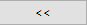

# Validation

CDT has the facilities to validate gridded data or point data against the observation data or station data. Using validation functionality of CDT, users can validate spatial points data in CDT format, gridded data in netCDF format or even validate multiple datasets at once.

## Spatial Points Data (CDT Format)

This feature allows you to validate satellite/gridded data extracted at station locations against station data. This can be done for both precipitation and temperature data.

### Precipitation data

The step-by-step process to validate precipitation data is described below.

Use the menu **Validation -> Spatial Points Data (CDT Format) -> Precipitation Data** to validate precipitation data of satellite or gridded data converted into CDT format. This will open a tabbed widget in the left.

1. Select the time step of the data by clicking on the dropdown.
2. Select the station precipitation data using which you want to validate some other precipitation data.
3. Use the field CDT station data to be validated to select the satellite/gridded data extracted at the station locations that you want to validate. For example, if you want to validate CHIRPS data for Kenya against rainfall data, then you need to extract CHIRP data at station locations for Kenya and then use that file here. 
4. Specify the directory where you want to save the result.

Now, click on the Validation tab to perform validation by specifying different options for validation.

1. Click on the tab **Validation**.
2. If validation was already performed in a previous session, then you can use that instead of performing a new validation. For that, tick the box to the left of **Validation already performed**. Using , browse to the .Rds file containing the validation data.
3. Select the time period by selecting the month and year ranges. For example, if you want to validate gridded data for rainfall season, then select the months corresponding to rainy season and the years for which you want to validate.
4. You can also aggregate data by ticking the **Aggregate data** field and selecting any of the two functions **sum** and **mean** under **Function**. For example, if you want to validate total rainfall for the rainy season, select the function **sum** and if you want to validate the average rainfall, select **mean**.
5. If you selected **count**, **Operator** and **Threshold** fields will be activated.
6. This allows to calculate validation either for **All Data**, or for **Spatial Average**, or for **Per Station**. For **All Data**, validation is performed by considering all the data, for **Spatial Average**, validation is performed by aggregating data on a single date for all stations and then computing validation, for **Per Station**, validation is done separately for all stations. 
7. **Dichotomous validation** allows you to look at the amount of rainfall below or above which you want to validate the rainfall. For example, if you want to validate gridded data for extreme rainfall such as an amount of 200mm rainfall or above, specify >= and 200 in the fields right to **Threshold**.
8. Click on Calculate Statistics to calculate the validation statistics.

Using the **Plot** tab, you can plot the validation and view the result in tabular format.

1. Click on the **Plot** tab.
2. Click on **Display Table** to look at the validation statistics arranged in a table. If you selected **All Data** or **Spatial Average** in step 6 of the validation tab, then you will see validation statistics where only one statistic is reported and if you selected **Per station**, then every statistic will be reported for each of the stations. 
3. If you selected **Per station** in step 6 of the validation tab, then using  and , you can look at validation statistics for different stations.
4. Again, if you selected **Per station** in step 6 of the validation tab, then this field will be activated and it lists all the validation statistics. Clicking on **PLOT** will plot a map of the selected statistic.
5. Click on **Plot Type** to select the plot type which is either **Points** or **Pixels**. Clicking on **Options**, you can change the format of the color.
6. **Scatter** and **CDF** graphs are available for all the three options (step 6 of the **Validation** tab) for validation and **Per station** has additional option of **Lines** chart. 
7. For Per station, this field is activated and you can use  and  to look at the selected graph for different stations.

Using **Add layers** tab, you can add shapefile to your validation maps.

1. To add map, tick **Add boundaries to Map** and then load the shapefile.
2. You can also add DEM by ticking Add DEM to the Map and then by loading the DEM.

### Temperature data

Similar to precipitation, users can perform all the aforementioned validation tasks using the menu **Validation -> Spatial Points Data (CDT Format) -> Precipitation Data**. 

##  Gridded Data (NetCDF Format)

This feature allows you to validate satellite/gridded data against station data where you can extract gridded data at the station locations inside this feature. Thus if you have NetCDF data of rainfall or temperature data (NetCDF) coming from satellite or reanalysis data, you can use this feature to validate the gridded data using this feature. 

### Precipitation data

Use the menu **Validation -> Gridded Data (NetCDF Format) -> Precipitation Data** to validate precipitation data of satellite or gridded data in NetCDF format where the extraction of gridded data at station location is done using an additional tab available for this feature. This will open a tabbed widget in the left.

1. Specify the time step of the data. 
2. Specify the station data file by browsing to or loading it.
3. Specify the directory that contains the NetCDF files corresponding to the precipitation data that you want to validate.
4. Provide the date range for which you want to extract data from the NetCDF files. This is the time range for which you want to validate the gridded precipitation data (in NetCDF format).
5. Browse to the directory where you want to save the result.

Using **Extraction** tab, you can extract NetCDF data at station locations.

1. Click on the **Extraction** tab.
2. You can specify the way you want to extract from the NetCDF files by clicking on three different options under **Selection Type** field. If you selected All Stations, then coordinates of all station locations will be used to extract the data. If you selected **Rectangle**, then you can draw a rectangle over the map that will be shown in the output section (adding shapefile is to be done in the next step). The other two options are: **Rectangle** and **Polygons** where the former one allows you to extract data from the NetCDF file by specifying a rectangle and the latter allows you to extract by a polygon of the shapefile specified by you.  
3. Add the shapefile by selecting from the dropdown or by browsing to it.
4. In step 2, if you selected **Polygons** under **Selection Type**, then the two fields under **Attribute field to be used and displayed** will be activated. For the first field, you can select the attribute field that you want to use for selecting polygon. For the second field, you can write a name that will be displayed.
5. You can zoom in , zoom out , select zoom area , reset zoom , redraw map , or move the map . If you click Display Map, then the map will be displayed in the **Output** section in the right. If you selected **Polygons** in step 2, click on **Select** to select the polygon you want to select from the map. If you selected Rectangle in step 2, then specify the minimum and maximum of the longitude and latitude to specify the rectangle coordinates.
6. Click on Extract Data for Validation to extract data from the NetCDF files according to the specifications provided here.

Using **Validation** tab, you can specify the time period of the validation and the way validation is to be performed.

1. Click on the **Validation** tab.
2. If validation was performed before, tick the field Validation already performed and select the .Rds file corresponding to the validation.
3. Select the time period by specifying the Season and **Years**.
4. Tick on Aggregate data to aggregate data either by **mean**, or **sum**, or **count**. If you selected **count**, **Operator** and **Threshold** fields will be activated.
5. This allows to calculate validation either for **All Data**, or for **Spatial Average**, or for **Per Station**. For **All Data**, validation is performed by considering all the data, for **Spatial Average**, validation is performed by aggregating data on a single date for all stations and then computing validation, for **Per Station**, validation is done separately for all stations. 
6. **Dichotomous validation** allows you to look at the amount of rainfall below or above which you want to validate the rainfall.
7. Click on **Calculate Statistics** to calculate the validation statistics.

Using **Plot** tab, you can plot the validation and view the result in tabular format.

1. Click on the **Plot** tab.
2. Click on **Display Table** to look at the validation statistics arranged in a table. If you selected **All Data** or **Spatial Average** in step 6 of the validation tab, then you will see validation statistics where only one statistic is reported and if you selected **Per station**, then every statistic will be reported for each of the stations. 
3. If you selected **Per station** in step 6 of the validation tab, then using  and , you can look at validation statistics for different stations.
4. Again, if you selected **Per station** in step 6 of the validation tab, then this field will be activated and it lists all the validation statistics. Clicking on **PLOT** will plot a map of the selected statistic.
5. Click on **Plot Type** to select the plot type which is either **Points** or **Pixels**. Clicking on **Options**, you can change the format of the color.
6. **Scatter** and **CDF** graphs are available for all the three options (step 6 of the **Validation** tab) for validation and **Per station** has additional option of Lines chart. 
7. For Per station, this field is activated and you can use  and  to look at the selected graph for different stations.
	
Using **Add layers** tab, you can add shapefile to your validation maps.

1. To add map, tick **Add boundaries to Map** and then load the shapefile.
2. You can also add DEM by ticking Add DEM to the Map and then by loading the DEM.

## Validate multiple data sets

This is similar to **Spatial Points Data (CDT Format)**, the only difference is that using **Validate multiple data sets**, you can validate multiple data products. Suppose you want to validate CHIRP, CHIRPS, TAMSAT and TRMM against the station data of Kenya. Using this feature, you can do this. Under this feature, CDT allows you to validate multiple precipitation and temperature products.

### Precipitation Data

Use the menu **Validation -> Validate multiple data sets -> Precipitation Data** to validate multiple data sets of precipitation data. This will open a tabbed widget in the left.

1. Select the time step of the data.
2. Select or browse to the station data using which you want to validate multiple data sets.
3. Click on Add Data to validate to add data set one by one. Once you click this field, you will see that an option is added in this widget to add a new dataset. Every time you click this field, you will see a new field added to add another data set.

    

    a.	A new field is added and you can browse to the first data set using this field.
    b.	You can give it a name to this dataset. 
    c.	If you click Remove, then all the fields under Data to be validated #1 will be removed.

If you again click on Add Data to validate, then similarly another field will be added.

Using **Validation** tab, you can specify the time period of the validation and the way validation is to be performed.

All the options under **Validation** tab are similar what you have seen for other Validation tabs you have seen before. 

Plot and Add layers tabs also have similar set of features you have seen for other validation types you have seen here before.

### Temperature Data

The validation for multiple data sets for temperature is very similar to precipitation and so we the description is not provided here.