# Analysis

Analysis section in CDT allows to conduct different analyses of climate data. Users can compute different summary statistics and show them in tabular form, show them graphically in plots and also in maps. For temperature data, one can compute the mean and range for different time periods. One can also compute derived variables such as potential evapotranspiration and water balance. Further, a user can also compute climatologies for different time frequency data. Climatologies can also be plotted or shown in maps wherein these are computed for different stations.  Under spatial analysis, a user can compute different statistics aggregated at either monthly, or seasonal, or annual scale, or all of them according to what a user select in CDT. In addition, time series graphs such as line chart, bar plot, probability of exceedance, line chart with ENSO years, bar plot with ENSO years and probability of exceedance for ENSO, and anomaly plot can also be computed. All of these are computed for separate stations and using CDT, one can explore any of these statistics or graph for a single station selected by him/her. For rainfall, he can define rainy/wet days and generate different charts for a season defined by himself/herself. Line chart, bar plot, probability of exceedance and anomaly plot can be generated using features found under Daily Rainfall Analysis. Seasonal rainfall can also be plotted in map. One can also calculate rainy season onset, rainy season cessation and rainy season length. Using the features available under **Rainy Season Analysis**, one can also compute many other statistics associated with rainy season such as longest dry spell, number of rainy days, maximum daily rain, total rainfall when rainfall is greater than 95th percentile etc. CDT also allows you to get different climate extreme indices for temperature and rainfall as found in the Climdex website https://www.climdex.org/learn/indices/. CDT also allows you to compute drought indices such as standardized precipitation index (SPI), standardized precipitation evapotranspiration index (SPEI), and deciles of meteorological variables.

## Potential evapotranspiration 

According to Rosenberg, potential evapotranspiration (PET) is “the evaporation from an extended surface of a short green crop which fully shades the ground, exerts little or negligible resistance to the flow of water, and is always well supplied with water. Potential evapotranspiration cannot exceed free water evaporation under the same weather conditions” (M.B. Kirkham, 2014).

There are many different methods for calculating the PET, they differ in precision and complexity. The most trusted method is the Penman-Monteith equation (Allen et al., 1998). However, the Penman-Monteith method is computed from several climate variables which are not available most of the time. CDT offers 2 methods to compute the PET:  Hargreaves (Hargreaves and Samani, 1985; Droogers and Allen, 2002) which only uses the minimum and maximum temperatures; and Modified Hargreaves (Farmer et al., 2011) with which the precipitation data is used in addition to the minimum and maximum temperatures.

### Hargreaves method

This method uses temperature and solar radiation to calculate PET. The equation is defined as:

$$
PET = \alpha*0.408*R_A*(\frac{T_{min}+T_{max}}{2}+b)*(T_{max}-T_{min})^{0.5}
$$

Where:

* R~A~ is the incoming solar radiation (in W/$m^2$), 
* $T_{min}$ and $T_{max}$ are the minimum and maximum temperatures (in $^{0}C$),
* PET is expressed in mm/day,
* The coefficients a and b depend on the temporal resolution of the data (Farmer et al., 2011).

|`    Temporal resolution     `|`   a   `|`   b   `|
|------------------------------|---------|---------|
| Daily data | 0.0028 | 19.1869 |
| Pentad, dekadal and monthly data | 0.0023 | 17.8 |

### Modified Hargreaves method

This method requires the maximum and minimum temperatures, as well as the precipitation. The formula is given by

$$
PET = \alpha*0.408*R_A*(\frac{T_{min}+T_{max}}{2}+b)*((T_{max}-T_{min}) - c*p)^{0.5}
$$
Where:

* R~A~ is the incoming solar radiation (in W/$m^2$), 
* $T_{min}$ and $T_{max}$ are the minimum and maximum temperatures (in $^{0}C$),
* P is the precipitation data (in mm/day),
* PET is expressed in mm/day,
* The coefficients a, b, c and d depend on the temporal resolution of the data (Farmer et al., 2011).

|`    Temporal resolution     `|`   a   `|`   b   `|`   c   `|`   d   `|   
|------------------------------|---------|---------|
| Daily data | 0.0019 | 21.0584 | 0.0874 | 0.6278 |
| Pentad, dekadal and monthly data | 0.0013 | 17 | 0.0123 | 0.76 |

### Water balance

CDT offers a simple soil water balance model at a daily time step based on Thornthwaite model. The model only uses the current day precipitation and potential evapotranspiration data. The water balance equation is given by the following:

$$
SM^t = SM^{t-1} +P_{eff}^t-PET^t
$$

Where  

* $SM^t$ is the soil moisture for day t, 
* $P_{eff}$ is the effective rainfall, and 
* $PET_{red}$ is the reduced potential evapotranspiration.

The principle of the Thornthwaite model is based on the assumption that the actual evapotranspiration (AET) is always less than or equal to the potential evapotranspiration (PET). The model estimates the actual evapotranspiration and the effective rainfall first. Every day, the algorithm checks if the PET can be satisfied or not, by taking the water from the precipitation (P), and if the precipitation is not sufficient, then the water will be taken from soil moisture (SM). If P > PET, then AET = PET. Otherwise (P < PET), AET depend on the amount of available water in the soil; if it is sufficient, AET = PET else AET < PET = SM + P. At each time step t, the effective rainfall is then at most equal to P – AET. The resulting algorithm for calculating the AET and effective rainfall at each time step is as follows:

$$
AET^t = min(PET^t, P^t + SM^t)\\
P_{eff}^t = P^t - AET^t + SM^t - SM_{max}\\
If P_{eff}^t \le 0 then P_{eff}^t = 0\\
SM^{t-1} = min(SM_{max}, SM^t+P^t-AE^t)
$$
where $SM_{max}$ is the soil moisture storage capacity.

### Drought Index

Using drought index, we can get an estimate of drought severity. CDT allows you to use three drought indices which are: standardized precipitation index (SPI) and standardized precipitation evapotranspiration index (SPEI), and deciles. 

### Standardized precipitation index (SPI)

SPI is calculated using long-term historical precipitation record which is fitted to a probability distribution and then transformed to have a mean of zero SPI for the location and considered period (Edwards & McKee 1997). This index helps you to differentiate between dry years and wet years. Positive SPI values indicate precipitation greater than the median amount and the negative SPI values indicate less than the median amount. If SPI is continuously negative for successive time periods and its value is less than -1, we say that there is a drought condition. If the value of SPI becomes positive, then the drought condition ends.

Table: (\#tab:unnamed-chunk-1)SPI classification

|Value      |Classification |
|:----------|:--------------|
|2 or more  |Extremely wet  |
|1.55-1.99  |Severely wet   |
|1-1.49     |Moderately wet |
|-0.99-0.99 |Near normal    |
|-1.0-1.49  |Moderately dry |
|-1.5--1.99 |Severely dry   |
|-2 or less |EZxtremely dry |

### Standardized precipitation evapotranspiration index (SPEI)

The Standardized Precipitation Evapotranspiration Index (SPEI) is an extension of the widely used Standardized Precipitation Index (SPI). The SPEI is designed to take into account both precipitation and potential evapotranspiration (PET) in determining drought. Thus, unlike the SPI, the SPEI captures the main impact of increased temperatures on water demand. The classification of the SPEI is the same as the SPI.

A detailed description of the SPEI and the calculation process are available at the National Center for [Atmospheric Research Climate Data Guide website](https://climatedataguide.ucar.edu/climate-data/standardized-precipitation-evapotranspiration-index-spei). 

#### Deciles

Deciles method work by grouping monthly precipitation into 10% parts or deciles. There is a drought condition if the precipitation total for the last 3 months falls within the lowest decile of the same 3-months’ rainfall distribution. The deciles group and their description according to Haied et al, 2017 are given below in the table.

Table: (\#tab:unnamed-chunk-2)Deciles classification

|Value                          |Classification    |
|:------------------------------|:-----------------|
|Deciles 1-2 (lowest 20%)       |Much above normal |
|Deciles 3-4 (next lowest 20%)  |Below normal      |
|Deciles 5-6 (middle 20%)       |Near normal       |
|Deciles 7-8 (next highest 20%) |Above normal      |
|Deciles 9-10 (hihhest 20%)     |Much above normal |

### Extreme Indices

ENSO (El Niño and the Southern Oscillation): ENSO is a climate phenomenon which represents the periodic fluctuation in sea surface temperatures and winds across the equatorial Pacific Ocean along with changes in the atmosphere. This is an oscillating warming and cooling pattern where the warming phase is known as El Niño, and the cooling phase is known as La Niña and the phase between warming and cooling is known as Neutral. 
1.	El Niño: El Niño corresponds to warming of the ocean surface in the central and eastern tropical Pacific Ocean. If there is an El Niño phase, usually rainfall reduces over Indonesia and increases over central and eastern tropical Pacific Ocean (NOAA, 2021). In El Niño phase, Australia, Indonesia, Southeast Asia, and the Philippines can have drier conditions or even droughts (Trenberth, 2013).
2.	La Niña: La Niña is the cooling phase of the ocean surface in the equatorial Pacific. If there is an El Niño phase, usually rainfall increases over Indonesia and decreases over central and eastern tropical Pacific Ocean (NOAA, 2021).
3.	Neutral: This is the middle phase between these two oscillating cycles of El Niño and La Niña.

ENSO conditions are monitored by looking at the seas surface temperature (SST) anomalies in Niño 3.4 region which spread between 1700W to 1200W longitude. If SST anomalies are greater than or equal to 0.5$^{0}C$C, it indicates El Niño phase and if it is less than or equal to -0.5$^{0}C$, it indicates La Niña.

#### Temperature

There are many extreme indices for temperature which are discussed below. For convenience, we will use these notations TX for daily maximum temperature and TN for daily minimum temperature.

* **TX~n~**: It is the monthly minimum value of TX or maximum temperature. 
* **TXx**: It is the monthly maximum value of TX or maximum temperature.
* **TX10p**: It is the percentage of days when TX is less than 10th percentile.
* **TX90p**: It is the percentage of days when TX is more than 90th percentile.
* **WSDI**: It is the warm spell duration index defined as annual count of days with at least 6 consecutive days when TX is greater than 90th percentile.
* **ID**: This is the number of icing days or annual count of days when TX or daily maximum temperature is less than 0$^{0}C$.
* **SU**: This is the number of summer days when TX > 250C or any user defined threshold.  
* **TNn**: Monthly minimum value of TN or minimum temperature. Let the daily minimum temperature for month k and period j be denoted by TNnkj. Then the minimum daily minimum temperature for each month is TNn = min(TNnkj).
* **TNx**: This is the monthly maximum value of TN or minimum temperature. Again, let the daily minimum temperature for month k and period j be denoted by TNnkj. Then the maximum daily minimum temperature for each month is TNn = max(TNnkj).
* **TN10p**:  It is the percentage of days when TN is less than 10th percentile.
* **TN90p**: It is the percentage of days when TN is more than 90th percentile.
* **CSDI**: It is the cold spell duration index defined as annual count of days with at least 6 consecutive days when TN is less than 10th percentile.
* **FD**: It is the number of frost days when TN or minimum temperature is less than 00C. CDT also gives you option to choose a threshold of your requirement to compute this index.
* **TR**: It is called the number of tropical nights or annual count of days when TN > 20$^{0}C$ or when daily minimum temperature is greater than 200C.
* **DTR**: This is the daily temperature range. If I represents the number of days in period j, then it is defined for period j as

$$
DTR_j = \frac{\sum_{i}^{I}{(TX_{ij}-TN_{ij})}}{I}
$$
GSL: GSL is defined as the growing season length. In CDT, you can manually specify mean temperature threshold and consecutive days.

#### Rainfall

* **R~x1~day**: This is the maximum 1-day precipitation in a period. In CDT, this period is considered as a month.
* **R~x5~day**: This is the maximum consecutive 5-day precipitation in a period. In CDT, this period is considered as a month or it is monthly maximum consecutive 5-day precipitation.
* **SDII**: This is the simple precipitation intensity index. Let RRwj be the daily precipitation amount on wet days (RR ≥ 1mm) denoted as w in period j. If W stands for number of wet days in j, then

$$
SDII_j = \frac{\sum_{i}^{I}{RR_{wj}}}{W}
$$

* **R10mm**: This is the annual count of days for a period when precipitation is greater than or equal to 10mm. 
* **R20mm**: This is the annual count of days for a period when precipitation is greater than or equal to 20mm. 
* **Rnnmm**: It is the annual count of days when precipitation is greater than or equal to nn where nn is a threshold defined by a user.
* **CDD**: It is the maximum length of dry spell or maximum number of consecutive days when rainfall is less than or equal to 1 mm.
* **CWD**: It is the maximum length of wet spell or maximum number of consecutive days when rainfall is more than or equal to 1 mm.
* **PRCPTOT**: This is the annual precipitation on wet days. If RR~ij~ is the daily precipitation where I represents the number of days in period j, then it is defined as

$$
PRCPTOT_j = \sum_{i=1}^{I}RR_{ij}
$$

* **R95pTOT**: This is the contribution to total precipitation from very wet days.  If R95p is the annual total precipitation when rainfall is greater than 95th percentile and PRCPTOT is the total precipitation, then it is defined as

$$
R95pTOT = \frac{100\times{R95p}}{PRCPTOT}
$$

* **R99pTOT**: This is the contribution to total precipitation from extremely wet days.  If R99p is the annual total precipitation when rainfall is greater than 99th percentile and PRCPTOT is the total precipitation, then it is defined as

$$
R99pTOT = \frac{100\times{R99p}}{PRCPTOT}
$$

* **Exceedance probability**: This is the probability of exceeding a certain value. Probability of exceedance is used for climate trends analysis and climate forecasting. If probability of exceedance for a period for 300mm rainfall is 0.1 then it means there is only 10% probability that the rainfall will exceed 300 mm in that period.

## Summary statistics in CDT

To compute summary statistics in CDT, use the menu **Analysis -> Summary Statistics**. This will open a tabbed widget in the left.

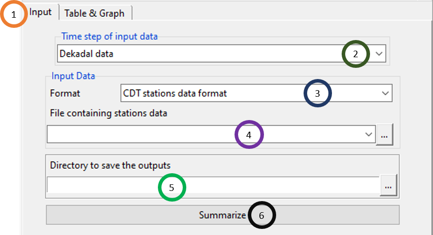

1. By default, when this widget opens, the **Input** tab is selected and you see all the options under it.
2. Click on the dropdown under **Time step of input data** to select the temporal frequency of the data.
3. Specify whether the dataset is in CDT stations data format or CDT dataset format (gridded). 
4. Specify the directory where you want to save the result by browsing to it using .
5. Click on Summarize. Now, a new folder, named **SUMMARY_Statistics** is created which contains the summary statistics. In this folder, a file named **Summary.rds** will be created. This file can be used later in an option available under **Table & Graph** tab, even in a new R session to look at summary statistics.

Now, to see the output, click on the **Table & Graph** tab.

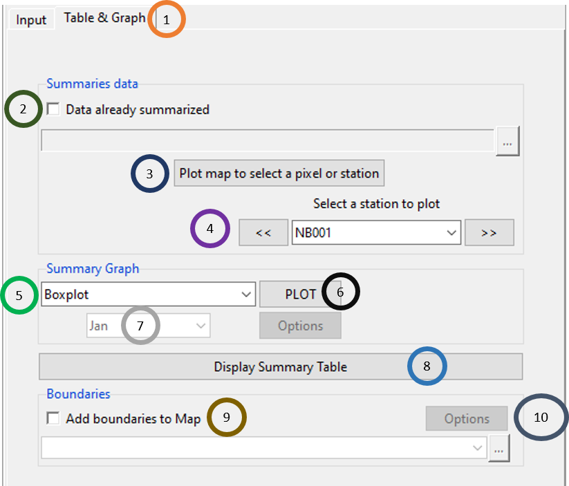

1. Click on the **Table & Graph** tab.
2. If we tick Data already computed, then the inactive portion below will b e activated and you can browse to the file **Summary.rds**. This is useful when you computed these statistics before and then to visualize it, you don’t need to compute these again using **Input** tab.
3. Now, to visualize the output, click on **Plot map to select a pixel or station**. This will open a new map with the values plotted on longitudinal and latitudinal scale.

    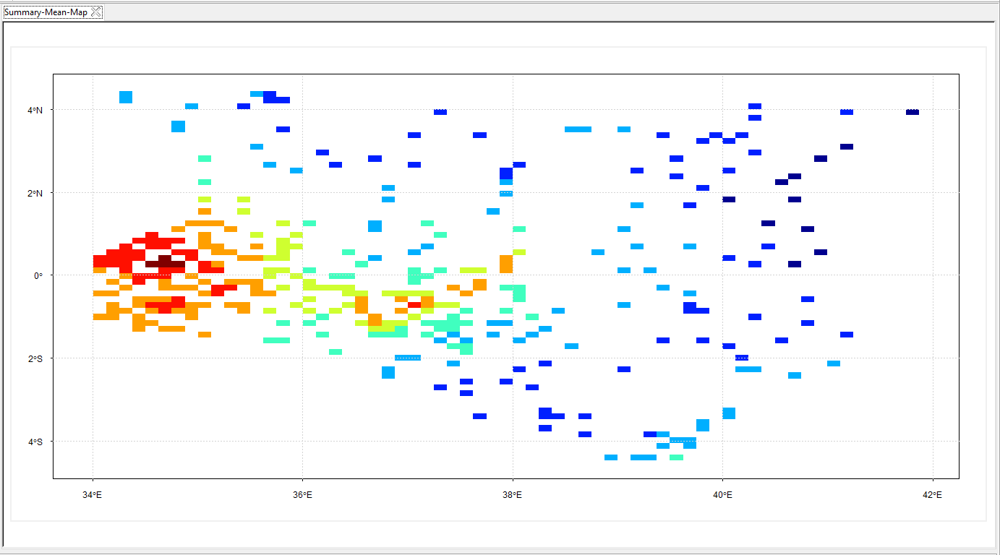

    In the above map, mean for all of the stations are plotted. Now, if we click on any of those colored pixels, the summary graph will be displayed according to which pixel or station you clicked. If in the **Summary Graph**, **Boxplot** is selected, then boxplot will be shown; if **Histogram** is selected, then histogram will be shown. 

    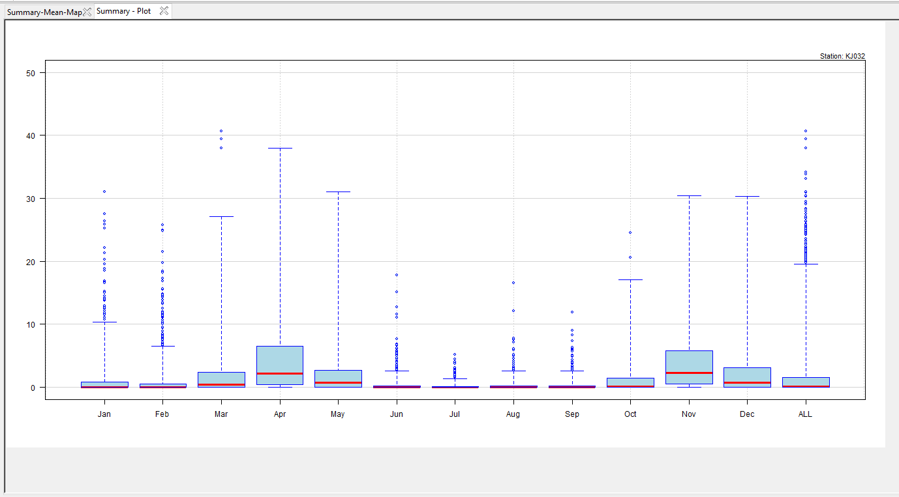

4. Using  and , you can look at the boxplots and histograms for different stations. You can also use the dropdown to select a station.

5. Under Summary Graph, click on the graph you want to show, either **Boxplot** or **Histogram**.

6. Now, click **PLOT** to show the selected graph. 

7. If you selected Histogram in step 5, then this field corresponding to different months will be activated. From the dropdown, you can select any month, and the histogram for that month for a selected station will be displayed.

    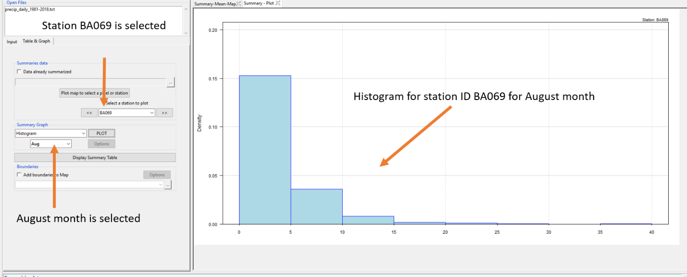
    
8. If you click on **Display Summary Table**, summary statistics such as minimum, 1st quartile, median, mean, 3rd quartile, maximum, standard deviation, missing value and the station ID with longitude and latitude values are shown in a table.

    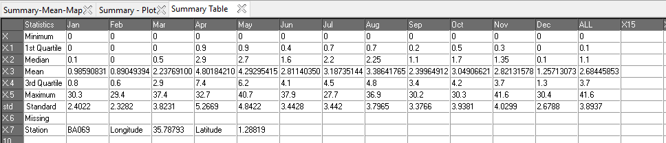

9. If you want to overlay an administrative boundary or shapefile on the top of this map, click on **Add boundaries to Map**. This will activate the option to browse to a shapefile you want to use. After browsing and selecting a shapefile, to see it added to the map, click on **Plot map to select a pixel or station** as you did in step 3. This will add a shapefile to the map and it will look like this.

    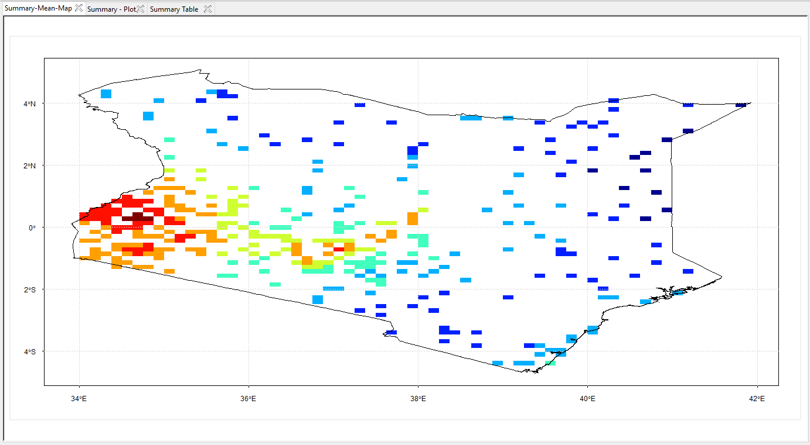

10.	Click on **OPTION** to change the color and width properties of the shapefile boundary. When you click on **OPTION**, you see a new dialog box.

    

    a.	Click on **Color** to select a new color of your choice. This will open another dialog box. We selected the dark red color, you can select any of the color. You can also add custom color by clicking on **Add to Custom Colors**. 
        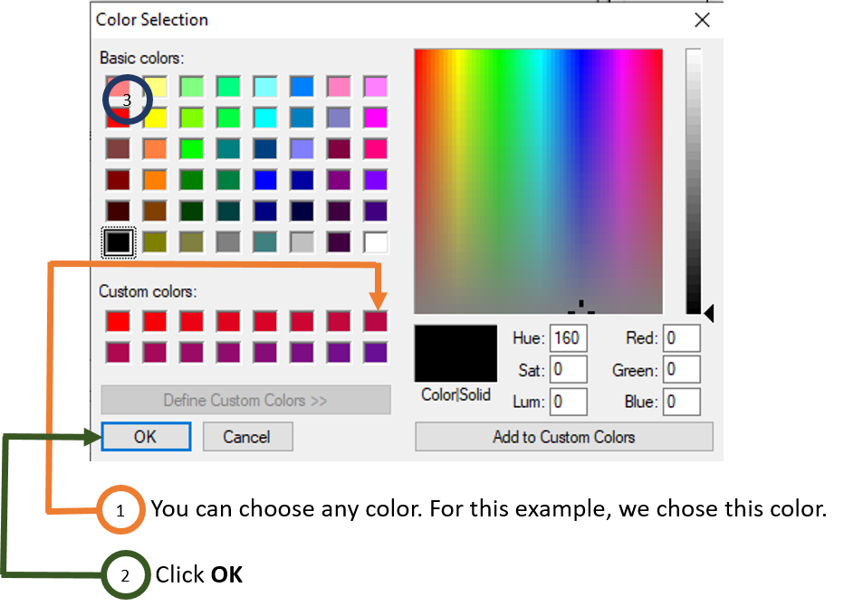
    
    b.	Now, in this Width field, you can increase or decrease the boundary of your shapefile. For example, we used value 2.5 for width.
    c.	Click **OK**.
        
    Now, to map again with the selected dark red color and width of 2, click on **Plot map to select a pixel or station** as you did in step 3 and also in step 9. This will bring the map now with thick and dark red boundary.

    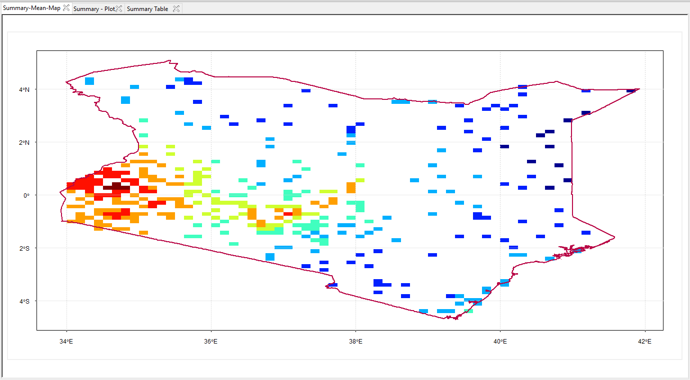

## Derived Climate Variables

This can be accessed using menu **Analysis -> Derived Climate Variables** and it has the features to compute the mean and range of temperature, evapotranspiration and water balance. To access the features to compute the mean and range of temperature, use the menu **Analysis -> Derived Climate Variables -> Temperature Variables**. This will open a new dialog box.

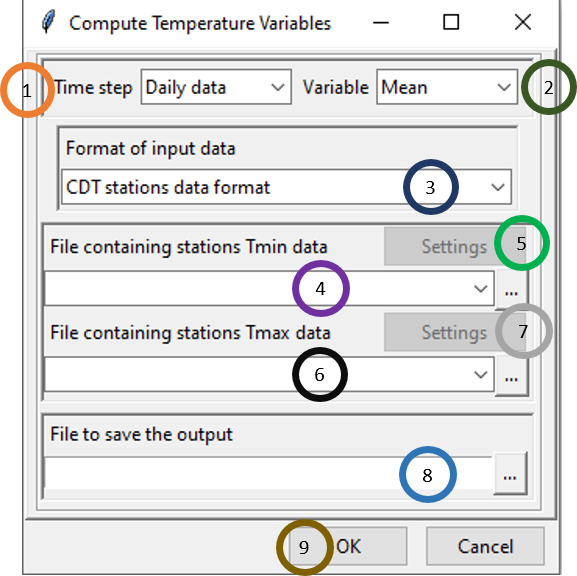

1.	Specify the **Time step** of the data.
2.	Click on the dropdown for **Variable** and select either **Mean** or **Range**.
3.	Click on 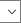 under **Format of input data** to select the format of the input data. You can specify any of these three formats: **CDT stations data format**, **CDT dataset format (gridded)** and **NetCDF gridded data**. 
4.	Browse to the file containing minimum temperature data using . If this file is already loaded, click  to select it. After you selected the minimum temperature, you will see that a new dialog box will be popped. You can specify the settings of the minimum temperature data here.
5.	Browse to the file containing maximum temperature data using . If this file is already loaded, click   to select it. After you selected the minimum temperature, you will see that a new dialog box will be popped. You can specify the settings of the maximum temperature data here.
6.	Specify the full path of your output file or browse to the directory where you want to save the output file and specify a name. The output file can be saved as either **.txt** or **.csv**.
7.	Click on **OK**.

Now, press  in the Tool bar to compute either mean or range of the temperature data. A new file according to your specification will now be created with mean or range of the temperature data. 

### Potential evapotranspiration

To access the features to compute the potential evapotranspiration (PET), use the menu **Analysis -> Derived Climate Variables -> Potential Evapotranspiration**.

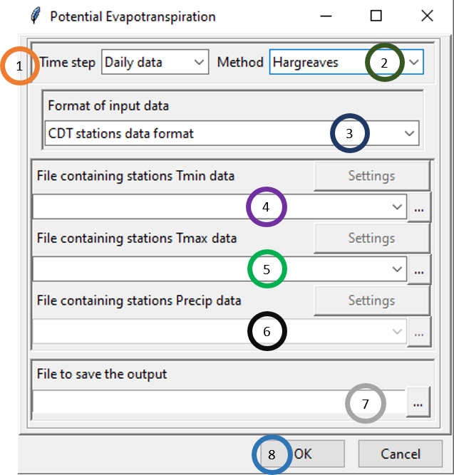

1. Specify the **Time step** of the data.
2. Click on the dropdown for **Method** and select either **Hargreaves** or **Modified Hargreaves** method.
3. Click on  under **Format of input data** to select the format of the input data. You can specify any of these three formats: **CDT stations data format**, **CDT dataset format (gridded)** and **NetCDF gridded data**. 
4. Browse to the file containing minimum temperature data using . If this file is already loaded, click  to select it. After you selected the minimum temperature, you will see that a new dialog box will be popped. You can specify the settings of the minimum temperature data here.
5. Browse to the file containing maximum temperature data using . If this file is already loaded, click  to select it. After you selected the minimum temperature, you will see that a new dialog box will be popped. You can specify the settings of the maximum temperature data here.
6. If we you selected **Hargreaves** method, the field File containing stations Precip data will be deactivated. But if you selected Modified Hargreaves method, then this field will be activated and select the file containing precipitation data. Again, after you selected precipitation file, you will see that a new dialog box will be popped. You can specify the settings of the precipitation data here.
7.	Specify the full path of your output file or browse to the directory where you want to save the output file and specify a name. The output file can be saved as either **.txt** or **.csv**.
8.	Click on **OK**.

Now, press  in the Tool bar to compute EP. A new file named PET with your specified extension containing PET data will now be created using the method that you specified. 

### Water balance

Water balance (WB) can be computed using precipitation and PET data. CDT allows you to compute WB by specifying the water balance start time, first day water balance or multiple water balance and single or multiple soil water holding capacity. 

To access the features to compute the WB, use the menu **Analysis -> Derived Climate Variables -> Water Balance**. This will open a new dialog box like the following.

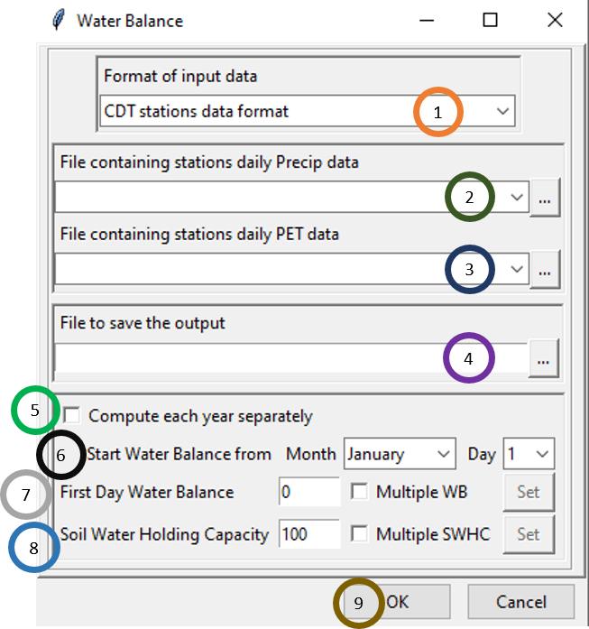

1. Click on  under **Format of input data** to select the format of your data. There are two options available for data types which are **CDT stations data format** and **CDT dataset format (gridded)**. 
2. Browse to the file containing precipitation data using . If this file is already loaded, click  to select it. After you selected the precipitation file, you will see that a new dialog box will be popped. You can specify the settings of the precipitation data here.
3. Specify the file containing PET data that you computed while calculating PET. Browse to the file by using , or if this file is already loaded, click  to select it. After you selected the PET file, you will see that a new dialog box will be popped. You can specify the settings of the precipitation data here.
4.	Specify the full path of your output file or browse to the directory where you want to save the output file and specify a name. The output file can be saved as either **.txt** or **.csv**.
5. Tick **Compute each year separately** if you want to compute water balance separately for each year.
6. Specify the month and day from which you want to start computing water balance.
7. In the field, **First Day Water Balance**, you can specify either single water balance or water balance for all the considered stations or locations. If you want to use multiple water balance, then tick **Multiple WB** and then you will see that the button Set will be activated. Click on **Set** and you will see the following dialog box using which you can browse to a file which contains WB for all the stations.

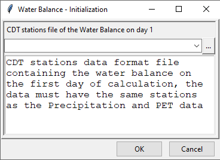

8. In the field, **Soil Water Holding Capacity**, you can specify either single soil water holding capacity or soil water holding capacity for all the considered stations or locations. If you want to use multiple soil water holding capacity (SWHC), then tick **Multiple SWHC** and then you will see that the button **Set** will be activated. Click on **Set and you will see the following dialog box using which you can browse to a file which contains SWHC for all the stations.

    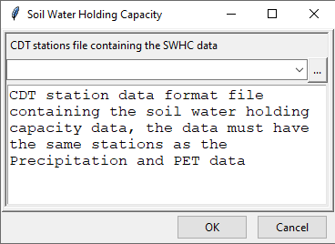

9. Click **OK**.

Now, press  in the **Tool bar** to compute SWHC. A new file named PET with your specified extension containing PET data will now be created using the parameters that you specified. 

## Compute Climatologies

Climatologies and anomalies can be computed using CDT. Now, we will discuss how you can do this using CDT.

### Climatologies

To access the features to compute the climatologies, use the menu **Analysis -> Compute Climatologies -> Climatologies**. This will open a new dialog box like the following.

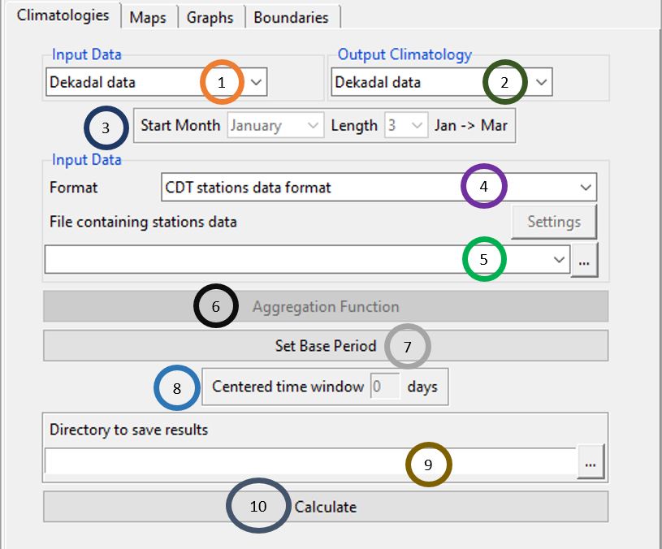

1. Specify the time step of the input data by clicking on  under **Input Data**. You can use any of these 4 time steps for input data: daily, pentad, decadal and monthly.
2. For **Output Climatology**, specify the time step at which you want CDT to compute the climatology. There are 6 options for this: daily, pentad, dekadal, monthly, seasonal and annual. For computing climatology, Output Climatology time step has to be at least same or higher. For example, from daily data you can compute climatology at any of the 6 time steps defined for **Output Climatology**. If the input data has monthly time step, then you can compute climatology for any of these three time steps which are same or higher than monthly: monthly, seasonal and yearly.
3. If the time step selected for **Output Climatology** is seasonal, then these fields will be activated to define the season start and season length. If activated, for **Start Month**, specify the month from which the season starts and for **Length**, specify the season length, for example, 3 or 4.
4. Specify the format of the input data by clicking on Format field and select any of the three: CDT stations data format, CDT dataset format (gridded) and NetCDF gridded data.
5. Use the field **File containing stations data** to specify the input data file. Browse to the file by using , or if this file is already loaded, click  to select it. After you selected the input file, you will see that a new dialog box will be popped. You can specify the settings of the data here.
6. Aggregation Function will be activated if you have chosen higher time step in the **Output Climatology** field. In this case, you need to specify the aggregation function to use for computing climatology at a higher time step. Click **Aggregation Function** which will pop a new dialog box open.

    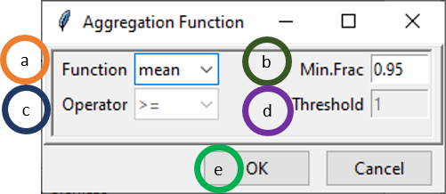

    a. Click on **Function** dropdown to select the function to be used for aggregation. You can use any of the 5 functions: **mean**, **sum**, **max**, **min** and **count**. Use mean if you want to aggregate data using mean. Again, use sum if you want the total, for example, converting daily rainfall to total monthly rainfall.
    b. **Min.Frac** is the minimum fraction of available data that must be present within each output time step.
    c. If **count** is selected as the aggregation function in a, then the field Operator will be activated. The four available operators are: ≤, <, ≥ and >.
    d. The field **Threshold** is also activated when count is selected for Function field. This allows you to count an event according to your specification defined using the combination of **Operator** and **Threshold** field.
    e. Click **OK**.
7. Click on **Set Base Period** to select the base period for climatology calculation.
8. If you used daily data as input and also want daily data as output, then this field **Centered time window** is activated. The daily climatology is calculated using a centered (2*window + 1) time window where window is specified by you. 
9. Specify the directory where to save the result. You can do this by writing the path or by browsing to the directory using .
10. Click Calculate.

This will create a folder named **CLIMATOLOGY_data**. Inside this folder, you will see there are three subfolders named **CDTMEAN** containing mean data, **CDTSTATIONS** containing output data in csv form and CDTSTD containing .rds file are created. In the **CLIMATOLOGY_data**, another fie named **Climatology.rds** is also created which you can use later use to explore these values without needing to redo these steps again. You can rename the folder **CLIMATOLOGY_data** to save these computations. If we again compute climatology using different specifications or data then new results will be added to this folder.

Now, open the Maps tab in the left tabbed panel to see the output in map.

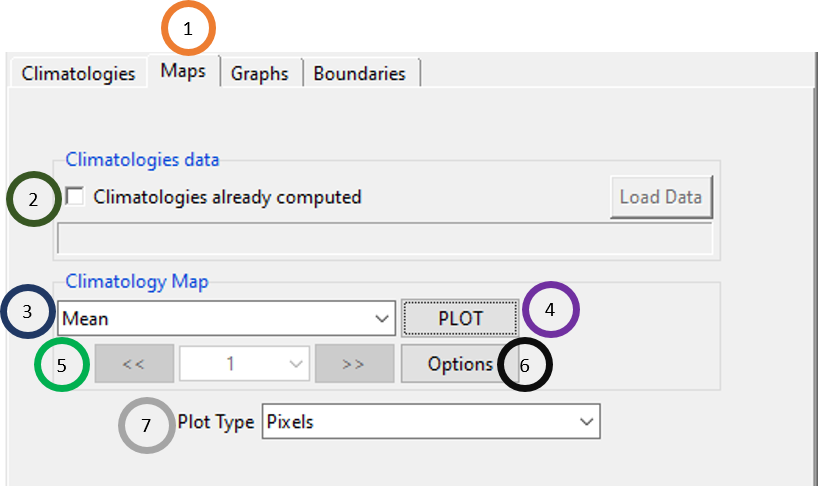

1. Click on the **Maps** tab.
2. If you have already computed climatologies, then tick this and click on Load Data and and browse to the file **Climatology.rds** and load it.
3. Click on the field Climatology Map and select whether you want to plot a climatology of the mean values or standard deviation values by selecting either **Mean** or **Standard deviation**.
4. Now, click on **PLOT**. This will plot the climatology on a map in the **Output** area of CDT. This will open a map like this.

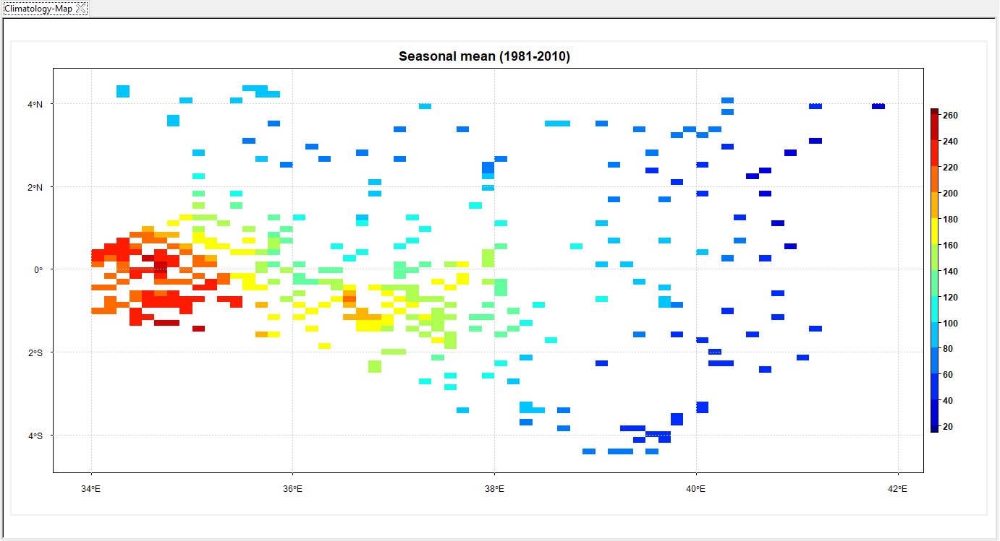

5. If activated, click on  and  to see the plot for different stations. 
6. Click on **Options** to format the map such as the color range used, map title etc. 

    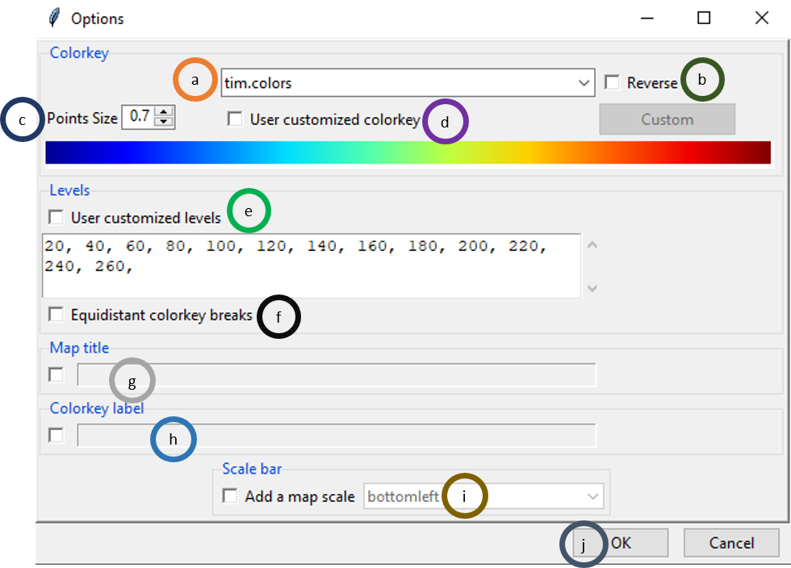
    a. There are 9 color keys such as tim.colors, rainbow, heat.colors etc. 
    b. Tick on **Reverse** to reverse the order of the colors of the color key.
    c. Click on **Point Size** and either write or use upper arrow and lower arrow to change the point size.
    d. Tick on **User customized colorkey** if you want to use customized colorkey. When it is ticked, **Custom** is activated. Now, click on **Custom** to create your own colorkey.

    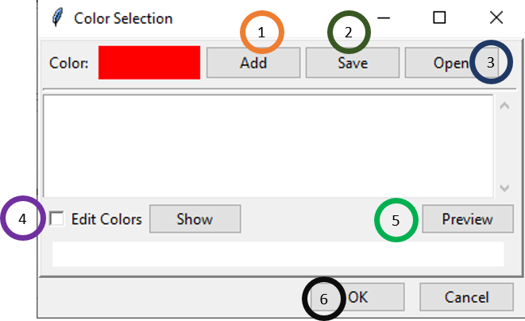

    1. Click on **Add** to add different colors to your colorkey. If we click on Add, a new window will open. Select a color or you can also specify the different values and then click **OK**.

    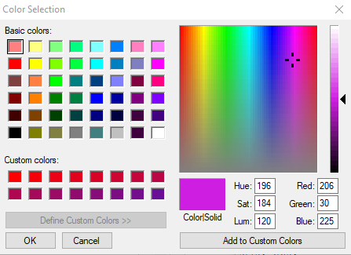

    Again click Add and select another color like before. In this way, select as many colors as you would like.
    
    2. If you have added all the colors, then click **Save** to save this colorkey to use for the color of the values in the map.
    3. By clicking on **Open**, you can also use a colorkey that has already been defined as .clr or .CLR file.
    4. Tick **Edit Colors** and then click on Show to show the map.
    5. If you click Preview, the new colorkey will be shown below.
    6. Click **OK**.

    e. If you tick **User customized levels**, you can specify different value levels for which different colors to be used.
    f. If you tick **Equidistant colorkey breaks**, then value levels will be equidistant.
    g. If you tick Map title, you can then write the title of the map.
    h. If you tick **Colorkey label**, write the name of the colorkey.
    i. If you tick **Colorkey** label, then you can put a map scale at any of the three positions available in the dropdowm: bottomleft, bottomcenter and bottomright.
    j. Click **OK**.
7. Click **Plot Type** to select the plot type either as Pixels or Points.

Now, open the Graphs tab in the left tabbed panel to see the graph of climatology.

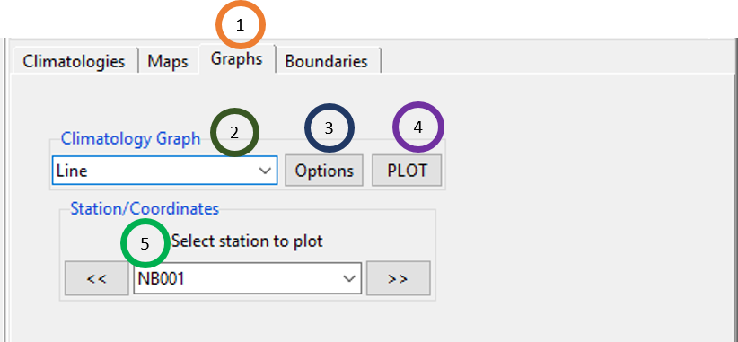

1. Click on the **Graphs** tab.
2. Select the graph type by clicking on the dropdown under Climatology Graph. It can be either **Line** chart or **Barplot**. 
3. Click on **Options** to specify different formatting options of the graph. This will open a new dialog box where you can specify the minimum and maximum for X and Y axis, axis labels, graph title, title position etc.

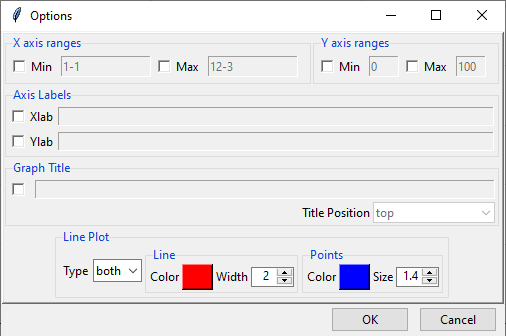

4. Click **PLOT** to redraw or plot.
5. Click  and  to select different stations. After selecting a station here, click **PLOT** to draw for that station.

Now, open the **Boundaries** tab in the left tabbed panel to add administrative boundary or a shapefile.

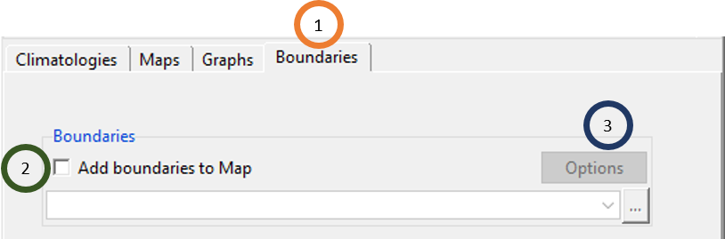

1. Click on the **Boundaries** tab.
2. If you want to add a shapefile, tick **Add boundaries to map**. This will activate the field below. If the shapefile has already been loaded before, use the dropdown  to select it. If the shapefile is not already loaded, then click  to browse to the desired shapefile.
3. Click on **OPTION** to change the color and width properties of the shapefile boundary. When you click on **OPTION**, you see a new dialog box.

    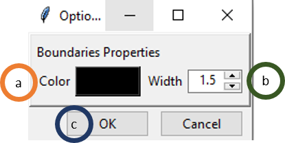

    a.	Click on the colored box to the right of Color field to select a new color of your choice. This will open another dialog box where you can select a new color or add custom color. 
    b.	Using **Width** field, you can increase or decrease the boundary of your shapefile. 
    c.	Click **OK**.

### Anomalies

To access the features to compute the anomalies, use the menu **Analysis -> Compute Climatologies -> Compute Anomalies**. This will open a new dialog box like the following.

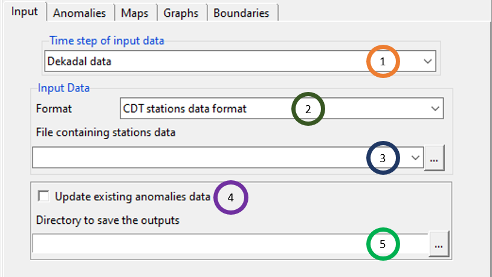

1. Specify the time step of the input data by clicking on  under **Time step of input data**. You can use any of these 4 time steps for input data: daily, pentad, dekadal and monthly.
2. Specify the format of the input data by clicking on **File containing stations data** field and select any of the two: CDT stations data format and CDT dataset format (gridded).
3. Use the field **File containing stations data** to specify the input data file. Browse to the file by using , or if this file is already loaded, click  to select it. After you selected the input file, you will see that a new dialog box will be popped. You can specify the settings of the data here.
4. If you have already computed anomalies data and want to update, tick the field **Update existing anomalies data**.
5. Browse to the folder where you want to save the output. But if you ticked **Update existing anomalies data** in previous step, then specify the **.rds** file that contains the anomaly file.

Now, open the **Anomalies** tab in the left tabbed widget. This tab allows you to calculate anomaly according to your specified method, set the anomalies date range, and set the base period among others. 

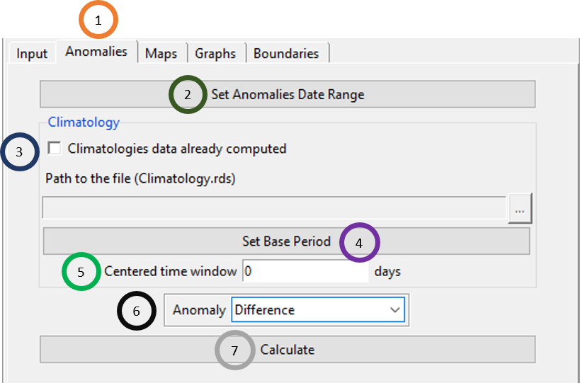

1. Click on **Anomalies** tab.
2. Click on **Set Anomalies Date Range** to set the date range to be used for computing anomalies.
3. If climatology for this data has already been computed then tick Climatologies data already computed. Once ticked, the deactivated field below will become activated and you can specify or browse to the location of the file **Climatology.rds**.
4. Click on Set Base Period to set the base period to be considered for anonaly.
5. The daily climatology is calculated using a centered (2*window + 1) time window where window is specified by you.
6. Click on the dropdown menu under the field Anomaly to select any of the three anomaly methods: **Difference**, **Percentage** and **Standardized**.
7. Click on **Calculate** to calculate the anomaly with the parameters specified by you. This will create a new folder **ANOMALIES_data**. Inside this folder, you will see that two **.rds** files are created, one is **Anomaly.rds** and the other one is **Climatology.rds**. Inside this folder also, you will see that four subfolders are created which are: CDTANOM, CDTMEAN, CDTSTATIONS and CDTSTD.

Now, open the **Maps** tab in the left tabbed widget. This tab allows you to browse through anomaly map for different time periods.

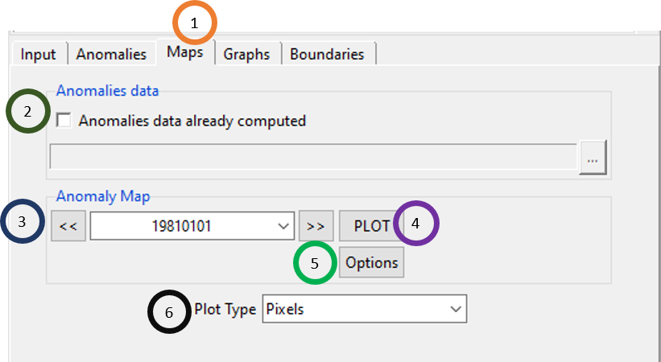

1. Click on the **Maps** tab.
2. Tick the field **Anomalies data already computed** if the anomaly was calculated before and you want to use that file now. This will activate the field below and using , you can browse to the file **Anomaly.rds**.
3. Under the field Anomaly Map, using  and , you can select different time period.
4. Click **PLOT** to plot the map in the right.
5. If you click Options, you will see the same options for changing map colors and value levels as you saw in the **Graphs** tab of the **Climatologies** panel.

    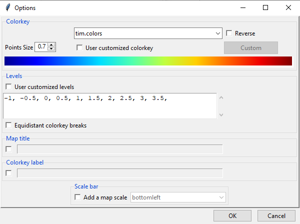

6. Select the **Plot Type** as either **Pixels** or **Points**.

Now, open the **Graphs** tab in the left tabbed widget. Using this tab, you can generate and format different anomaly graphs.

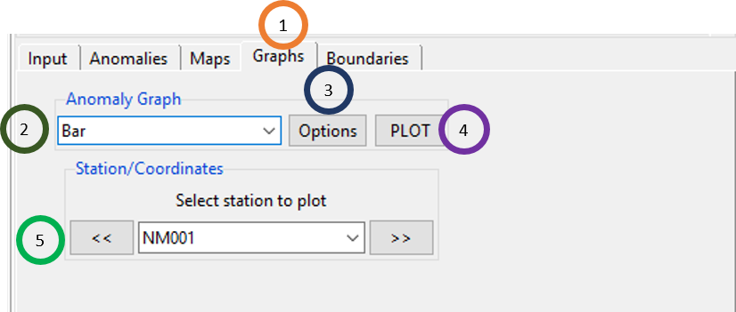

1. Click on the **Graphs** tab.
2. Select the plot type which can be either **Bar** or **Line** plot.
3. Click **Options** to provide different options for anomaly graph. If **Bar** was selected for **Anomaly Graph**, then clicking on **Options** will bring a new dialog box like the following.

    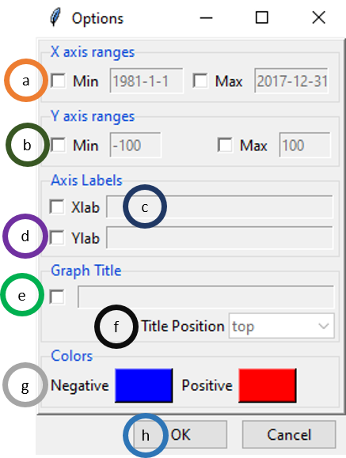

    a. If ticked, you can specify the starting and end day for X axis range for charts.
    b. If ticked, you can specify the range of anomaly or Y axis range.
    c. If ticked, you can specify a label for X axis.
    d. If ticked, you can specify a label for Y axis.
    e. If ticked, you can specify the title of the graph.
    f. If **Graph Title** was clicked in step e, you can also specify the position of the title.
    g. For anomaly plot, you get positive and negative values. Click on the colors to select a color of your own choice for **Negative** and **Positive**. 

    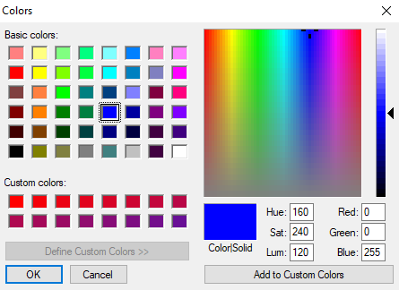

    h. Click **OK**.
    If **Line** was selected for **Anomaly Graph**, then clicking on **Options** will bring a dialog box similar to the one you saw for Bar but the difference is that now it has options for Line plot, line color and size, and point color and size.
    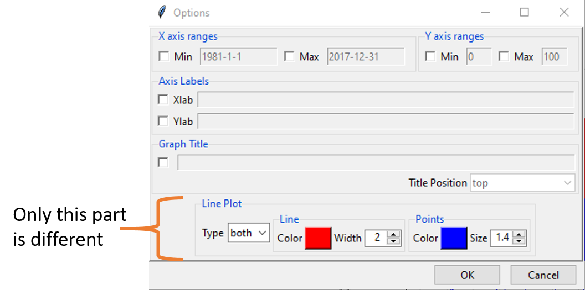

4. Click on **PLOT** to show the anomaly plot. For example, if you selected **Bar** for the **Anomaly Graph** field, then you will see a plot similar to the one shown below.

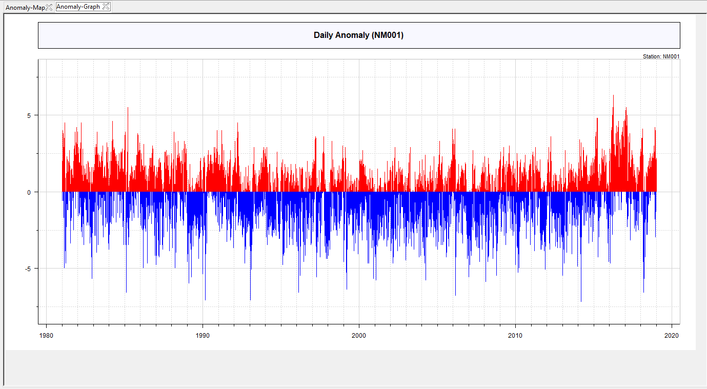
But, if you selected Line for the **Anomaly Graph** field, then you will see a plot like the one shown below.

5. Under the field **Select station to plot**, use  and  to plot anomaly graph for different stations. You can also use the dropdown to select different stations. Once a new station is selected, click on **PLOT** to draw the anomaly graph.

Now, open the **Boundaries** tab in the left tabbed widget. With this tab you can add administrative boundaries or shapefile.

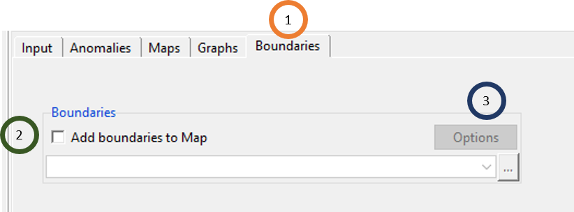

1. Click on the **Boundaries** tab.
2. Tick **Add boundaries to Map** if you want to add a shapefile. After this field is ticked, the field below will be activated. Now, if this shapefile is already loaded, you can select it using  and if it is not loaded, browse to the shapefile using .
3. Clicking Options you can specify the map boundary width and color.

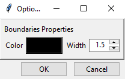

Now, if a shapefile is loaded in the last step, then click on the **Maps** tab again and now if you click PLOT, you will see that the shapefile is added to the map.

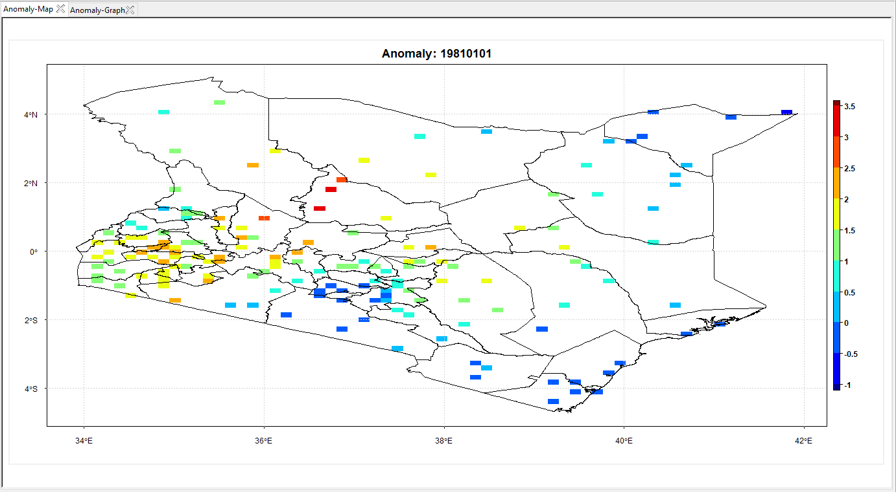

## Spatial Analysis

Spatial Analysis in CDT allow you to aggregate data to either monthly, or seasonal, or annual data and to calculate different statistics on these aggregated data which are: mean, median, standard deviation, coefficient of variation, trend, percentiles, frequency and anomaly. The statistics maps can be shown for the aggregated time series for different stations. Time series graph such as line chart, bar plot, probability of exceeding, and all of these charts for ENSO years, and anomaly plot etc. can be shown for aggregated data. 

To access the features to compute the spatial analysis, use the menu **Analysis -> Spatial Analysis**. This will display a tabbed widget on the left panel. 

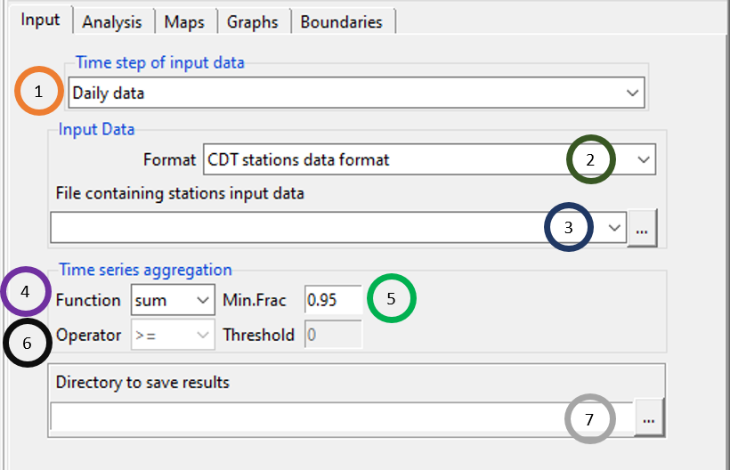

1. Specify the time step of the input data by clicking on  under **Time step of input data**. You can use any of these 4 time steps for input data: daily, pentad, dekadal and monthly.
2. Specify the format of the input data by clicking on **File containing stations data** field and select any of the two: CDT stations data format and CDT dataset format (gridded).
3. Use the field **File containing stations data** to specify the input data file. Browse to the file by using , or if this file is already loaded, click  to select it. After you selected the input file, you will see that a new dialog box will be popped. You can specify the settings of the data here.
4. You can aggregate the input data by specifying any of the three functions: **mean**, **sum** and **count**. 
5. **Min.Frac** is the minimum fraction of available data that must be present within each output time series.
6. If **count** is selected as **Function**, then the **Operator** and **Threshold** fields are activated. If **count** is selected as the aggregation function in a, then the field Operator will be activated. The four available operators are: ≤, <, ≥ and >. The field **Threshold** allows you to count an event according to your specification defined using the combination of **Operator** and **Threshold** field.
7. Browse to the folder where you want to save the result of the spatial analysis.

Now, click on the **Analysis** tab, to compute the statistics specified by you on the aggregated output data. 

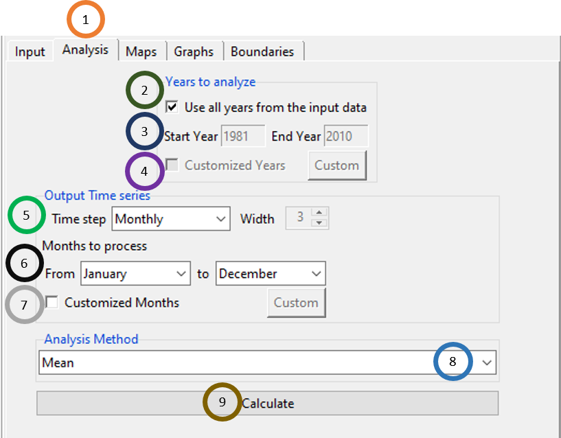

1. Click on the **Analysis** tab.
2. By default, the field Use all years from the input data is ticked. If you don’t want to use all the years, then untick this field.
3. If you have unticked in step 2, then specify the **Start Year** and **End Year**.
4. If you have unticked in step 2, then **Customized Years** is activated and if you tick this, you can provide some specific years for which you want to analyze. If you click **Custom**, you will see a new dialog box where you can specify custom years. 

    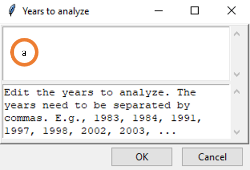

    a. Specify the custom years separated by commas. 

5. Select the **Time step** of the **Output Time series**. The available time steps are: **Monthly**, **Seasonal** and **Annual**. If you selected Seasonal, then the field to the right **Width** will be activated. You can specify the number of months in a season in this **Width** field, for example, specifying 4 means a season consists of four months. 
6. If you selected **Monthly** for **Time step** field in the precious step, then specify the range of months to be considered for the analysis. Also, if you selected **Seasonal**, then **From** field will be activated and you can specify the first month of the season you want to analyze. For example, if you specify April for **From** field and in step 5, 3 for Width, then CDT will compute statistics for only the season starting from April and ending in June.
7. Again, if you selected **Monthly** for **Time step** field in the precious step, you can specify customized months or any months of your choice by ticking the **Customized Months** field. Once you ticked, **Custom** button will be activated and by clicking on this you can specify specific months as you also saw in step 4 for years.

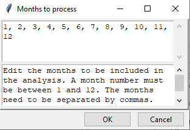

8. You can calculate any of these 8 statistics by using the dropdown under **Analysis Method**: **mean**, **median**, **standard deviation**, **coefficient of variation**, **trend**, **percentiles**, **frequency** and **anomaly**.
9. Click **Calculate**. This will create a new folder with the statistics for all stations at the time step level specified by you.

Now, click on the **Maps** tab to map the statistics at different stations for the output time period.

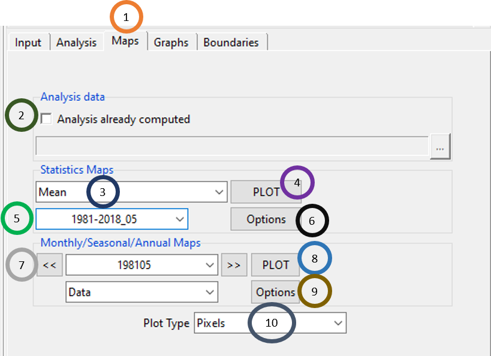

1. Click on the **Maps** tab.
2. If you have already conducted spatial analysis, load the **.rds** file by ticking on **Analysis already computed** and browsing to the file.
3. Click on the dropdown to select the statistics type for which you want to plot. If in the **Analysis** tab, you first selected **Mean** for the **Analysis Method** field, then you will see only **Mean** in the **Statistics Maps** field. Then if you selected any other method for the **Analysis Method** field and clicked **Calculate** in the **Analysis** tab, then in the **Maps** tab this method will also be added with the first method and become available in the dropdown under **Statistics Maps**. In short, for all the methods that we use to compute statistics are all available in the **Statistics Maps** field. 
4. Click on **PLOT** to plot the map of the statistics for all the stations.
5. This field gives the statistics of the aggregated data over the total time period. If the time step of the output data is monthly, then this field will allow to look at 30 year statistics for each of the 12 months. So for monthly data, it allows to look at 12 different data representing the statistics of each station over 30 years. For seasonal data, you will get only one seasonal statistics for each of the stations and so on.
6. If you click **Options**, you will see the same options for changing map colors and value levels.

    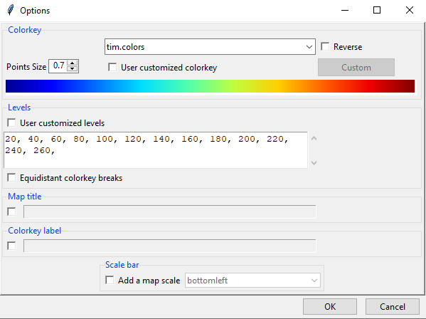

7. This field allows to look at each of the year for a specified statistics. For example, if the output time step was monthly, then this field allows you to look at every month statistics for each of the years within the considered period.   
8. Click on **PLOT** to plot the map of the statistics for different years at the output time step for all the stations.
9. If you click **Options**, you will see the options for changing map colors and value levels for maps specified in step 7. This option is the same as you saw in step 6.
10. **Plot Type** can be either **Pixels** or **Points**.

Now, click on the **Graphs** tab to plot different graphs of different stations for the output time period.

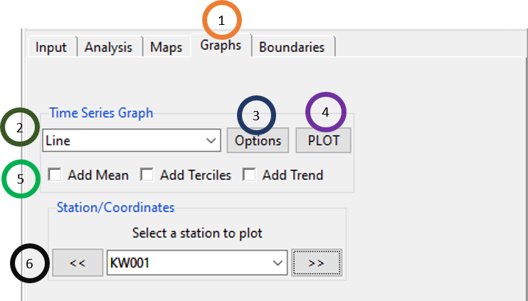

1. Click on **Graphs**.
2. Under **Time Series Graph**, you will see may options of graph including Line, **Barplot**, **Probability** (probability of exceeding), **ENSO-Line** (line graph including ENSO information), **ENSO-Barplot** (bar plot with different bars colored according to ENSO type), **Enso-Proba** (Probability of exceeding chart separately calculated for all years, El Niño and La Niña years) and Anomaly. 
3. **Options** gives you different options for formatting these different graphs. For all the graphs, the common options are defining the minimum and maximum of X and Y axis, defining axis labels, graph title and its position. Then there are options that are not common across all graphs and these changes as you select different graphs. For Line Plot, you will see options for formatting line type, line color, line width, point size and color whereas for bar plot, you will see option of changing the bar color. Similarly for all other graphs, we see different options according to the graph type.
4. Clicking on PLOT will plot the graph selected by you for **Time Series Graph** field in step 2.
5. For **Line** and **ENSO-Line** graphs, you can add any of or all of these: mean, tercile and trend. You can do these by ticking these fields: **Add Mean**, **Add Terciles**, and **Add Trend**.
6. Select different stations by using either dropdown or by using  and  to see different graphs for these stations.

Now, open the **Boundaries** tab in the tabbed widget in the left. With this tab you can add administrative boundaries or shapefile. You have already seen how to load a shapefile before using this tab for using other feature in CDT.

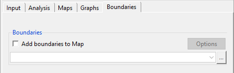

## Daily Rainfall Analysis

This feature allows you to use daily rainfall data and compute different statistics over a season for total rainfall, rainfall intensity, number of wet days, number of dry days, number of wet spells and number of dry spells. To access these features, use the menu **Analysis -> Daily Rainfall Analysis**. This will open a new dialog box like the following where the first tab **Input** is selected and different options under it are shown.

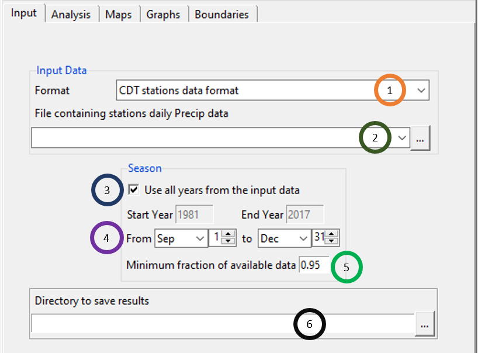

1. Specify the format of the input data by clicking on **Format** field and select any of the two: CDT stations data format and CDT dataset format (gridded).
2. Use the field **File containing stations Precip data** to specify the input data file for rainfall. Browse to the file by using , or if this file is already loaded, click  to select it. As you saw before, after you select the input file, you will see that a new dialog box will be popped. You can specify the settings of the data here.
3. The field **Use all years from the input data** is ticked by default meaning that all the years in the input data will be used. If you don’t want to use all the years, untick this field and provide the starting and finishing year by specifying the values in the fields **Start Year** and **End Year**.
4. Specify the season starting and end time.
5. Specify the **Minimum fraction of available data**.
6. Browse to the folder where you want to save the result of the **Daily Rainfall Analysis**.

Now, click on the **Analysis** tab to compute different statistics over a season for different parameters of rainfall data. 

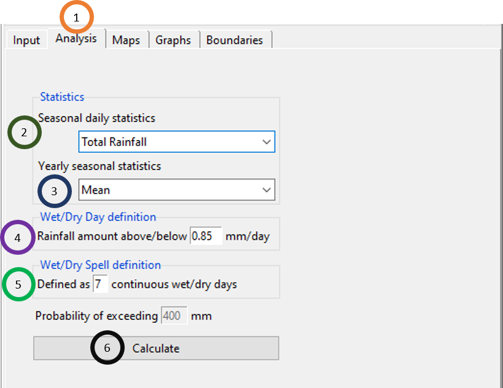

1. Click on the Analysis tab.
2. Now, define in which dimension you want to aggregate your daily rainfall data to seasonal rainfall data. You can look at any of these dimensions: total rainfall, rainfall intensity, number of wet days, number of dry days, number of wet spells and number of dry spells.
3. This field Yearly seasonal statistics allows you to define the statistics you want to use for the seasonally aggregated data that you defined in step 2.
4. **Wet/Dry Day definition** allows you to define the wet/dry day in terms of rainfall in mm. By default, 0.85 is given, you can change it to any other value according to your requirement.
5. **Wet/Dry Spell definition** allows you to define the wet/dry spell in terms of consecutive wet/dry days. By default, 7 is used, again, you can change this value according to your requirement.
6. Click on **Calculate**. This will generate a new folder named **DAILY.RAINFALL.ANALYSIS_data**. This folder contains folders containing the result of your analysis and a file **DailyRainfallAnalysis.rds** using which you can load the same result without having to conduct the same analysis again in CDT. 

Now, click on the **Maps** tab to plot different statistics over a season for different parameters of rainfall data. 

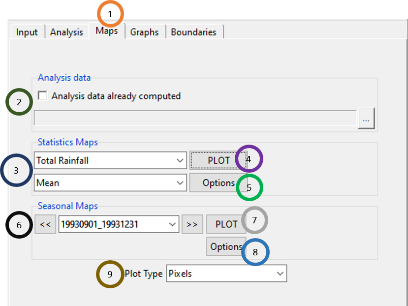

1. Click on the **Maps** tab.
2. If you have already computed different statistics, then tick **Analysis data already computed**. Once it is ticked, the field below will be activated and browse to the **.rds** file containing the analysis data.
3. For the example shown in the picture, it means that the mean of total rainfall for a season will be shown over the total time period for each station. If the above field is **Rainfall Intensity** and the below field is Standard deviation, then you can plot the standard deviation of rainfall intensity for a season over the total time period for each station. 
4. Clicking on **PLOT** will plot according to what you specified in step 3. According to the selection in the above chart, clicking **PLOT** will show a plot of the mean of total rainfall for the specified season over the total time period for each station.
5. If you click **Options**, you will see the options for changing map colors and value levels as you have already seen before.
6. **Seasonal Maps** field allows you to look at seasonal value of the aggregated rainfall for each year for each station. For the example shown in the chart above, this map will show seasonal total rainfall for each station for each year. In step 3, if the above field is Rainfall Intensity, then the field in step 6 represents seasonal value of the **rainfall intensity** for each year for each station.
7. Clicking on **PLOT** will show the map of the data as selected in step 6.
8. Similar to previous Options, clicking on this Option will show different options for changing map colors and value levels for plot you get from step 6 and 7.
9. **Plot Type** can be either **Pixels** or **Points**.

Now, click on the **Graphs** tab to plot different statistics over a season for different parameters of rainfall data. 
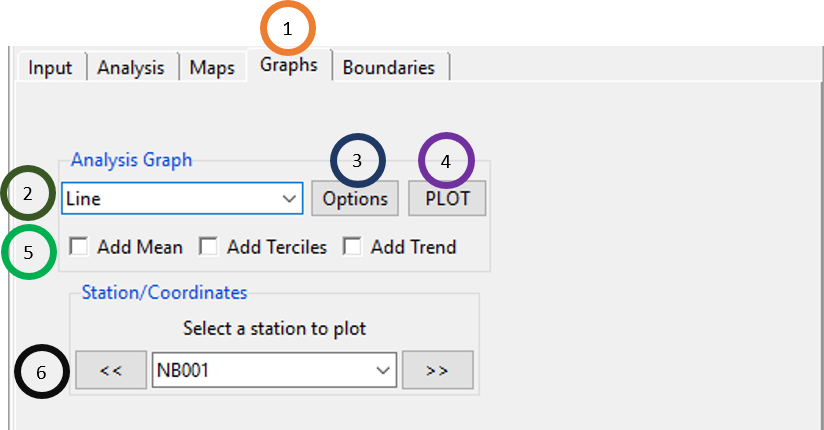

1. Click on the **Graphs** tab.
2.In the Analysis Graph field, you can see that there are 4 graphs that you can generate using CDT. The four graphs available are: **Line**, **Barplot**, **Probability** (probability of exceeding) and **Anomaly**. If you selected **Total Rainfall** for the field Statistics Maps, and then if you selected **Line** graph for **Analysis Graph** and clicked on **PLOT**, you will see a line graph of total rainfall for different stations. 
3. Click on **Options** to see different formatting options for graph. 
4. Click on **PLOT** to generate the graph as you defined in the step 2.
5. For **Line** graph, you can add any or any combination of the following: mean, terciles, and trend. You can do this by ticking the relevant fields.
6. Select different stations by using either dropdown or by using  and  to see different graphs for these stations.

Now, click on the **Boundaries** tab to add shapefile to the map as you saw similar examples before. 

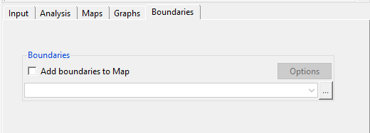

## Rainy Season Characteristics

You can compute different rainy season characteristics such as the season onset, season cessation and season length. To access these features, use the menu **Analysis -> Rainy Season Characteristics**. Under this, you can compute these different characteristics. 

### Season onset
Season onset is the start time of the rainy season. You can access this feature using **Analysis -> Rainy Season Characteristics -> Season Onset**. 

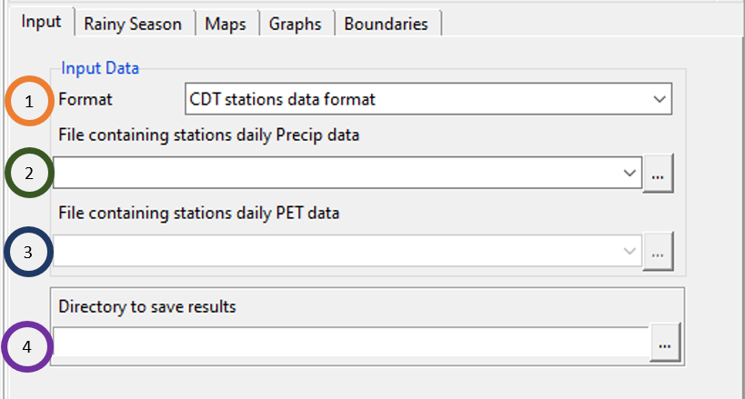

1. Specify the format of the input data by clicking on **Format** field and select any of the two: CDT stations data format and CDT dataset format (gridded).
2. Use the field **File containing stations daily Precip data** to specify the input data file for daily rainfall. Browse to the file by using , or if this file is already loaded, click  to select it. As you saw before, after you select the input file, you will see that a new dialog box will be popped. You can specify the settings of the data here.
3. Similarly, under the field **File containing stations daily PET data** to load the input data file for daily PET data. Browse to the file by using , or if this file is already loaded, click  to select it and specify the format of the PET data. 
4. Browse to the folder where you want to save the result of the **Season Onset**.

**Rainy Season** tab allows you to specify the different parameters to define the onset. In this tab, rainy season onset can be calculated both for one region or multiple regions. For multiple regions, either you can use latitudes or shapefile.

1. Click on the **Rainy Season** tab.
2. By default, the **Region** field has value One. If you selected **Multiple** for the **Region** field, then different options will be shown under this field.

    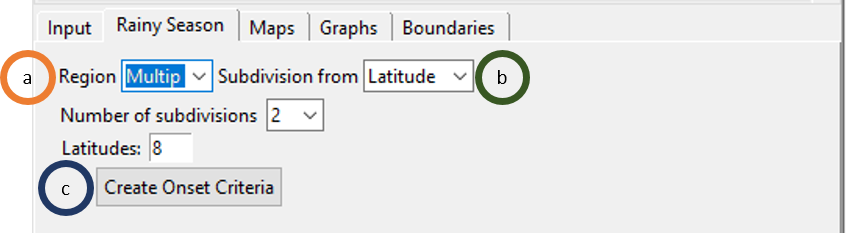

    a. Select the value **Multip** for the field **Region** if you want to use latitude or shapefile as region.
    b. If you selected Latitude s the value for the field Subdivision from, then in the bottom of it, you will see two more fields which you can change: **Number of subdivisions** and **Latitudes**.

    If you select **Shapefile** for the field **Subdivision** from, then two more fields will appear below the field allowing you to upload shapefile and to specify the attribute to be used to split the region.

    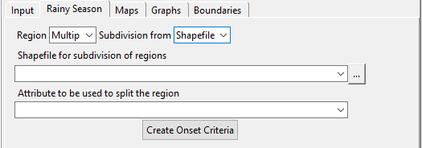
    c.	Now, click **Create Onset Criteria** to specify the criteria for defining the onset. This will show the following list of criteria below.

    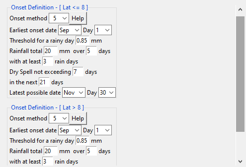

3. **Onset Definition** field shows many options for setting the parameters to define the onset. These are shown, if in the step 1 you selected One for the **Region** field. 
4. Click on **Calculate Onset** to calculate the onset date.

Now, using **Maps** tab, you can generate different maps. 

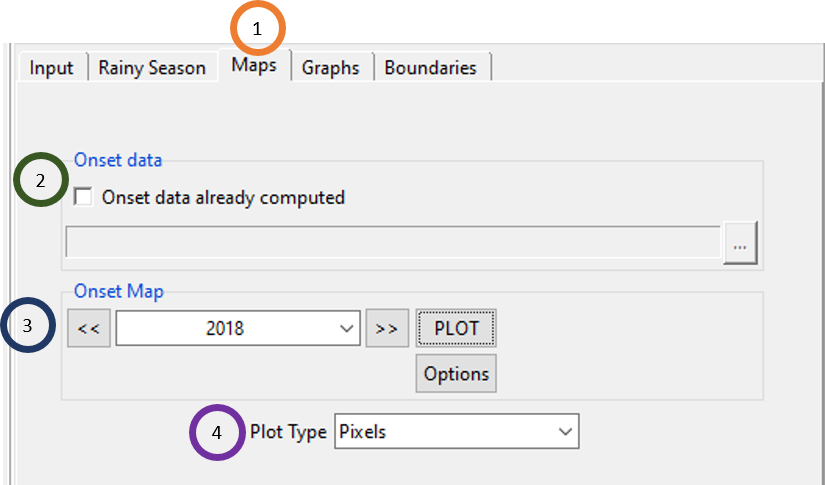

1. Click on the **Maps** tab.
2. If you have already computed onset, then tick **Onset data already computed**. Once it is ticked, the field below will be activated and browse to the **.rds** file containing the onset data.
3. Under **Onset Map**, select different years and click on PLOT to plot the onset date for different locations. You can also click on **Options** to format the options for changing map colors and value levels.
4. **Plot Type** can be either **Pixels** or **Points**.

Using **Graphs** tab, you can generate different graphs. 

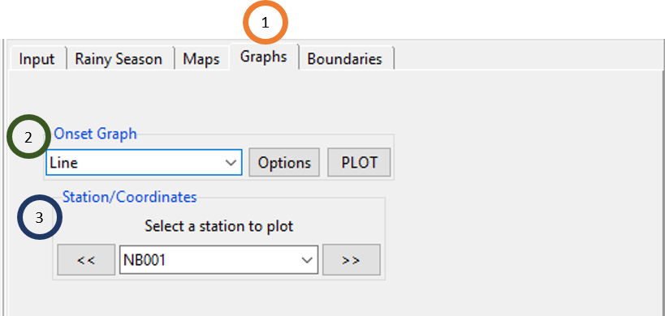

1. Click on the **Graphs** tab.
2. For **Onset Graph**, **Line** or **Barplot** can be selected and clicking on **PLOT** you can plot the selected graph and clicking on **Options** you can change the format of the graph.
3. Under Station/Coordinates, click on the station ID to plot the graph for that particular station.

Similar to Daily Rainfall Analysis, click on the **Boundaries** tab to add shapefile to the map. 

### Season Cessation

Season onset is the start time of the rainy season. You can access this feature using **Analysis -> Rainy Season Characteristics -> Season Cessation**. 

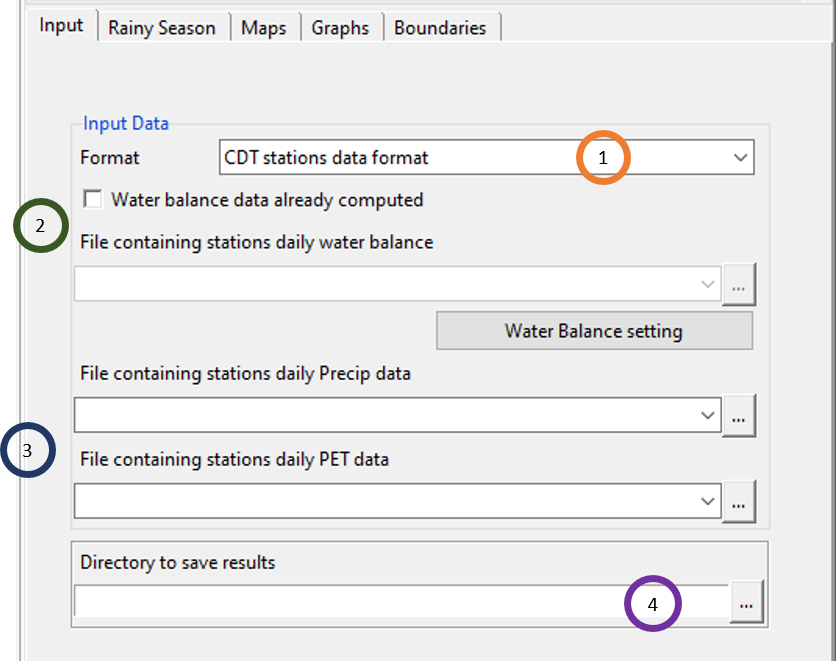

1. Specify the format of the input data by clicking on **Format** field and select any of the two: CDT stations data format and CDT dataset format (gridded).
2. If you have already computed water balance, then tick the field **Water balance data already computed**. Once it is ticked, you can now upload the water balance by using the field **File containing stations daily water balance**. Click on **Water Balance settings** to specify the settings of the water balance file.
3. If you have not computed water balance already, then don’t tick **Water balance data already computed** field and now the two fields for precipitation and PET data are activated. Use these two fields to upload precipitation and PET data.
4. Browse to the folder where you want to save the result of the **Season Cessation**.

**Rainy Season** tab allows you to specify the different parameters to define the cessation. Similar to onset, using this tab, rainy season cessation can be calculated both for one region or multiple regions. Similar to onset, for multiple regions, either you can use latitudes or shapefile.

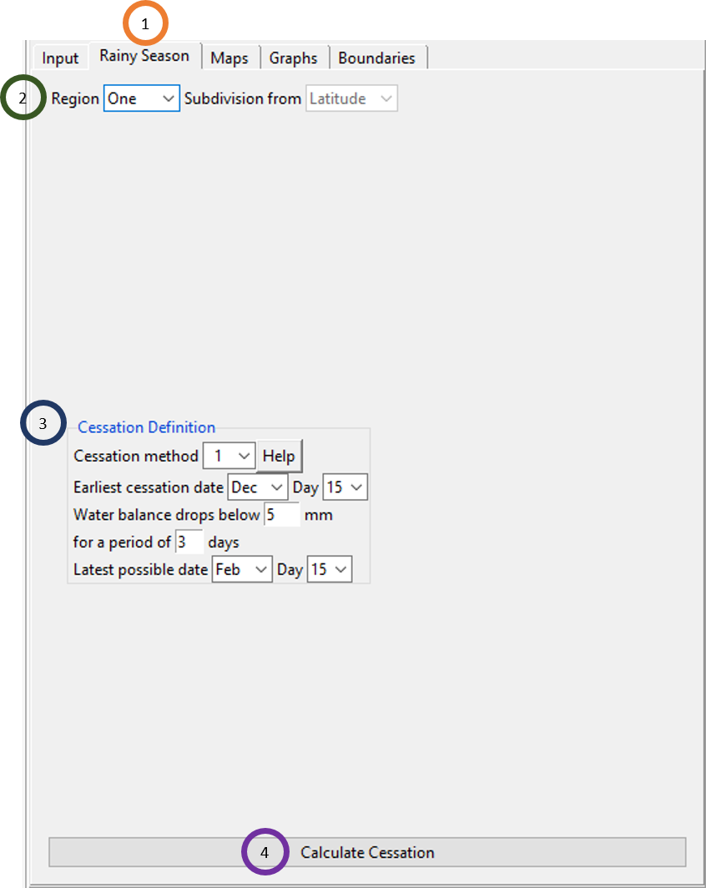

1. Click on the **Rainy Season** tab.
2. By default, the **Region** field has value **One**. If you selected **Multiple** for the **Region** field, then different options will be shown under this field as you saw for **Season Onset**.
3. **Cessation Definition** field shows many options for setting the parameters to define the cessation. These are shown, if in the step 1 you selected **One** for the **Region** field. 
4. Click on **Calculate Cessation** to calculate the onset date. This will create a file **Cessation.rds** in the output directory.

Now, using **Maps** tab, you can generate different maps of cessation date as you saw for onset date calculation. 

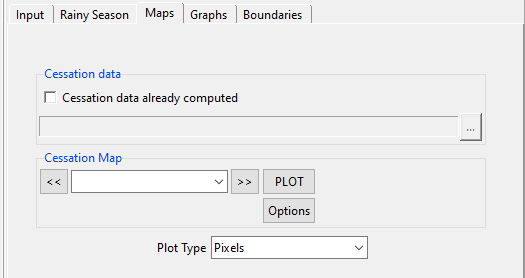

Using **Graphs** tab, you can generate different graphs for cessation as you saw for onset. 

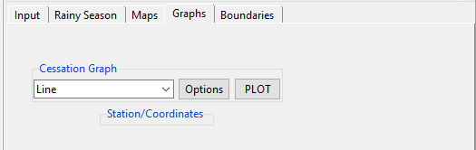

Similar to **Season Onset**, click on the **Boundaries** tab to add shapefile to the map. 

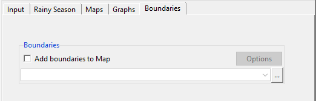

### Season Length

Season length is the duration of the rainy season. You can calculate season length after computing season onset and season cessation. You can access this feature using **Analysis -> Rainy Season Characteristics -> Season Length**.

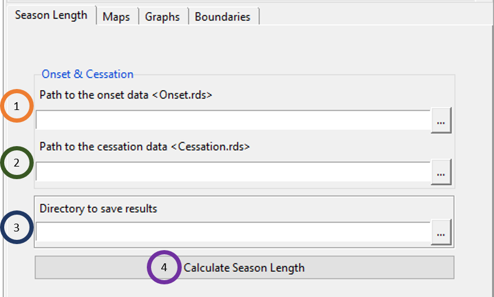

1. Specify the full path to the file **Onset.rds** that was generated when you calculated **Season Onset**. Browse to this file using .
2. Specify the full path to the file Cessation.rds that was generated when you calculated Season Cessation. Browse to this file using .
3. Browse to the folder where you want to save the result of the Season Length.
4. Click on Calculate Season Length which will create a new folder with the season length data. The newly created folder is named **SEASON.LENGTH_data**. This folder contains among others a .rds file named **SeasonLength.rds** which contains the result of this computation.

Now, click on the **Maps** tab to see maps of season length for every station location. 

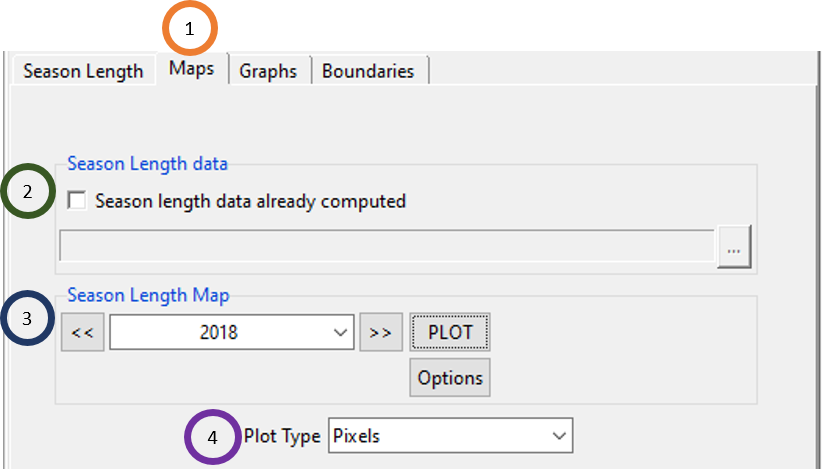

1. Click on the **Maps** tab.
2. If season length was previously computed, then tick **Season length data already computed** and browse to the file **SeasonLength.rds**.
3. Select the year for which you want to see season length for all the stations in a map. Now, click **PLOT** to plot a map of the selected year. By clicking **Options**, you can format the graph properties. Below is an example of a season length map.

    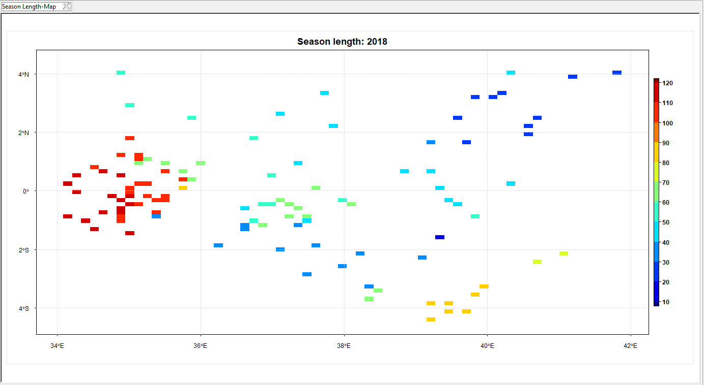

4. **Plot Type** can be either Pixels or Points.

Using **Graphs** tab, you can generate different graphs for season length and using Boundaries tab, you can add a shapefile to the map. As you are already familiar with these features, we are not discussing it any more here. 

## Rainy Season Analysis

Rainy Season Analysis allows you to compute different characteristics of rainy season and compute different climatological analysis (statistics) of these characteristics. You can see all of these results in maps and graphs. To access these features, use the menu **Analysis -> Rainy Season Analysis**. This will open a tabbed widget on the left panel.

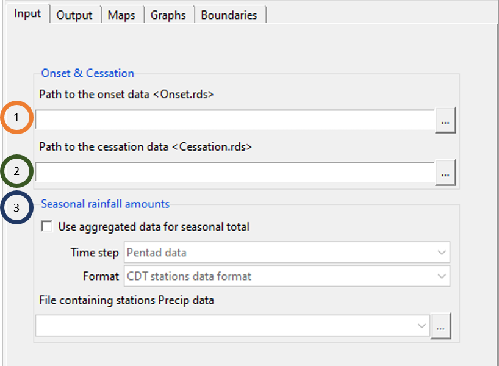

1. Browse to the file **Onset.rds** containing the onset data.
2. Browse to the file **Cessation.rds** containing the onset data.
3. If you don’t want to use aggregated data for seasonal total, ignore this field. Otherwise, for seasonal rainfall amount, if you want to use aggregated data, tick the field **Use aggregated data for seasonal total**. Now, in the Time Step field, define the time step of the aggregated data, define the format of the data using the dropdown for Format field and browse to the aggregated data using  under the field **File containing stations Precip data**.

Now, click on the **Output** tab to define the dray day definition and other parameters for running the analysis for every station location. 

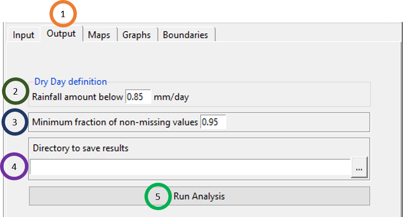

1. Click on the **Output** tab.
2. Specify the amount of rainfall below which you define a day as dry day. By default, 0.85 mm/day is given in CDT.
3. Specify the **Minimum fraction of non-missing values**.
4. Specify the directory where you want to save the result by browsing to that address.
5. Click on **Run Analysis**. This will create a folder named **RAINY.SEASON.ANALYSIS_data**. Inside this folder, along with two other subfolders, a file named **RainySeasonAnalysis.rds** is created using which you can load the results in a later session of CDT.

**Maps** tab allows you to look at different characteristics of rainy season for each year and also to look at different climatological analysis (statistics) of these characteristics calculated over all the years. 

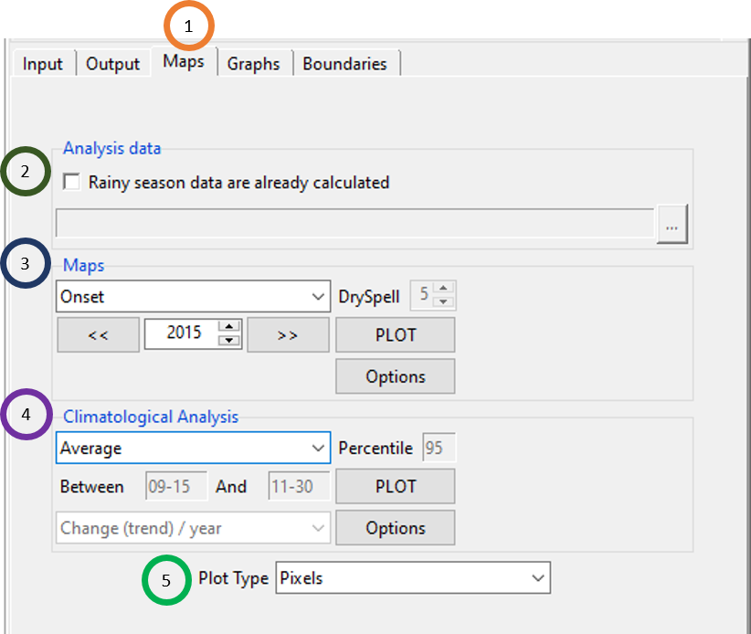

1. Click on the **Maps** tab.
2. If the **Rainy Season Analysis** was conducted in a previous CDT session, then just load the **RainySeasonAnalysis.rds** file. If this is the case, you don’t need to use the **Input** and **Output** tabs.
3. Click on the type of rainfall property you want to see a map of it for every single year over the considered period. The rainfall properties that can be looked at are: **Onset**, **Cessation**, **Season Length**, **Seasonal Rainfall Amounts**, **Dry Spells**, **Longest Dry Spells**, **Number of rainy day**, **Maximum daily rain**, **Total rain when RR>95thperc** and **Total rain when RR>99thperc**. If you selected Dry Spells, you can actually define how many continuous dry days to be considered as dry spell by specifying the value in the DrySpell field. Once you selected the rainfall characteristic, you can also then select the year for which you want to map for all stations by clicking **PLOT**. Click on **Options** to format the map such as the color range used, map title etc. For example, if you selected Dry Spells and defined 4 continuous dry days to be considered as dry spell and selected year 1987, then clicking on PLOT will show a map similar to the following one.

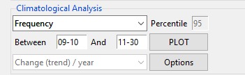

4. This allows you to look at different climatologies of the different characteristics of the rainy season. The available climatological analysis are: **Average**, **Median**, **Standard deviation**, **Trend**, **Percentiles** and **Frequency**. If you select **Percentiles**, you can actually enter the nth percentile that you want to calculate by putting this in the **Percentile** field. If you select **Frequency** as the climatological analysis method, then you can enter the lower bound and upper bound of the interval to cunt the number of occurrences. Specify these time in the format of Month-Day. For example, if you want to count the number of times a rainy season characteristics (selected by you in step 2) occurred between September 10th and November 30th, enter the values in the following way.

You can also change the mapping color and other formatting by clicking on **Options**.

5. **Plot Type** can be either **Pixels** or **Points**.

The next two tabs Graphs and Boundaries have similar functionality as you seen before and so we don’t discuss the functionalities of these two tabs here. We encourage to look at these two tabs and work with some of the features that you get in these two tabs.

## Climate Extreme Indices

CDT allows you to compute different climate extreme indices as defined in Climdex website (Indices, 2021). It allows you to compute indices for both rainfall and temperature.

### Extreme Indices for Rainfall

To compute extreme indices for rainfall, use the menu **Analysis -> Climate Extreme Indices -> Precipitation Data**. This will display a tabbed widget like the following.

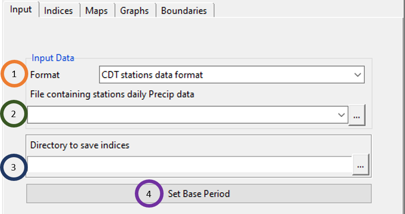

1. Specify the format of the precipitation data.
2. Use the field **File containing stations daily Precip data** to specify the input data file for daily rainfall. Browse to the file by using , or if this file is already loaded, click  to select it. After that specify the settings of the data file.
3. Specify the directory where you want to save the result.
4. Click on **Set Base Period** to customize the base period according to your requirement.

Click on the Indices tab to select the indices you want the CDT to compute. By default, all the indices are selected, you can also select as many as you want by ticking.

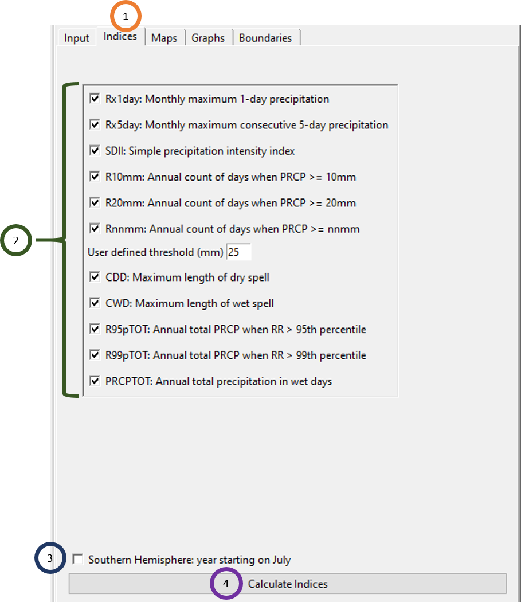

1. Click on the **Indices** tab.
2. Select any or all of the extreme precipitation indices.
3. If the region you are working with is located in the southern hemisphere, check the box **Southern Hemisphere: year starting on July**. It will shift the yearly data so that the summer season will be centered in December/January which is the main rainy season.
4. Click on **Calculate Indices** to calculate the extreme rainfall indices.

Click on the **Maps** tab to map different precipitation extreme indices for different years and also to plot different statistical estimates of these indices. 

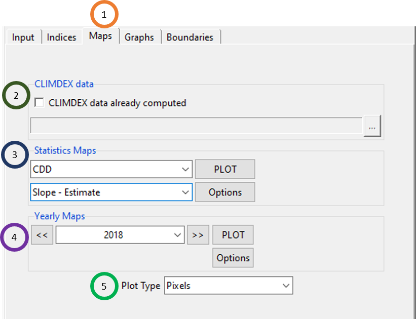

1. Click on the **Maps** tab.
2. If you computed extreme precipitation indices using these features in CDT before, then load the file **climdex.rds**.
3. Under Statistic Maps, click on the extreme precipitation index and then also click on the type of statistic you want to calculate of the extreme index. For example, from the figure above, this shows that you will see estimate of the slope of the CDD. Here this slope is the slope of a linear model where CDD is the dependent variable and year is the independent variable. 

    In general, you can estimate a number of estimates of linear models where every different linear model is built of one of the extreme indices as the dependent variable and year as independent variable. The linear model estimates that you get from the linear model are: estimate of the slope (**Slope - Estimate**), standard error of the slope (**Slope – Standard Error**), t-value of the slope (**Slope t-value**), estimate of the intercept (**Intercept - Estimate**), standard error of the intercept (**Intercept – Standard Error**), t-value of the intercept (**Intercept t-value**), p-value of the intercept (**Intercept p-value Pr(>t)**), multiple R-squared (**Multiple R-squared**) and residual standard error (**Residual Standard Error**). 

    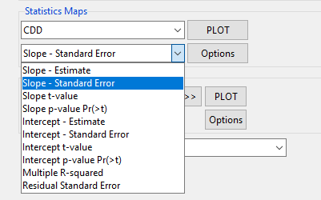

    For example, if you select the **CDD** index and **Slope – Estimate** statistics, and then you click **PLOT**, you will see the estimate of the slope of CDD for different stations computed over the considered time period.

    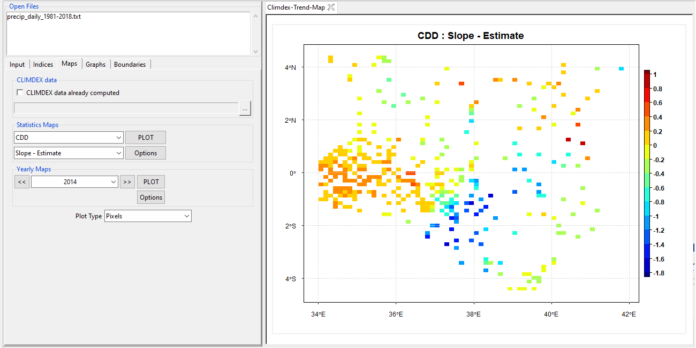

    You can also change the mapping color and other formatting by clicking on **Options**.

4. Select different years by clicking  and  or by using the dropdown . Similar to step 3, you can also map clicking **PLOT** and change the map formatting clicking **Options**.    
5. **Plot Type** can be either **Pixels** or **Points**.

**Graphs** tab allows you plot line chart or barplot of extreme precipitation indices for different stations separately.

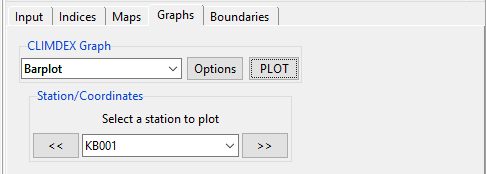

Here, under **CLIMDEX Graph**, select the plot type, which is either **Line** or **Barplot** and select any one station under **Select a station to plot**. Now, this will show either a Line or Barplot of the selected station of the extreme index that you selected under **Maps** tab. This will also show the value of R-sqaure, p-value, estimated slope and slope error. If you want to see a graph of any other index than the one already selected, just change the extreme index under Maps and then go to the **Graphs** tab and then select the graph type and plot it. For the figure shown above, if you click **PLOT** (in the **Graphs** tab), then you will see a bar plot like below.

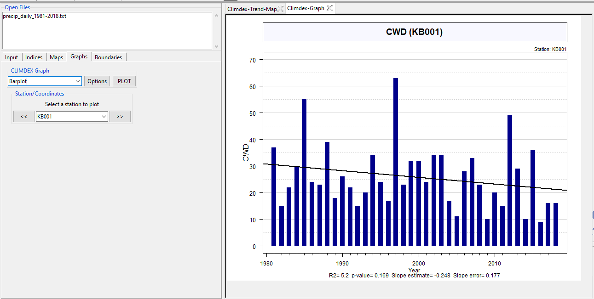

The Boundaries tab allows you to add a shapefile to the maps.

### Extreme Indices for Temperature

To compute extreme indices for temperature, use the menu **Analysis -> Climate Extreme Indices -> Temperature Data**. This will display a tabbed widget like the following. 

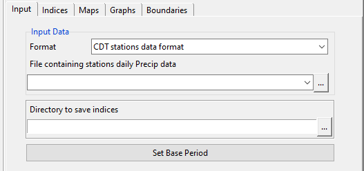

The tab allows you to upload temperature data as you did for uploading precipitation data for computing extreme precipitation indices. 

Click on the **Indices** tab to select the extreme temperature indices you want the CDT to compute. 

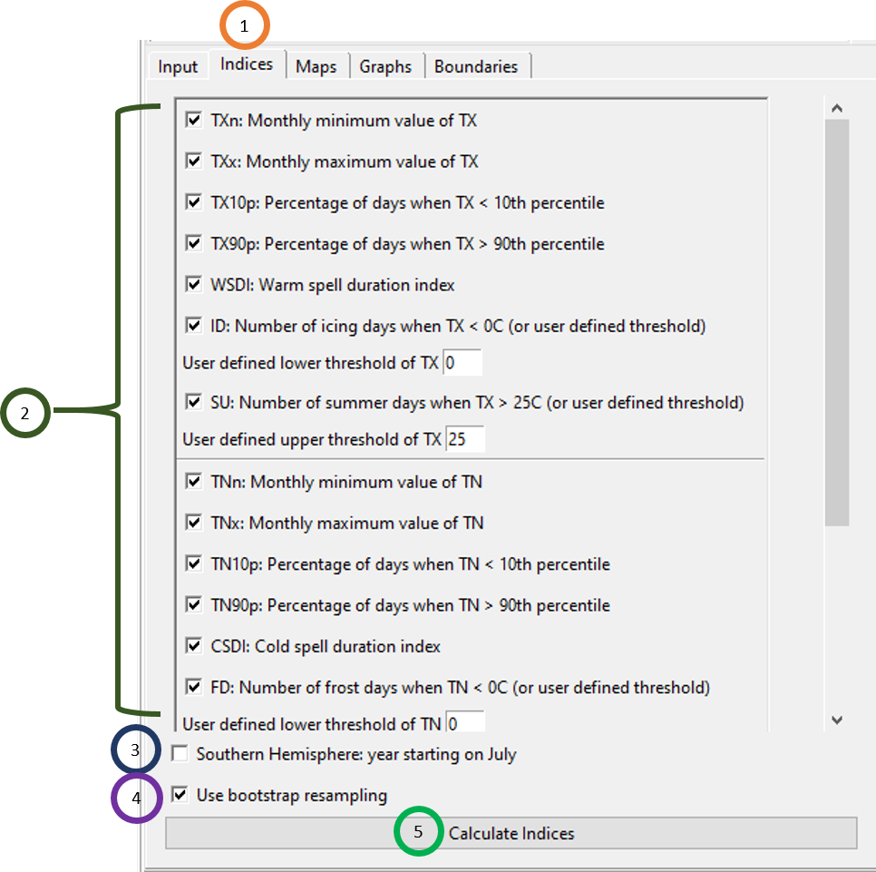

1. Click on the **Indices** tab.
2. Select any or all of the extreme temperature indices.
3. If the region you are working with is located in the southern hemisphere, check the box **Southern Hemisphere: year starting on July**. It will shift the yearly data so that the summer season will be centered in December/January which is the hottest season.
4. To apply a bootstrapping method, tick **Use bootstrap sampling** box. The bootstrap sampling avoids any possible inhomogeneity in percentile-based indices of temperature extremes. Details are described in Zhang et al. (2005).
5. Click on **Calculate** Indices to calculate all the selected extreme temperature indices. This will create a new folder **CLIMDEX_TEMP_data**. Inside this folder, you will see 2 more subfolders which are **CDTDATASET** and **CDTSTATIONS**. Both of these folders contain all the information in the extreme indices, the first folder contains information as **.rds** file and the latter subfolder contains information as **.csv** file. Every **Trend** subfolder contains the estimate of the linear model of the extreme index under which this subdirectory resides. For example, for this file **CDTDATASET -> CSDI -> Trend -> CSDI.rds**, the file CSDI.rds contains the linear model estimates of CSDI in a .rds file. The Yearly subfolder contains the yearly estimate of the extreme index for all stations. For example, for this file **CDTDATASET -> CSDI -> Yearly -> CSDI.rds**, the file **CSDI.rds** contains yearly estimate of CSDI for all the stations. Similarly, for CDTSTATIONS subfolder, we have the same estimates not in **.rds** format, but in **.csv** format.

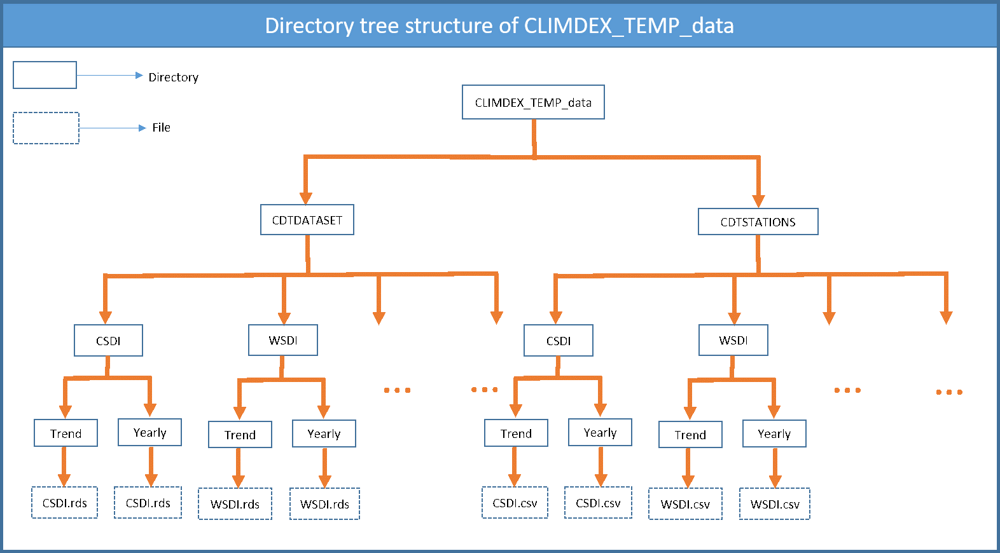

The Maps, Graphs and Boundaries tab offer the same features as you saw for extreme precipitation indices and so we don’t discuss any more about these.

## Drought Indices

Using CDT, you can compute three drought indices which are **Standardized Precipitation Index (SPI)**, **Standardized Precipitation Evapotranspiration Index (SPEI)** and **Deciles**. To access the features for computing drought indices, use the menu **Analysis -> Drought Indices**. 

### Standardized Precipitation Index (SPI)

Use the menu **Analysis -> Drought Indices -> Standardized Precipitation Index (SPI)** to calculate SPI. 

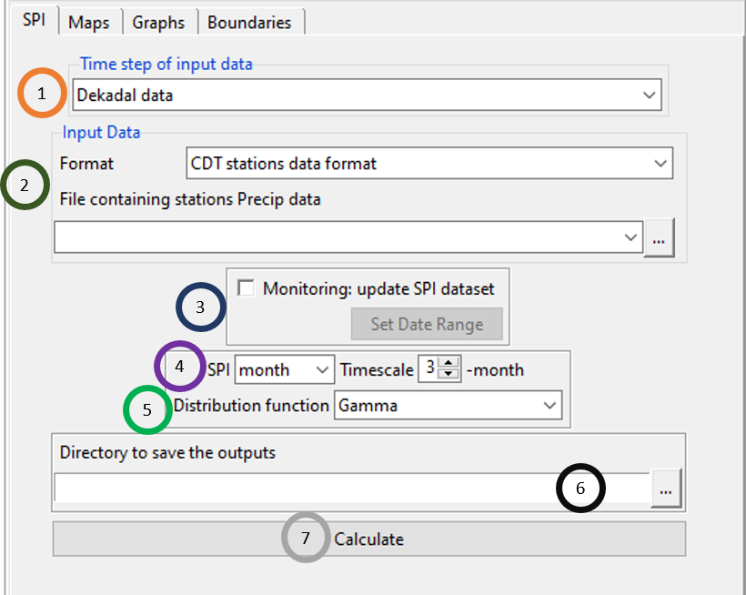

1. Specify the time step of the data. The available time steps are: daily, pentad, dekadal, and monthly.
2. Specify the format of the precipitation data and then browse to the precipitation file.
3. As the calculation of the SPI is a time consuming, especially for the gridded data, if you already have calculated SPI dataset you do not need to compute the index from the begin. You can only compute the index for the latest data you added to the CDT data by ticking the **Monitoring: update SPI dataset** box, then specify the date range over which you want to update the index by clicking on **Set Date Range** button. It is useful when you monitor the evolution of the drought. 
4. Specify whether you want to calculate SPI for month or for dekad. If you want it for month, then you can also specify for how many months, you want to calculate SPI.
5. For calculating SPI, specify the distribution function to be used for calculating SPI. The available distribution functions are: Gamma, Pearson Type III, log-Logistic and Z-Score. But if you have ticked the field **Monitoring: update SPI dataset** in step3, then **Distribution function** will be disabled.
6. Specify the directory where you want to save the result. But if you ticked the field **Monitoring: update SPI dataset** in step3, then specify the already calculated file **SPI.rds**.
7. Click **Calculate** to calculate the SPI or update the existing SPI dataset. This will create a new folder **SPI_data** under which there will be 4 sub-directories and 1 file **SPI.rds**.

The **Maps** tab allows you to look at the map of SPI for different time period (month or dekad) for all stations.

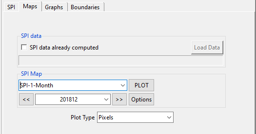

In the above figure, you can see that you can browse to different time period and can plot map for that time and also can change the map formatting by clicking on Options. In the SPI tab, for step 4, if you selected/wrote 3 for Timescale, then SPI is calculated for 3-months period. But, if you again select 1 month instep 4 for the SPI tab, then SPI Map will have two values from which you can choose: SPI-1-Month and SPI-3-Month. For example, for the above figure, if you click PLOT, you will see a map of SPI like the following.

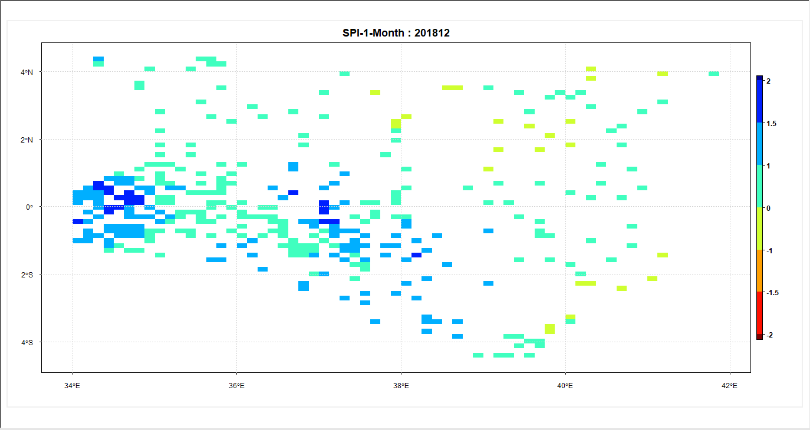

Now, click on the **Graphs** tab to see different graphs of the SPI you calculated.

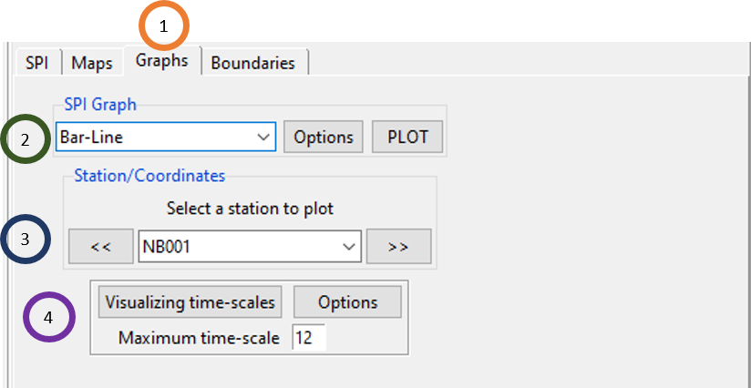

1. Click on the **Graphs** tab.
2. **SPI Graph** can be shown either as **Bar-Line** or **Polygon**. If you select **Bar-Line** and click **PLOT**, you will see a graph like the following.

    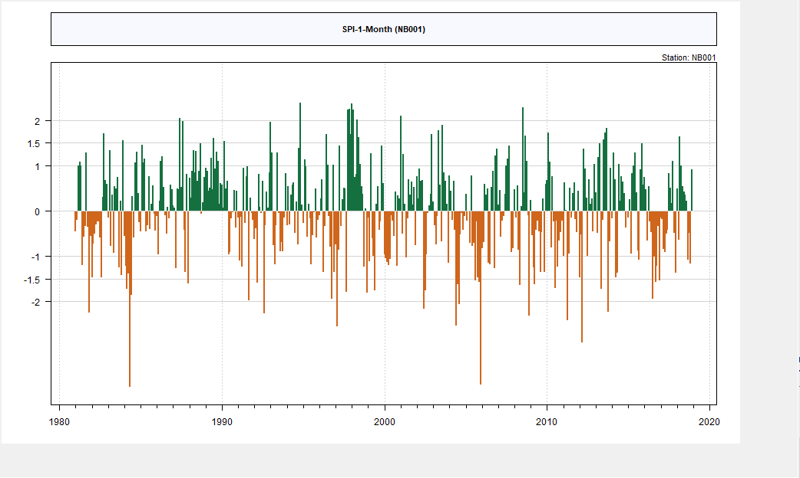

    But, if you select **Polygon** and then click **PLOT**, you will see a plot like the following.

    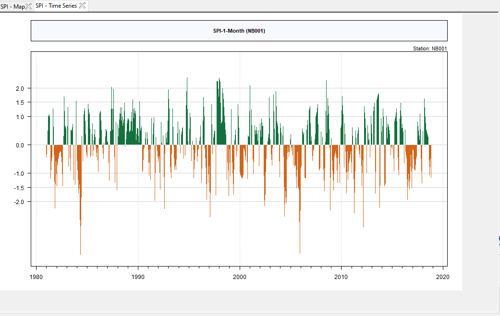

    Using Options, you can change the formatting such as label, color etc. of this chart.

3.	Select the station for which you want to plot.
4.	Click **Visualizing time-scales** button to visualize the severity and extent of any drought events using different time-scales. The lowest time-scale is 1 month, you can also specify the maximum time-scale you want to visualize. 

Use **Boundaries** tab to add shapefile which you are already much familiar with.

### Standardized Precipitation Evapotranspiration Index (SPEI)

Calculating SPEI in CDT is very similar to calculating SPI, the only difference being the additional use of potential evapotranspiration data (PET). Use the menu **Analysis -> Drought Indices -> Standardized Precipitation Evapotranspiration Index (SPEI)** to calculate SPEI. 

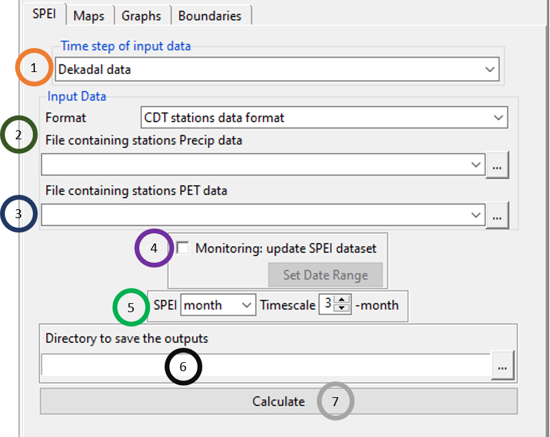

In the above figure, only the field File containing stations PET data is new where you need to browse to the PET data you already calculated using CDT. All other steps are similar to what you saw for SPI calculation. Similarly, Maps, Graphs and Boundaries have the same features that you already saw while calculating **SPI** in CDT.

### Deciles

Deciles is another index for calculating a quantitative measure of drought. To calculate deciles, use the menu **Analysis -> Drought Indices -> Deciles**. 

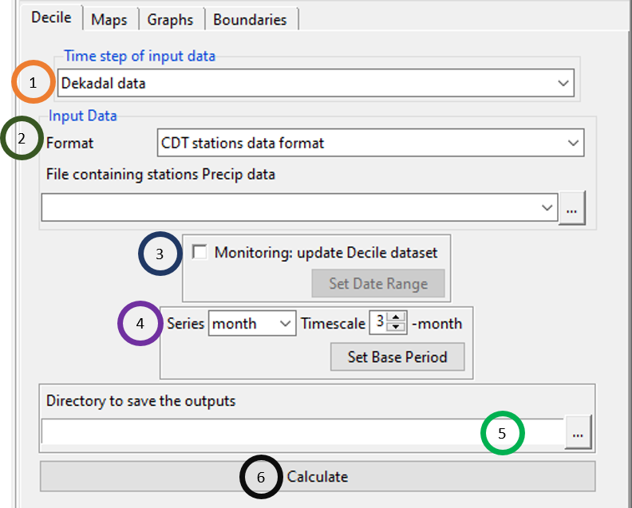

1. Click on the field **Time step of input data** to select the time step of the data.
2. Select the format of the precipitation data and using **File containing stations Precip data** field, browse to the precipitation file.
3.	The same as the SPI and SPEI, for drought monitoring purpose, if you already have calculated decile, tick this field **Monitoring: update Decile dataset**. You can also specify the date range for which you want to update by clicking on **Set Date Range**. 
4. Specify whether you want to calculate Decile for month or for dekad. If you want it for month, then you can also specify for how many months you want to calculate Decile. If the field **Monitoring: update Decile dataset** was not ticked in step 3, then you can also set the base period by clicking on **Set Base Period**.
5. Specify the directory where you want to save the result. But if you ticked the field **Monitoring: update Decile dataset** in step3, then specify the already calculated file **Decile.rds**.
6. Click **Calculate** to calculate the Decile or update the existing Decile dataset. This will create a new folder **Decile_data** under which there will be 4 sub-directories and 1 file **Decile.rds**. The descriptions of these are as following: folders named **CDTDATASET** and **PARAMS** which are used by CDT only, a folder in the form of **<out-time-step>_ data** where out-time-step is dekadal or monthly containing the aggregated data if the input data is daily or dekadal, and a folder named **CDTSTATIONS** containing the computed index if you compute the index from a CDT station data format and a folder named **DATA_NetCDF** in case of gridded data.

**Maps**, **Graphs** and **Boundaries** tabs have the same features that you already saw while calculating **SPI** and **SPEI** in CDT.

## References

Allen, R.G., Pereira, L.S., Raes, D., and Smith, M. (1998): Crop evapotranspiration: Guidelines for computing crop requirements. Irrigation and Drainage Paper No. 56, FAO, Rome, Italy.

Droogers, P., and Allen, R.G. (2002): Estimating reference evapotranspiration under inaccurate data conditions. Irrigation and Drainage Systems, 16: 33-45.

Farmer, W., Strzepek, K., Schlosser, C. A., Droogers, P.,  and Gao, X. (2011): A Method for Calculating Reference Evapotranspiration on Daily Time Scales. MIT Joint Program on
the Science and Policy of Global Change.

Hargreaves, G. H., and Samani, Z. A. (1985): Reference crop evapotranspiration from ambient air temperature. American Society of Agricultural Engineers, 1(2): 96-99.

Kirkham, M.B. (2014): Potential Evapotranspiration. In M.B. Kirkham (Eds.), Principles of Soil and Plant Water Relations (Second Edition). Academic Press. Chapter 28, 501-514. Doi:10.1016/B978-0-12-420022-7.00028-8.

NOAA. (2021, April 21). What is ENSO? https://www.weather.gov/mhx/ensowhat

Trenberth, KE. (2013). El Niño Southern Oscillation (ENSO). Elsevier. https://www.cgd.ucar.edu/cas/Trenberth/website-archive/trenberth.papers-moved/2013ElNinoSouthernOscillation(ENSO)-Elsevier.pdf

