# Visualization

CDT allows users to plot different types of data using Visualization menu. Input data and output data from different analyses can be visualized using CDT. One can plot different data types such as CDT station data, CDT gridded dataset, and NetCDF data using separate Menu abrs for each of them. A user can plot one NetCDF file, sequential NetCDF files, NetCDF files with multiple variables. Even CDT can be used to plot both station data and NetCDF data at the same time, or any other combination of these different data files for plotting. 

## Plot CDT Station Data

This feature allows you to plot a user's data for each time step and also for each station. One can access this feature using **Visualization -> Plot CDT Station Data**.

1. Specify the time step of the data. Use the field **File containing CDT stations data** to upload the data.
2. One can specify the date for which you want to plot your data. For example, if the time step of your data is minutes, then specify the **Minute**, **Hour**, **Day**, **Month** and **Year**. Again, if data is monthly, specify just **Month** and **Year**. Using  and , select a different day for which map will be generated with data for all stations. You can click **Points** or **Pixels** as the type of station data points drawn on the map. Clicking on **Options** you can change the format of the map.
3. Select a station from the field Stations using , and click on the graph type which is either of **Line** or **Barplot**. Click on **PLOT** to plot selected graph for the selected station. This will plot all the data of the selected station. Again, by clicking on **Options** you can change the format of the graph according to your need.

**Boundaries** tab allows you to add a shapefile to the map.

## Plot CDT Gridded Dataset

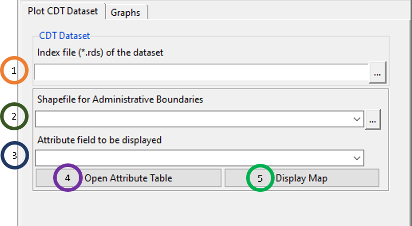

1. Browse to any .rds file that contains CDT gridded dataset.
2. Upload a shapefile.
3. Select an attribute field which you want to show.
4. Click on **Open Attribute Table** which will open a table in the right where all the attributes are listed.
5. Click on **Display Map** to display the uploaded shapefile.

Click on the **Graphs** tab to generate different graphs for a point inside the CDT gridded dataset. 

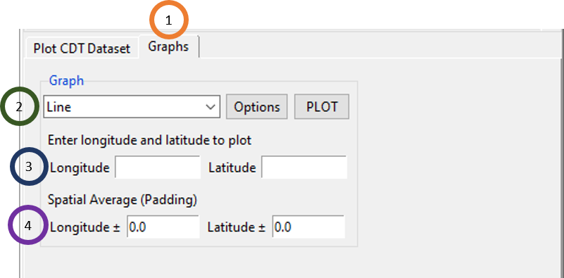

1. Click on the **Graphs** tab.
2. Select either **Line** or **Barplot**. Click on **PLOT** to plot the graph and click **Options** to change the formatting of the graph.
3. Specify the longitude and latitude for which you want the graph of the CDT gridded dataset.
4. You can specify some padding for longitude and latitude for spatial averaging to get the data of a point specified by longitude and latitude.

## Plot NetCDF Data (One File)

You can also plot a single NetCDF file by using the menu **Visualization -> Plot NetCDF Data (One File)**. 

1.	Browse to the NetCDF file that you want to plot using  or if this file is already loaded, select it using .
2.	Click on **Options** to change the format of the mapping such as colorkey, levels, amp title etc. Click on **PLOT** to plot the NetCDF in a map. All data points can be plotted on the map either as **Pixels** or **FilledContour**.
3.	Tick the field **Blank grid outside the boundaries** to blank the grid of the map that are outside of the boundaries of a shapefile.
4.	Tick **Add boundaries to Map** to add a shapefile to the map. Then browse to the shapefile corresponding to the NetCDF file that you want to plot. Click on **Options** to change the properties of the boundary of the shapefile which are color and width. 

One example of plotting maximum temperature (MERRA-2) data with plot type **Pixels** for the date January 1 of 2017 is given below. 

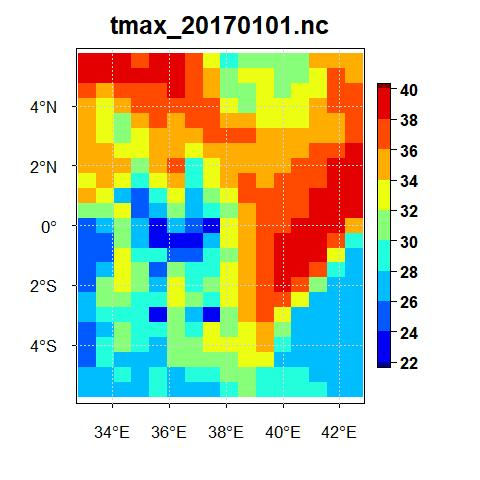

But, if for the same data for the same date, if you select **FilledContour**, the map will look like the following.

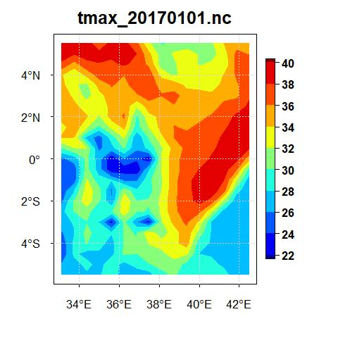

Now, if you upload the shapefile of Kenya, tick the field **Blank grid outside the boundaries** and select the plot type **Pixels** for the date January 1 of 2017 for maximum temperature data from MERRA-2, you will see a map as the following.

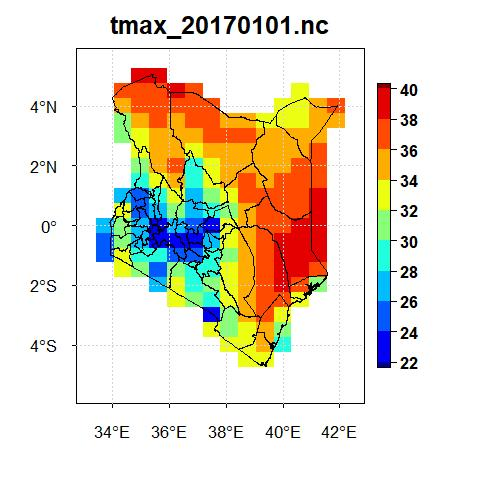

## Plot NetCDF Data (Sequential Files)

If there are a number of NetCDF files which represent sequential files by date, then you can just show the directory and plot all these files sequentially using this feature. To access this feature, use the menu **Visualization -> Plot NetCDF Data (Sequential Files)**. This will bring a tabbed widget in the left.

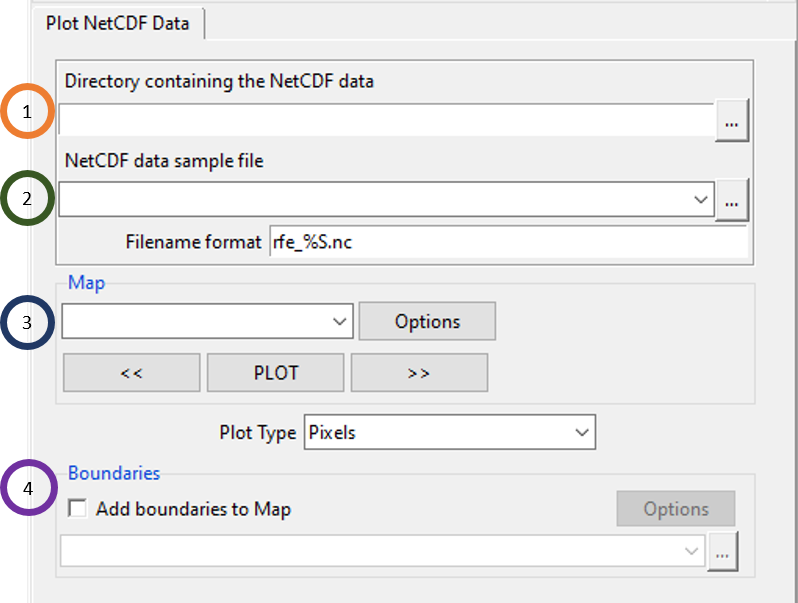

1.	Click on  to browse to the directory containing the sequential NetCDF files.
2.	Select any one of the NetCDF files and specify its settings. For example, using the maximum temperature of MERRA-2 data for Kenya, if we select any one of the files, then you will see an option like this.

    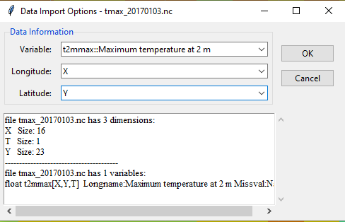
    In this case, select the variable name and specify the longitude and latitude variables. **Filename format** is very important and if you don’t specify it correctly, then you can’t plot the files. If the filenames (daily data) are in this format: tmax_20170101.nc, tmax_20170101.nc, tmax_20170103.nc, … then write **tmax_%S.nc** in the **Filename format** field. **%S** is to be used for the portion of the filename that represents changing dates. For more example, if the filenames are like these: tmin_19811101_downscaled.nc, tmin_19811102_downscaled.nc, tmin_19811103_downscaled.nc, …, then write **tmin_%S_downscaled** in the **Filename format** field.
3. Click on **PLOT** and you will see that all the filenames are listed in the dropdown under the **Map** field. Similar to Plot NetCDF data (One File), all data points corresponding to a file for a particular date can be plotted on the map either as **Pixels** or **FilledContour**. 
4. Similar to what you have seen before, tick **Add boundaries to Map** to add a shapefile to the map. Then browse to the shapefile corresponding to the NetCDF file that you want to plot. Click on **Options** to change the properties of the boundary of the shapefile which are color and width. 

## Plot NetCDF Data (Multiple Variables)

This allows you to plot NetCDF data with multiple variables. To access this feature, use the menu **Visualization -> Plot NetCDF Data (Multiple Variables)**. This will bring a tabbed widget in the left as the following.

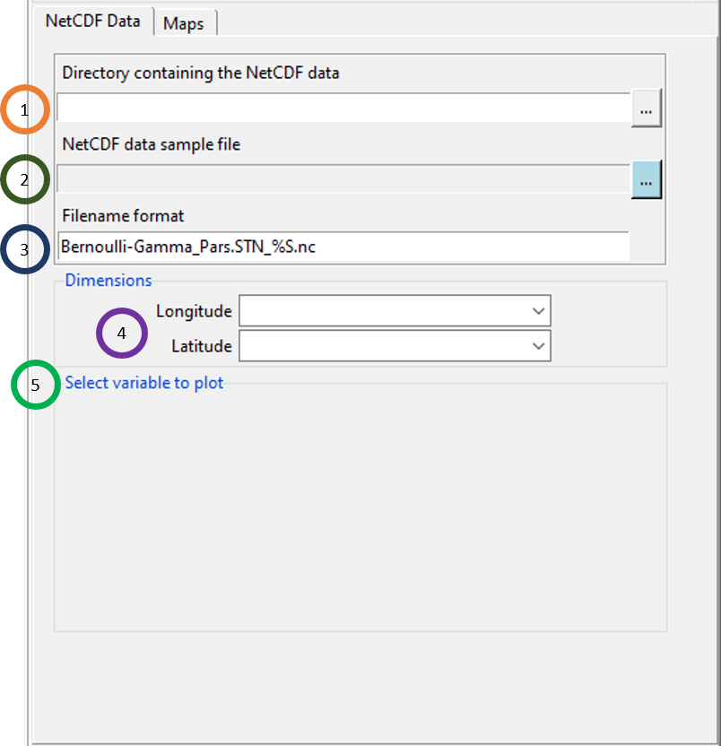

1.	Click on  to browse to the directory containing the sequential NetCDF files.
2.	Select any one of the NetCDF files and specify its settings.
3.	In the **Filename format** field, specify the filename format. For the format of the name, use **%S** for the part of the name that represents changing date.
4.	Specify longitude and latitude.
5.	After specifying a NetCDF sample file, select the variable to plot from the selected file.

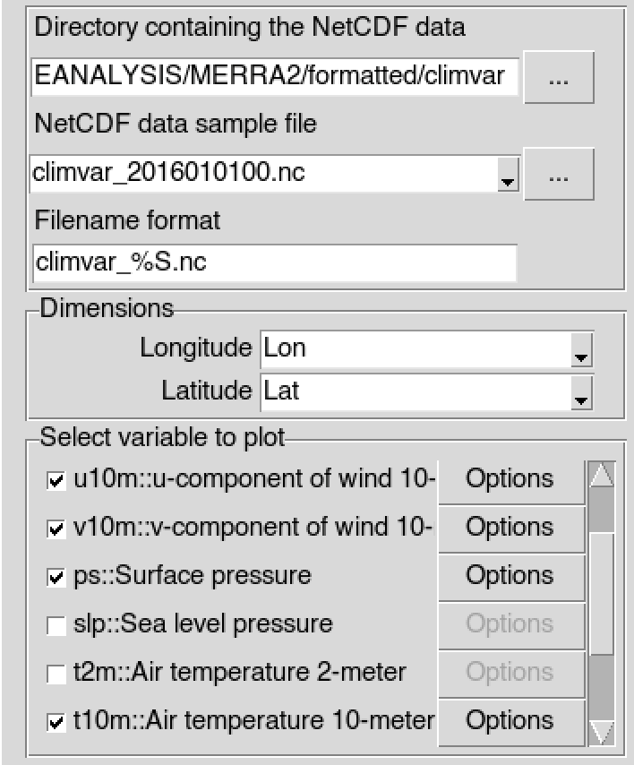

 It will display the following image

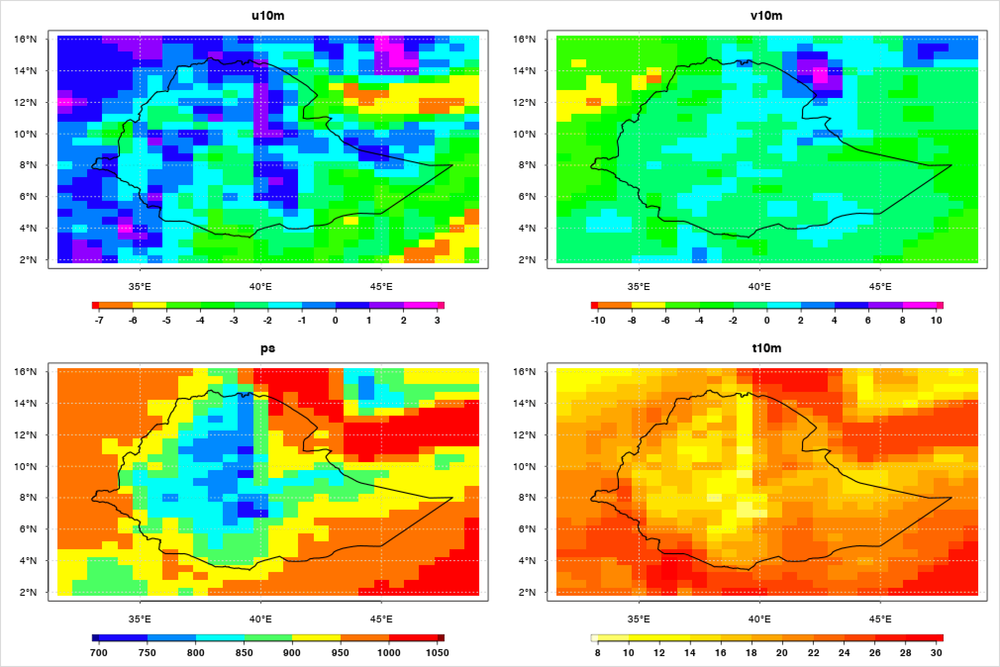

## Plot multiple data sets

This feature allows you to plot both CDT station data and NetCDF data in any combination that you want. That is, you can plot either one or multiple CDT datasets along with one or multiple NetCDF datasets. Further, for all of these different datasets, you can look at different plots corresponding to these datasets for a specific date chosen by you in CDT. This is a very useful feature as it allows you to look at station data and model or other gridded data for a single date to compare them visually. To access this feature, use the menu **Visualization -> Plot multiple data sets**. This will bring a tabbed widget in the left.

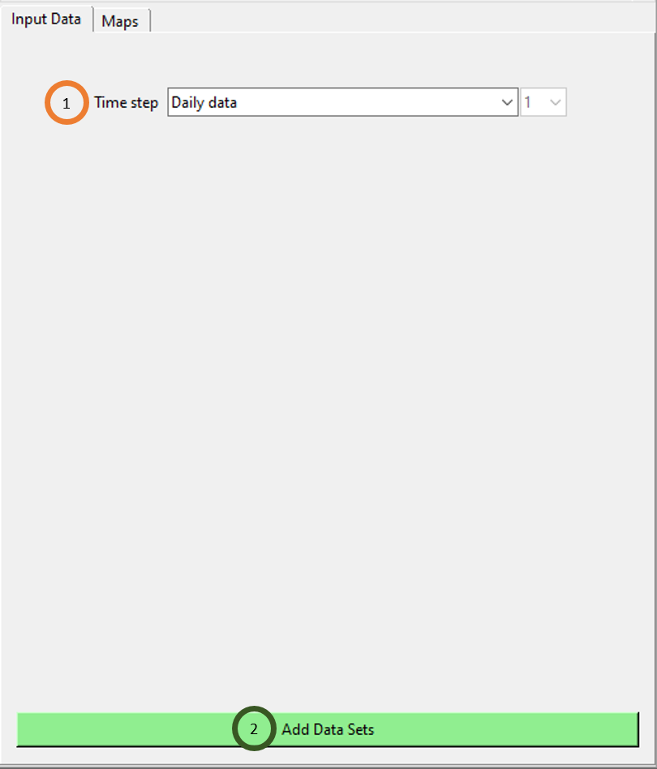

1. Click on the **Time step** field to select the time step. Please take a note that all the different files, be it CDT dataset or NetCDF gridded data, they all have to have the same time step if you want to visualize all these different files using this feature.
2. Click on **Add Data Sets** to add a dataset. You can add as many datasets you want by clicking on this button as many times accordingly. The first time, you click on this button **Add Data Sets**, you will see that new fields are added to add a new dataset where you can specify both the data type and the file itself.

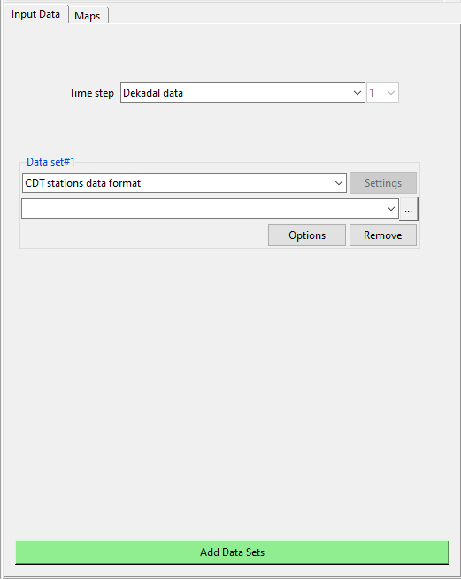

Now, specify any file (CDT stations or NetCDF) that you want to plot by specifying its format and browsing to it. Once you do it, click on **Add Data Sets** to add a new file of any format. Now, do this as many times as you want to select all the files that you want to plot. For example, we selected minimum temperature first, MERRA-2 maximum temperature and maximum temperature of Kenya last. The tabbed widget now looks similar to the one we see below.

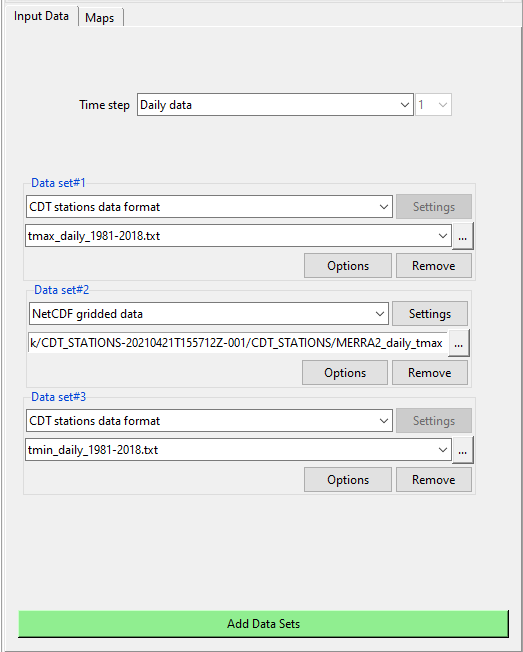

Using **Maps** tab, you can map all of these different datasets together for a date chosen by you.

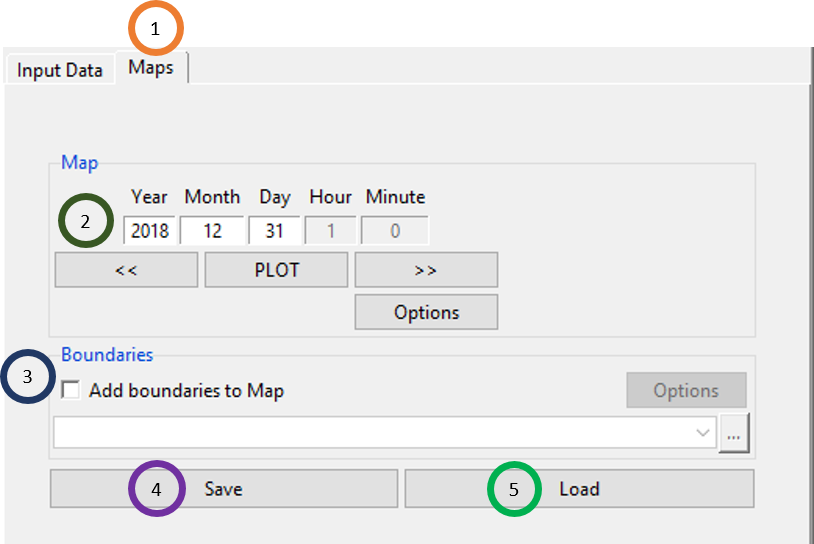

1. Click on the **Maps** tab.
2. Select the date for which you want to plot the map. Click on **PLOT** to plot the map. Using **Options** you can change the map setting. The map for the three data that we selected in the previous Input Data are shown below.

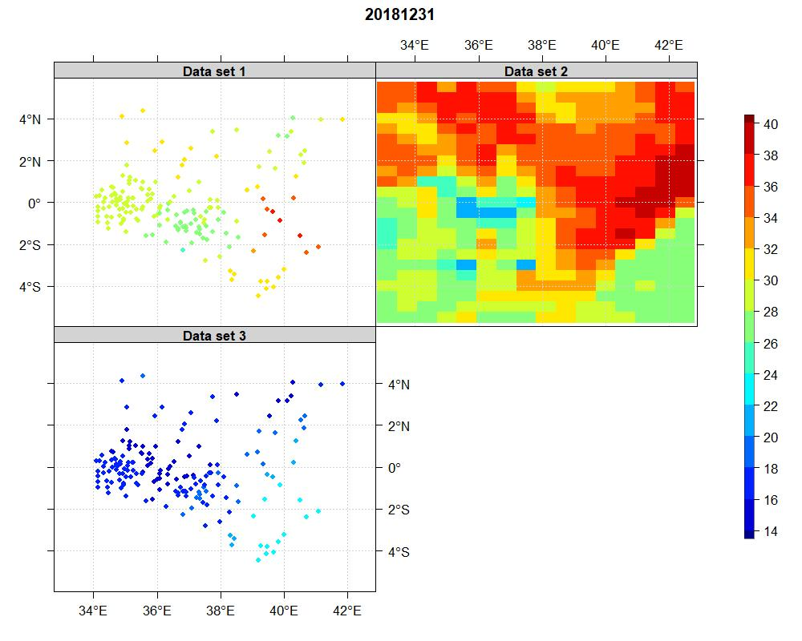

3. Click on Save if you want to save the file for this map for the day you have selected. You can save this as **.rds** or **.RDS**, or as **.RData**. If you have already saved such data for map, then click on Load to load that file containing this data.

